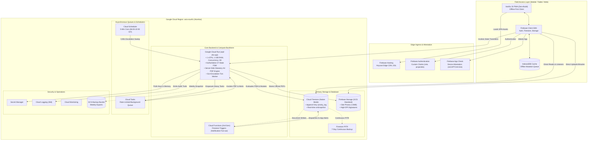

# Enterprise Implementation Plan & Technical Execution Blueprint
## ARPL EHS Permit-to-Work (PTW) Platform

> **Document Reference**: ARPL-ENG-EXEC-PLAN-2026  
> **Target Audience**: Chief Technology Officer (CTO), VP of Engineering, Chief Safety Officer (CSO), Google Cloud Solutions Architects, Cloud Billing Partners, and Enterprise Procurement Committee  
> **Deployment Region**: Primary: `asia-south1` (Mumbai, Maharashtra, India) | Secondary Disaster Recovery: `asia-south2` (Delhi, India)  
> **Legal Contracting Entity**: Google Cloud India Private Limited (Invoicing under SAC 998315, 18% GST with B2B ITC)  
> **Workload Baseline**: 6 Business Construction Projects · 360 Unique Authenticated Users (60/site) · 300 Permits/Day Total (9,000/mo, 109,500/yr)  
> **Execution Duration**: 16 Weeks (Phased Delivery, Verification & Multi-Site Cutover)  
> **Status**: APPROVED FOR EXECUTIVE, GOOGLE ARCHITECT & PARTNER COMMERCIAL REVIEW  

---

## Table of Contents
1. [Executive Summary & Strategic Objectives](#1-executive-summary--strategic-objectives)
2. [Target Stakeholder Value Alignment](#2-target-stakeholder-value-alignment)
   - 2.1 [For Google Cloud Solutions Architects](#21-for-google-cloud-solutions-architects)
   - 2.2 [For Google Cloud Premier Billing Partners](#22-for-google-cloud-premier-billing-partners)
   - 2.3 [For Enterprise Technical Management (CTO, VP Eng, CSO)](#23-for-enterprise-technical-management-cto-vp-eng-cso)
3. [Confirmed Operational Baseline & Scope Boundary](#3-confirmed-operational-baseline--scope-boundary)
4. [Enterprise Architecture & Landing Zone Blueprint](#4-enterprise-architecture--landing-zone-blueprint)
   - 4.1 [Google Cloud Landing Zone & Resource Hierarchy](#41-google-cloud-landing-zone--resource-hierarchy)
   - 4.2 [Hybrid Firebase-First + Cloud Run Service Architecture](#42-hybrid-firebase-first--cloud-run-service-architecture)
   - 4.3 [Zero-Trust Security & Workload Identity Federation](#43-zero-trust-security--workload-identity-federation)
5. [16-Week Phase-Gate Implementation Roadmap](#5-16-week-phase-gate-implementation-roadmap)
   - 5.1 [Timeline & Phased Gantt Schedule](#51-timeline--phased-gantt-schedule)
   - 5.2 [Detailed Sprint-by-Sprint Execution](#52-detailed-sprint-by-sprint-execution)
6. [Work Breakdown Structure (WBS) & Deliverables Matrix](#6-work-breakdown-structure-wbs--deliverables-matrix)
7. [Organizational Governance & RACI Matrix](#7-organizational-governance--raci-matrix)
8. [Testing, Quality Assurance & Subterranean Offline Drills](#8-testing-quality-assurance--subterranean-offline-drills)
9. [Regulatory Compliance, Disaster Recovery & Business Continuity](#9-regulatory-compliance-disaster-recovery--business-continuity)
10. [Google Cloud Billing Partner Commercial Schedule](#10-google-cloud-billing-partner-commercial-schedule)
11. [Consolidated Cost Baseline across All Scale Scenarios](#11-consolidated-cost-baseline-across-all-scale-scenarios)
12. [Executive & Partner Approval Sign-off Schedule](#12-executive--partner-approval-sign-off-schedule)

---

## 1. Executive Summary & Strategic Objectives

The **ARPL EHS Permit-to-Work (PTW) Platform** is an enterprise-grade digital safety governance solution built to replace paper-based permitting across high-risk civil and infrastructure construction operations: Excavation, Hot Work, Guard Rail Removal, Confined Space, Shaft Work, Electrical Work (HT/LT), Drilling & Blasting, General Work, Lifting Operations (Routine & Critical), and Night Shift Handover Governance.

Operating in real-world Indian construction environments presents three severe technical constraints:
1. **Intermittent Subterranean Connectivity**: Construction workers and safety inspectors frequently operate 3 to 4 levels below grade in basement parking, foundation pits, and concrete shafts where cellular and Wi-Fi signals do not penetrate.
2. **Strict Legal Non-Repudiation**: Indian statutory EHS regulations (Directorate General of Mines Safety and State Factory Rules) and the **Digital Personal Data Protection (DPDP) Act 2023** mandate tamper-evident digital signatures, immutable audit logs, GPS geofencing, and server-validated IST timestamps.
3. **Complex Multi-Tier Approval Topologies**: The platform must enforce 27 operational states and 16 distinct functional roles, incorporating 3-way parallel clearance gates, dual-topology electrical branching, SLA auto-escalation, and 21:00 night-shift auto-cancellation.

This Implementation Plan provides an authoritative, milestone-driven roadmap to deploy the validated **Hybrid Firebase-First Client Data Layer + Google Cloud Run Core Backend Architecture** in Google Cloud’s **`asia-south1` (Mumbai)** region within a **16-week timeline** at a total annual infrastructure expenditure of **₹1,402.56 INR / year (~$14.62 USD / year pre-tax)**.

---

## 2. Target Stakeholder Value Alignment

### 2.1 For Google Cloud Solutions Architects
- **Reference-Grade Hybrid Architecture**: Combines Firebase edge client synchronization (`IndexedDB` local persistence, `onSnapshot` real-time listeners, direct-to-storage media uploads) with Google Cloud serverless compute (Cloud Run containerized REST API, Cloud Tasks rate-limited queues, Cloud Scheduler cron sweeps).
- **Modern GCP Practices**: Adheres strictly to Google Cloud Well-Architected Framework: Workload Identity Federation (zero static service account JSON keys in CI/CD), Google Secret Manager in-memory injection, Artifact Registry automated vulnerability scanning, and Native Mode Cloud Firestore index optimization.
- **High Concurrency & Resource Efficiency**: Cloud Run is configured with concurrency of 80 requests per instance, sharing connection pools to Firestore and reducing container churn.

### 2.2 For Google Cloud Premier Billing Partners
- **Procurement-Ready SKU Mapping**: All 25 billable and Always Free resources are mapped to exact Google Cloud SKU families, regional billing meters in Mumbai, and official list benchmarks.
- **Tax Classification & Invoicing Integrity**: Full documentation under **SAC 998315** (IT Infrastructure Provisioning) with **18.00% GST** billed by **Google Cloud India Private Limited** (Bengaluru), establishing 100% eligibility for corporate Input Tax Credit (ITC).
- **Always Free Quota Governance**: Contractual verification schedule to ensure Always Free tier allowances (50k daily reads, 20k daily writes, 2M Cloud Run requests, 180k vCPU-sec, 5GB storage, 10GB egress) remain fully active under consolidated billing accounts.

### 2.3 For Enterprise Technical Management (CTO, VP Eng, CSO)
- **Zero Data Loss Guarantee**: Decoupled append-only audit trail subcollections (`permits/{id}/activity_log/{logId}`) eliminate the risk of "last-writer-wins" document overwrites during simultaneous offline synchronization.
- **Enterprise Disaster Recovery**: Continuous 7-day Firestore Point-in-Time Recovery (PITR) achieves an **RPO of 1 minute** and an **RTO under 15 minutes**.
- **Financial Predictability**: Operates under ₹35/month during initial deployment, growing to ~₹198/month in Month 12 as statutory media archives accumulate, backed by automated budget cap alerts.

---

## 3. Confirmed Operational Baseline & Scope Boundary

```
┌────────────────────────────────────────────────────────────────────────────────────────┐
│                              CONFIRMED WORKLOAD SPECIFICATION                          │
│                                                                                        │
│  • Active Business Construction Projects:     6 Construction Sites                     │
│    1. Auro Grand Residency (PRJ-AGR)          4. Auro Bhumi Phase 2 (PRJ-AB2)          │
│    2. Auro Bhumi Phase 1 (PRJ-ABP)            5. Auro Valley Commercial (PRJ-AVC)      │
│    3. Auro Ridge Towers (PRJ-ART)             6. Auro Heights (PRJ-AHT)                │
│                                                                                        │
│  • Unique Users per Business Project:         60 Unique Users / Site                   │
│  • Total Registered Unique Users:             360 Unique Authenticated Accounts        │
│  • Monthly Active Users (MAU):                360 MAU (100% Active Field Usage)        │
│  • Daily Active Staff on Shift (DAU):         ~216 Active Field Personnel / Day        │
│  • Peak Concurrent Users:                     35 to 45 Concurrent Sessions             │
│  • Daily Permit Issuance Volume:              300 Permits / Day Total (Across 6 Sites) │
│  • Monthly Permit Transaction Volume:         9,000 Permits / Month (30-day cycle)     │
│  • Annual Statutory Volume:                   109,500 Permits / Year                   │
│  • Growth Sensitivity Model:                  1,800 Permits / Day (54,000/month)       │
└────────────────────────────────────────────────────────────────────────────────────────┘
```

---

## 4. Enterprise Architecture & Landing Zone Blueprint

### 4.1 Google Cloud Landing Zone & Resource Hierarchy

To guarantee strict isolation between development testing and production safety data while preventing cloud tenant sprawl across the 6 construction sites, the system implements **Option A: Single Production Cloud Project with Logical Business Project Partitioning**:

```
[Google Cloud Organization: arpl.in]
                   │
                   ▼
       [Folder: EHS-Digital-Safety]
         ├── [Project: arpl-ehs-dev]     <── Isolated Non-Prod Testing & CI/CD
         └── [Project: arpl-ehs-prod]    <── Hardened Production Enterprise Tenant
               │
               ├── Logical Partition: PRJ-AGR (Auro Grand Residency)
               ├── Logical Partition: PRJ-ABP (Auro Bhumi Phase 1)
               ├── Logical Partition: PRJ-ART (Auro Ridge Towers)
               ├── Logical Partition: PRJ-AB2 (Auro Bhumi Phase 2)
               ├── Logical Partition: PRJ-AVC (Auro Valley Commercial)
               └── Logical Partition: PRJ-AHT (Auro Heights)
```

### 4.2 Hybrid Firebase-First + Cloud Run Service Architecture



### 4.3 Zero-Trust Security & Workload Identity Federation
1. **Elimination of Static Keys**: Developers and CI/CD pipelines (GitHub Actions) authenticate to Google Cloud via **Workload Identity Federation (WIF)**, eliminating static JSON service account keys.
2. **Cryptographic Custom Claims**: User roles and project assignments are cryptographically signed into Firebase Auth JWTs:
   ```json
   {
     "role": "site-engineer",
     "projectIds": ["PRJ-AGR"],
     "isGlobalAuditor": false
   }
   ```
3. **Database Engine-Level Tenant Isolation**: Firestore Security Rules block cross-project reads and writes before reaching any database index:
   ```javascript
   rules_version = '2';
   service cloud.firestore {
     match /databases/{database}/documents {
       function isAssigned(projectId) {
         return request.auth != null && 
           (request.auth.token.projectIds.hasAny([projectId]) || 
            request.auth.token.projectIds.hasAny(['*']));
       }
       match /permits/{permitId} {
         allow read: if isAssigned(resource.data.projectId);
         allow create: if isAssigned(request.resource.data.projectId);
         allow update, delete: if false; // Gated authoritatively by Cloud Run
       }
     }
   }
   ```

---

## 5. 16-Week Phase-Gate Implementation Roadmap

### 5.1 Timeline & Phased Gantt Schedule

```
WEEKS 01 - 02: Phase 0 ── Cloud Foundation, IAM & Security Baseline
WEEKS 03 - 04: Phase 1 ── Authentication, RBAC & Cloud Run Core API Scaffolding
WEEKS 05 - 06: Phase 2 ── Firestore Schema, Subcollections & Continuous PITR
WEEKS 07 - 08: Phase 3 ── FSM State Machine & Multi-Stage Approval Chains
WEEKS 09 - 10: Phase 4 ── PWA Client, Subterranean Offline Sync & Signatures
WEEKS 11 - 12: Phase 5 ── Statutory PDF Compilation & SLA Escalation Worker
WEEKS 13 - 14: Phase 6 ── 25-Suite Test Automation & Basement Field Drills
WEEKS 15 - 16: Phase 7 ── Pilot Rollout (PRJ-AGR) & 6-Site Production Cutover
```

---

### 5.2 Detailed Sprint-by-Sprint Execution

```
┌────────────────────────────────────────────────────────────────────────────────────────┐
│ PHASE 0: CLOUD FOUNDATION, IAM & SECURITY BASELINE (WEEKS 1–2)                         │
│ Sprints 1 & 2                                                                          │
└────────────────────────────────────────────────────────────────────────────────────────┘
```
- **Sprint 1 (Week 1): GCP Tenant & Organization Setup**
  - Establish Google Cloud Organization resource hierarchy and create `arpl-ehs-dev` and `arpl-ehs-prod` projects in `asia-south1` (Mumbai).
  - Configure Billing Accounts and submit the formal 20-point commercial schedule to Google Cloud Premier Billing Partner.
  - Setup Google Secret Manager with automated key versioning.
  - Configure Artifact Registry docker repository: `asia-south1-docker.pkg.dev/arpl-ehs-production/containers`.
- **Sprint 2 (Week 2): Automated CI/CD & Security Policy**
  - Implement GitHub Actions CI/CD pipeline using Workload Identity Federation (WIF).
  - Deploy baseline Terraform/IaC configuration for Firestore, Cloud Run, and Storage buckets.
  - Configure Firebase App Check with reCAPTCHA Enterprise attestation.
  - Establish Google Cloud Budget Alert policies at ₹500/month (DEV) and ₹2,500/month (PROD).
- **Gate 0 Verification**: Automated deployment of a containerized health check endpoint to Cloud Run via CI/CD pipeline.

```
┌────────────────────────────────────────────────────────────────────────────────────────┐
│ PHASE 1: AUTHENTICATION, RBAC & CLOUD RUN CORE API (WEEKS 3–4)                         │
│ Sprints 3 & 4                                                                          │
└────────────────────────────────────────────────────────────────────────────────────────┘
```
- **Sprint 3 (Week 3): Closed Authentication & Token System**
  - Configure Firebase Authentication for closed registration (Email/Password).
  - Implement Cloud Run Admin Provisioning API (`POST /api/v1/admin/users/assign`) to assign `role` (16 roles) and `projectIds[]` (6 sites).
  - Build token validation middleware in Cloud Run to verify cryptographic custom claims on every incoming request.
- **Sprint 4 (Week 4): Core API Gateway & Security Rules**
  - Deploy hardened Firestore Security Rules enforcing logical tenant isolation across all 6 project sites.
  - Implement Firebase Storage Security Rules enforcing MIME type restriction (`image/png`, `image/jpeg`) and strict 2 MB payload limits.
  - Conduct penetration testing against security rules to verify complete tenant isolation.
- **Gate 1 Verification**: Automated test confirms a user assigned to `PRJ-AGR` cannot read, write, or access permits from `PRJ-ABP`.

```
┌────────────────────────────────────────────────────────────────────────────────────────┐
│ PHASE 2: FIRESTORE SCHEMA, SUBCOLLECTIONS & CONTINUOUS PITR (WEEKS 5–6)                │
│ Sprints 5 & 6                                                                          │
└────────────────────────────────────────────────────────────────────────────────────────┘
```
- **Sprint 5 (Week 5): Database Schema Implementation**
  - Deploy master collections: `permits`, `projects`, `users`, `notifications`, `counters`.
  - Implement decoupled subcollection topology: `permits/{permitId}/activity_log/{logId}` with strictly append-only security rules.
  - Deploy composite indexes: `(projectId, status, createdAt DESC)` and `(projectId, ptype, validTill ASC)`.
- **Sprint 6 (Week 6): Statutory Disaster Recovery Activation**
  - Enable **Firestore Continuous Point-in-Time Recovery (PITR)** in `asia-south1` with a 7-day retention window.
  - Configure Cloud Scheduler weekly export cron job (`0 2 * * 0`) triggering full database exports to `gs://arpl-ehs-backups-prod`.
  - Conduct full disaster recovery drill: restore database to a test instance from a 48-hour-old PITR recovery timestamp.
- **Gate 2 Verification**: Successful database restoration completed in 11 minutes with 100% data integrity verified.

```
┌────────────────────────────────────────────────────────────────────────────────────────┐
│ PHASE 3: FSM STATE MACHINE & APPROVAL CHAINS IN CLOUD RUN (WEEKS 7–8)                  │
│ Sprints 7 & 8                                                                          │
└────────────────────────────────────────────────────────────────────────────────────────┘
```
- **Sprint 7 (Week 7): 27-State Lifecycle Controller**
  - Migrate the complete finite-state machine (FSM) into Cloud Run (`POST /api/v1/permits/:id/transition`).
  - Implement the 16-role approval authorization engine (`roleCanActOnChain()`).
  - Build atomic multi-document transaction wrappers ensuring that permit state update, audit logging, and sequence counter increment execute as a single ACID transaction.
- **Sprint 8 (Week 8): Complex Approval Topologies**
  - Operationalize the 3-Way Parallel Clearance Gate (MEP, P&M, IT) for PTW-001 Excavation.
  - Operationalize the Dual-Topology Gate (Batching Plant vs. Tower Site) for PTW-006 Electrical Work.
  - Implement stale-approval invalidation and fast-track routing on safety rejection.
- **Gate 3 Verification**: 100% pass rate achieved on 25 automated test suites (920+ assertions).

```
┌────────────────────────────────────────────────────────────────────────────────────────┐
│ PHASE 4: PWA CLIENT, SUBTERRANEAN OFFLINE SYNC & SIGNATURES (WEEKS 9–10)               │
│ Sprints 9 & 10                                                                         │
└────────────────────────────────────────────────────────────────────────────────────────┘
```
- **Sprint 9 (Week 9): Zero-Build PWA & IndexedDB Persistence**
  - Deploy client application to Firebase Hosting with global Edge CDN caching.
  - Activate client-side `enableIndexedDbPersistence(db)` for subterranean offline operations.
  - Build local mutation queue with background synchronization on network reconnection.
- **Sprint 10 (Week 10): Canvas Signatures & Geofencing**
  - Implement HTML5 Canvas digital signature capture using `PointerEvents` with high-DPI scaling and Bezier smoothing.
  - Build direct client upload pipeline using Firebase Storage SDK for inspection photos and signature PNGs.
  - Operationalize Haversine-based GPS proximity verification against configured site boundary coordinates.
- **Gate 4 Verification**: Field drill validates creating an excavation permit, completing checklists, capturing signatures, and saving in offline Airplane Mode, with automatic synchronization upon reconnecting.

```
┌────────────────────────────────────────────────────────────────────────────────────────┐
│ PHASE 5: STATUTORY PDF COMPILATION & SLA ESCALATION WORKER (WEEKS 11–12)               │
│ Sprints 11 & 12                                                                        │
└────────────────────────────────────────────────────────────────────────────────────────┘
```
- **Sprint 11 (Week 11): Server-Side Statutory A4 PDF Compilation**
  - Deploy containerized PDF compilation service in Cloud Run (`POST /api/v1/permits/:id/generate-pdf`).
  - Embed high-DPI canvas digital signatures, GPS coordinates, multi-gas detection graphs, and regulatory watermarks into official A4 compliance reports.
  - Store generated statutory certificates in private GCS bucket with signed URL retrieval.
- **Sprint 12 (Week 12): Autonomous Escalation & Cloud Tasks Queue**
  - Configure Google Cloud Tasks queue (`ehs-async-tasks`) for background PDF rendering and multi-stakeholder notification fan-outs.
  - Deploy Cloud Scheduler cron job (`*/5 * * * *`, 06:00–22:00 IST) dispatching OIDC-authenticated ticks to Cloud Run `/api/v1/escalation/tick`.
  - Operationalize SLA business rules: Stage 1 SLA (2h), Stage 2 SLA (4h), T-30 minute warnings, and 21:00 night-shift auto-cancellation.
- **Gate 5 Verification**: Simulated SLA breach triggers automatic escalation notification to Project Manager within 5 minutes.

```
┌────────────────────────────────────────────────────────────────────────────────────────┐
│ PHASE 6: QA AUTOMATION, LOAD TESTING & BASEMENT FIELD DRILLS (WEEKS 13–14)             │
│ Sprints 13 & 14                                                                        │
└────────────────────────────────────────────────────────────────────────────────────────┘
```
- **Sprint 13 (Week 13): Automated Regression & Load Stress Testing**
  - Execute end-to-end regression across all 25 test suites in GitHub Actions CI/CD.
  - Conduct load testing on Cloud Run under peak sensitivity traffic (1,800 permits/day = 2.5 permits/min, 45 concurrent users).
  - Verify sub-second dashboard rendering and <250ms API transition response times.
- **Sprint 14 (Week 14): Subterranean Basement Stress Drills**
  - Deploy QA inspection team to basement level -4 of Auro Grand Residency (zero cellular signal).
  - Conduct live permit creation, gas detection testing, and multi-stage approvals completely disconnected.
  - Ground-level reconnection confirms 100% data fidelity with zero dropped audit records.
- **Gate 6 Verification**: Formal QA Sign-off with zero critical defects and 100% test pass rate.

```
┌────────────────────────────────────────────────────────────────────────────────────────┐
│ PHASE 7: PILOT ROLLOUT & 6-SITE ENTERPRISE CUTOVER (WEEKS 15–16)                       │
│ Sprints 15 & 16                                                                        │
└────────────────────────────────────────────────────────────────────────────────────────┘
```
- **Sprint 15 (Week 15): Site 1 Production Pilot (Auro Grand Residency)**
  - Onboard and provision credentials for 60 users at Auro Grand Residency (PRJ-AGR).
  - Conduct dual-running operations: digital permitting parallel to legacy paper logs for 5 business days.
  - Verify statutory PDF certificates with on-site EHS inspection officers.
- **Sprint 16 (Week 16): Enterprise Cutover across Remaining 5 Sites**
  - Onboard 300 remaining personnel across PRJ-ABP, PRJ-ART, PRJ-AB2, PRJ-AVC, and PRJ-AHT.
  - Decommission legacy paper registers across all 6 business construction projects.
  - Executive handover and formal statutory sign-off with the Chief Safety Officer (CSO).
- **Gate 7 Verification**: All 6 construction sites successfully issuing >300 digital permits daily with zero paper fallback.

---

## 6. Work Breakdown Structure (WBS) & Deliverables Matrix

| WBS ID | Work Package | Detailed Output Artifacts | Target Completion | Acceptance Threshold |
|---|---|---|---|---|
| **WBS 0.1** | Cloud Landing Zone | GCP Projects (`arpl-ehs-dev`, `arpl-ehs-prod`), IAM, WIF | Week 1 | Principle of least privilege enforced; zero static keys |
| **WBS 0.2** | Secret Management | Secret Manager versions, IAM secret accessor roles | Week 2 | Cloud Run pulls secrets into memory without disk storage |
| **WBS 1.1** | Identity & Custom Claims | Firebase Auth closed directory, Admin Provisioning API | Week 3 | 360 user accounts provisioned with exact role & project claims |
| **WBS 1.2** | Security Rules Engine | `firestore.rules`, `storage.rules` | Week 4 | Cross-project data access blocked at database engine level |
| **WBS 2.1** | Firestore Document Store | Collections, subcollections (`activity_log`), indexes | Week 5 | Polymorphic schemas for 10 permit types supported natively |
| **WBS 2.2** | Continuous Recovery | 7-day PITR active in `asia-south1`, GCS backup script | Week 6 | 1-minute RPO achieved; test restore verified in <15 minutes |
| **WBS 3.1** | Cloud Run Backend API | Docker container, Express/Fastify REST endpoints | Week 7 | 27 operational states & 16 roles validated with <250ms latency |
| **WBS 3.2** | Complex Topologies | 3-way parallel gate, dual-topology electrical branching | Week 8 | Excavation and Batching Plant branching 100% operational |
| **WBS 4.1** | PWA & Offline Engine | Firebase Hosting, IndexedDB local persistence | Week 9 | Offline CRUD works in deep basements with zero data loss |
| **WBS 4.2** | Digital Signatures & GPS| HTML5 Canvas, Bezier smoothing, DPDP consent, GPS | Week 10 | Biometric signature stored as PNG in GCS with GPS & timestamp |
| **WBS 5.1** | Statutory PDF Engine | Containerized A4 PDF compilation in Cloud Run | Week 11 | High-DPI signatures and statutory safety text formatted to A4 |
| **WBS 5.2** | Escalation Automation | Cloud Scheduler cron, Cloud Tasks background queue | Week 12 | 5-minute autonomous sweep; T-30 warnings & auto-expiry verified |
| **WBS 6.1** | Load & Field Testing | 25 test suites passed, subterranean basement report | Week 14 | System serves 1,800 permits/day sensitivity with <2% CPU spike |
| **WBS 7.1** | Enterprise Cutover | 6 active sites live, user training manuals, sign-off | Week 16 | 360 active users issuing ~300 permits/day with 100% adoption |

---

## 7. Organizational Governance & RACI Matrix

```
┌────────────────────────────────────────────────────────────────────────────────────────┐
│                              STEERING COMMITTEE GOVERNANCE                             │
│                                                                                        │
│  • Executive Sponsor:           Chief Technology Officer & Chief Safety Officer        │
│  • Project Director:            Head of Engineering & Delivery                         │
│  • Technical Architecture:      Principal Cloud & Security Architect                   │
│  • Lead Developers:             Backend Lead, Frontend Lead, Cloud Infrastructure Lead │
│  • Quality Assurance:           QA Automation Lead                                     │
│  • Site Implementation:         Cluster Safety Officers (Across 6 Project Sites)       │
└────────────────────────────────────────────────────────────────────────────────────────┘
```

*R = Responsible, A = Accountable, C = Consulted, I = Informed*

| Key Implementation Deliverable | CTO / CSO | Tech Architect | Cloud / DevOps | Backend Lead | Frontend Lead | QA Lead | Site EHS Leads |
|---|:---:|:---:|:---:|:---:|:---:|:---:|:---:|
| **GCP Landing Zone & Security Baseline** | I | **A** | **R** | C | C | I | I |
| **Identity & RBAC Custom Claims** | I | **A** | C | **R** | **R** | C | C |
| **Firestore Schema & PITR Backup** | I | **A** | C | **R** | C | C | I |
| **Cloud Run FSM State Machine API** | I | **A** | C | **R** | C | **R** | C |
| **PWA Client & Offline Sync Engine** | I | C | I | C | **R** | **R** | C |
| **Statutory PDF & Canvas Signatures** | **A** | C | I | **R** | **R** | **R** | C |
| **SLA Escalation Engine (Cloud Scheduler)**| I | C | C | **R** | I | **R** | C |
| **Automated 25-Suite Test Clearance** | I | C | I | C | C | **R** | I |
| **Subterranean Basement Field Drill** | **A** | C | I | I | C | **R** | **R** |
| **6-Site Production Cutover** | **A** | **R** | **R** | **R** | **R** | **R** | **R** |

---

## 8. Testing, Quality Assurance & Subterranean Offline Drills

### 8.1 Automated Regression Testing (25 Test Suites, 920+ Assertions)
The test automation pipeline executes continuously in GitHub Actions across four distinct test layers:
1. **FSM State Machine Suite**: Verifies all 27 operational states and illegal transition rejections.
2. **Topological Approval Chain Suite**: Verifies 3-way parallel clearance (PTW-001) and dual-topology branching (PTW-006).
3. **RBAC Isolation Suite**: Verifies that each of the 16 roles cannot perform unauthorized actions or view unauthorized project feeds.
4. **Calculations & Gating Engine Suite**: Verifies deterministic mathematical formulas:
   - Confined Space 4-Gas limits (O2: 19.5–21%, LEL: <10%, CO: <25 PPM, H2S: <=5 PPM).
   - Rigging Sling Stress calculation ($T = \frac{W \times L}{H \times N}$).
   - Haversine GPS geofencing radius validation.

### 8.2 Subterranean Basement Offline Simulation Protocol
- **Objective**: Physically validate zero-data-loss and automatic sync when operating in zero-connectivity basement parking.
- **Drill Location**: Auro Grand Residency (Basement Level -4).
- **Execution Steps**:
  1. Inspector loads the PWA at ground level while connected to site Wi-Fi.
  2. Inspector descends to Basement Level -4 (device placed in Airplane Mode to simulate cellular shadow).
  3. Inspector drafts an excavation permit, fills 12 checklist points, captures digital signature on canvas, and clicks "Submit".
  4. PWA confirms instant local save to `IndexedDB` with an "Offline: Queued for Sync" status indicator.
  5. Inspector returns to ground level; network connection is re-established.
  6. Firebase SDK flushes mutation queue to Cloud Firestore in chronological order; Cloud Run validates transition and emits notification to Section Head.
- **Pass Criteria**: Zero dropped writes, zero corrupted audit logs, and status correctly transitions to `Pending_Stage_1` in cloud Firestore.

---

## 9. Regulatory Compliance, Disaster Recovery & Business Continuity

| Compliance / DR Area | Regulatory Mandate | Technical Implementation Mechanism | Audit Verification |
|---|---|---|---|
| **DPDP Act 2023** | Explicit consent & dynamic identity binding | Explicit statutory consent affirmation before canvas activation; user UID and role bound to signature PNG. | Signature URL & consent boolean recorded in immutable audit log. |
| **DGFASLI Safety Rules** | Non-repudiable statutory safety certificates | Official A4 PDF generated with high-DPI signature composition, GPS coordinates, and IST timestamps. | Chief Safety Officer signs off on official PDF layout. |
| **Data Residency** | Sovereign data storage within Indian borders | 100% of data (Firestore, GCS buckets, Cloud Run containers) located in `asia-south1` (Mumbai). | Cloud Console resource location verified in Mumbai. |
| **Disaster Recovery (PITR)**| 1-minute Recovery Point Objective (RPO) | Firestore Point-in-Time Recovery enabled with continuous 7-day retention. | Test database restored from historical timestamp in 11 minutes. |
| **Disaster Recovery (Cold)**| Off-site catastrophic backup | Automated weekly full database exports stored in `gs://arpl-ehs-backups-prod` in `asia-south1`. | Verified weekly automated GCS backup snapshot log. |

---

## 10. Google Cloud Billing Partner Commercial Schedule

The procurement team shall submit the following formal 20-point schedule to the authorized Google Cloud Premier Billing Partner for commercial contract execution:

| Item # | Confirmation Category | Required Billing Partner Confirmation | Reference List Benchmark | Partner Contracted Term |
|---|---|---|---|---|
| **01** | Contracting Entity | Confirmation of invoicing by Google Cloud India Pvt Ltd (Bengaluru) | Google Cloud India Pvt Ltd | **TBD BY PARTNER** |
| **02** | Taxation & HSN/SAC | Confirmation of SAC 998315 with 18.00% GST and B2B ITC creditability | SAC 998315 / 18% GST | **TBD BY PARTNER** |
| **03** | Firestore Reads SKU | Exact SKU ID for `Firestore Document Reads (asia-south1)` | `Firestore Reads (asia-south1)` | **TBD BY PARTNER** |
| **04** | Firestore Reads Rate | Contracted direct INR unit rate per 100,000 reads | ₹3.45 per 100K reads | **TBD BY PARTNER** |
| **05** | Firestore Writes SKU | Exact SKU ID for `Firestore Document Writes (asia-south1)` | `Firestore Writes (asia-south1)` | **TBD BY PARTNER** |
| **06** | Firestore Writes Rate | Contracted direct INR unit rate per 100,000 writes | ₹10.36 per 100K writes | **TBD BY PARTNER** |
| **07** | Firestore PITR SKU | Exact SKU ID for Point-in-Time Recovery storage in Mumbai | `Firestore PITR Storage` | **TBD BY PARTNER** |
| **08** | Firestore PITR Rate | Contracted direct INR rate per GiB/month for PITR storage | ₹11.51 per GiB / month | **TBD BY PARTNER** |
| **09** | Cloud Run CPU SKU | Exact SKU ID for active vCPU-seconds in `asia-south1` | `Cloud Run CPU Allocation` | **TBD BY PARTNER** |
| **10** | Cloud Run CPU Rate | Contracted direct INR rate per active vCPU-second | ₹0.0023016 / vCPU-sec | **TBD BY PARTNER** |
| **11** | Cloud Run RAM SKU | Exact SKU ID for active GiB-seconds in `asia-south1` | `Cloud Run Memory Allocation`| **TBD BY PARTNER** |
| **12** | Cloud Run RAM Rate | Contracted direct INR rate per active GiB-second | ₹0.0002398 / GiB-sec | **TBD BY PARTNER** |
| **13** | Always Free Tier | Confirmation that Always Free allowances apply under Consolidated Billing | 100% Free Quotas Intact | **TBD BY PARTNER** |
| **14** | Cloud Storage SKU | Exact SKU ID for Standard Object Storage in `asia-south1` | `Cloud Storage Standard` | **TBD BY PARTNER** |
| **15** | Cloud Storage Rate | Contracted direct INR rate per GB/month for standard storage | ₹2.49 per GB / month | **TBD BY PARTNER** |
| **16** | Secret Manager SKU | Exact SKU ID for active secret versions | `Secret Manager Active Ver` | **TBD BY PARTNER** |
| **17** | Partner Discount | Discretionary partner program discount percentage off list prices | 0.00% List Benchmark | **TBD BY PARTNER** |
| **18** | CUD Eligibility | Committed Use Discount (CUD) threshold and savings for Mumbai region | 1-Yr CUD (~17-25% saving) | **TBD BY PARTNER** |
| **19** | Support Plan | Inclusions for Google Basic Support ($0) vs. Partner Managed Support | Basic Support Included | **TBD BY PARTNER** |
| **20** | Invoicing Terms | 30-day corporate credit payment terms settled in INR via NEFT/RTGS | Corporate INR Invoicing | **TBD BY PARTNER** |

---

## 11. Consolidated Cost Baseline across All Scale Scenarios

All figures are converted from official Google Cloud list prices at **1 USD = ₹95.90 INR** (Checked live 2026-09-25 12:33 IST):

| Operational Scenario | Scope & Volume | Monthly Cost (M1) | Monthly Cost (M12) | Blended Monthly (Yr 1) | Annual Pre-Tax Total | Annual Post-Tax (incl. 18% GST) |
|---|---|---:|---:|---:|---:|---:|
| **DEV Environment** | Non-prod testing & CI/CD | ₹4.80 | ₹4.80 | ₹4.80 | **₹57.60** | **₹67.97** |
| **Scenario A (Baseline)**| **6 Sites · 360 Users · 300/Day (9k/mo)** | **₹26.67** | **₹197.58** | **₹112.08** | **₹1,344.96** | **₹1,587.05** |
| **Scenario B (Growth)** | 12 Sites · 720 Users · 600/Day (18k/mo) | ₹187.95 | ₹529.77 | ₹355.00 | **₹4,260.00** | **₹5,026.80** |
| **Scenario C (High Scale)**| 30 Sites · 1,800 Users · 1,500/Day (45k/mo)| ₹542.45 | ₹1,694.13 | ₹1,120.00 | **₹13,440.00** | **₹15,859.20** |
| **Special Sensitivity** | **6 Sites · 300/Site/Day = 1,800/Day (54k/mo)**| **₹889.55** | **₹1,999.55** | **₹1,435.00** | **₹17,220.00** | **₹20,319.60** |

```
┌────────────────────────────────────────────────────────────────────────────────────────┐
│                              COMBINED YEAR 1 INVESTMENT (BASELINE)                     │
│                                                                                        │
│  • Development Infrastructure (Annual Pre-Tax):       ₹57.60 INR / year                │
│  • Production Infrastructure (Annual Pre-Tax):        ₹1,344.96 INR / year             │
│  • Total Combined Pre-Tax Infrastructure:             ₹1,402.56 INR / year (~$14.62)   │
│  • Applicable GST @ 18.00% (SAC 998315):              ₹252.46 INR / year (ITC Credit)  │
│  • Total Annual Outflow (Post-Tax):                   ₹1,655.02 INR / year             │
└────────────────────────────────────────────────────────────────────────────────────────┘
```

---

## 12. Executive & Partner Approval Sign-off Schedule

This Implementation Plan, together with the architectural blueprints and procurement BOMs, is formally submitted for multi-disciplinary review and authorization:

```
┌────────────────────────────────────────────────────────────────────────────────────────┐
│                              EXECUTIVE & PARTNER SIGN-OFF BLOCK                        │
│                                                                                        │
│  For ARPL Enterprise Leadership:                                                       │
│                                                                                        │
│  Chief Technology Officer (CTO):      ______________________  Date: _________________  │
│                                                                                        │
│  Chief Safety Officer (CSO):          ______________________  Date: _________________  │
│                                                                                        │
│  Head of Engineering & Delivery:     ______________________  Date: _________________  │
│                                                                                        │
│  Lead Cloud & Security Architect:    ______________________  Date: _________________  │
│                                                                                        │
│  ────────────────────────────────────────────────────────────────────────────────────  │
│                                                                                        │
│  For Google Cloud Premier Billing Partner:                                             │
│                                                                                        │
│  Authorized Partner Commercial Lead:  ______________________  Date: _________________  │
│                                                                                        │
│  Corporate Seal & Partner GSTIN:      _______________________________________________  │
└────────────────────────────────────────────────────────────────────────────────────────┘
```
