<div align="center">

# 🛡️ ARPL EHS Permit-to-Work Management System

### Enterprise-Grade Digital Safety Governance for Construction Operations

**PT-01 Excavation · PT-02 Hot Work · PT-03 Guard Rail · PT-04 Confined Space · PT-05 Shaft Work**

[](/)
[](/)
[](/)
[](/)
[](/)

---

*A zero-dependency, single-page application implementing the complete Permit-to-Work (PTW) lifecycle — from form initiation through multi-stage parallel approvals, GPS-verified digital signatures, real-time escalation automation, statutory PDF generation, and formal closure & surrender — all enforced through a strict finite-state machine with role-based access control.*

</div>

---

## Table of Contents

1. [Executive Summary](#1-executive-summary)
2. [System Architecture](#2-system-architecture)
3. [Technology Stack & Design Decisions](#3-technology-stack--design-decisions)
4. [Role-Based Access Control (RBAC)](#4-role-based-access-control-rbac)
5. [Permit Types & Master Data](#5-permit-types--master-data)
   - 5.1 [Active Permit Types Matrix](#51-active-permit-types)
   - 5.2 [Approval Chain Topology](#52-approval-chain-topology-per-permit-type)
   - 5.3 [Confined Space Multi-Gas Detection Engine (PT-04)](#53-confined-space-multi-gas-detection-engine--threshold-rules-pt-04)
   - 5.4 [PT-01 Excavation Safety Checklist (12 Items)](#54-statutory-safety-checklist-pt-01-excavation-work-12-items)
   - 5.5 [PT-02 Hot Work Safety Checklist (20 Items)](#55-statutory-safety-checklist-pt-02-hot-work-20-items)
   - 5.6 [PT-03 Guard Rail Safety Checklist (9 Items)](#56-statutory-safety-checklist-pt-03-guard-rail--floor-protection-removal-9-items)
   - 5.7 [PT-04 Confined Space Safety Checklist (15 Items)](#57-statutory-safety-checklist-pt-04-confined-space-entry-15-items)
   - 5.8 [PT-05 Shaft Work Safety Checklist (10 Items)](#58-statutory-safety-checklist-pt-05-shaft-work-10-items)
   - 5.9 [Enterprise Projects Master Registry](#59-enterprise-project-master-data--worksite-registry-projects)
   - 5.10 [Master Constants & Configuration Registries](#510-master-constants--configuration-registries)
6. [Core Workflow: Permit Lifecycle State Machine](#6-core-workflow-permit-lifecycle-state-machine)
7. [Approval Chain Architecture](#7-approval-chain-architecture)
   - 7.1 [Chain Data Schema per Permit Type](#71-chain-data-schema-per-permit-type-newchain)
   - 7.2 [Stage Resolution Algorithm](#72-stage-resolution-algorithm-chainstage)
   - 7.3 [Role Authorization Evaluator](#73-role-authorization-evaluator-rolecanactonchain)
   - 7.4 [Stale Approval Retention & Fast-Track Routing](#74-stale-approval-retention--fast-track-routing-algorithm)
   - 7.5 [Core Operational Dispatch & Execution Engine](#75-core-operational-dispatch--execution-engine)
8. [Swimlane Diagrams](#8-swimlane-diagrams)
   - 8.1 [PT-01 Excavation (3-Way Parallel Gate)](#81-pt-01-excavation-end-to-end-approval--lifecycle-3-way-parallel-gate)
   - 8.2 [PT-02 Hot Work (1-Hour Fire Watch Rule)](#82-pt-02-hot-work-end-to-end-approval--1-hour-fire-watch-rule)
   - 8.3 [PT-03 Guard Rail Removal (Re-Fixing Photo Gate)](#83-pt-03-guard-rail--floor-protection-removal-re-fixing-verification)
   - 8.4 [PT-04 Confined Space Entry (Gas Testing & Direct Spine)](#84-pt-04-confined-space-entry-direct-to-ti-spine--atmospheric-testing)
   - 8.5 [PT-05 Shaft Work (Dedicated MEP Clearance & Floor Dropdown)](#85-pt-05-shaft-work-dedicated-mep-clearance--floor-dropdown)
   - 8.6 [Rejection & Resubmission (Stale-Approval Rule)](#86-cross-cutting-workflow-rejection--resubmission-stale-approval-invalidation)
   - 8.7 [Safety Observation & Stop-Work Lifecycle](#87-cross-cutting-workflow-safety-observation--stop-work-lifecycle)
   - 8.8 [Permit Extension Lifecycle](#88-cross-cutting-workflow-permit-extension-lifecycle-630-pm-cutoff--830-pm-ceiling)
   - 8.9 [Excavation 2-Day Re-trigger Lifecycle](#89-cross-cutting-workflow-excavation-2-day-re-trigger-lifecycle)
   - 8.10 [Work Completion, Housekeeping & Surrender Gate](#810-cross-cutting-workflow-work-completion-housekeeping--statutory-surrender-lifecycle-closure-gate)
   - 8.11 [4-Step Creation & Initiation Wizard Flow](#811-cross-cutting-workflow-4-step-permit-creation--initiation-wizard-flow-wiz_steps)
   - 8.12 [Administrative Site Geofencing & Worksite Radar Calibration Flow](#812-cross-cutting-workflow-administrative-site-geofencing--worksite-radar-calibration-flow-view-admin-config)
   - 8.13 [Application-Wide Deterministic Navigation & Consistency Architecture](#813-cross-cutting-architecture-application-wide-deterministic-navigation--consistency-architecture)
9. [Escalation & Auto-Expiry Engine](#9-escalation--auto-expiry-engine)
10. [Safety Observation Workflow](#10-safety-observation-workflow)
11. [Extension Workflow](#11-extension-workflow)
12. [Day 2 Re-Trigger Workflow](#12-day-2-re-trigger-workflow)
13. [Notification Engine](#13-notification-engine)
14. [GPS Geofencing & Proximity Verification](#14-gps-geofencing--proximity-verification)
15. [Digital Signature Engine](#15-digital-signature-engine)
    - 15.1 [HTML5 High-DPI Canvas Rendering](#151-html5-high-dpi-canvas-rendering)
    - 15.2 [Quadratic Bezier Stroke Interpolation](#152-quadratic-bezier-stroke-interpolation)
    - 15.3 [File Upload Alternative](#153-file-upload-alternative)
    - 15.4 [DPDP Act 2023 Identity Binding & Consent](#154-dpdp-act-2023-identity-binding--consent)
    - 15.5 [Viewport Anchoring & Signatory Re-Sign Flow](#155-viewport-anchoring--signatory-re-sign-flow)
16. [Statutory PDF Generation](#16-statutory-pdf-generation)
17. [Role-Specific Dashboards & KPIs](#17-role-specific-dashboards--kpis)
18. [Permit Register & Advanced Filtering](#18-permit-register--advanced-filtering)
19. [Responsive Design Architecture](#19-responsive-design-architecture)
20. [Data Persistence & State Management](#20-data-persistence--state-management)
   - 20.1 [Global Data Schema Dictionary](#201-global-data-schema-dictionary)
   - 20.2 [State Lifecycle & Persistence Engine](#202-state-lifecycle--persistence-engine)
   - 20.3 [Seed Data Generation Architecture](#203-seed-data-generation-architecture-seedpermits)
21. [Unified Component Library](#21-unified-component-library)
22. [Security & Compliance](#22-security--compliance)
23. [Testing & Quality Assurance](#23-testing--quality-assurance)
24. [Glossary](#24-glossary)
25. [Authors & Engineering Team](#25-authors--engineering-team)

---

## 1. Executive Summary

The **ARPL EHS Permit-to-Work (PTW) Management System** digitises the entire high-risk work permitting process for large-scale construction projects. It replaces paper-based permit registers with an event-driven, state-machine-controlled web application that ensures:

| Concern | How the System Addresses It |
|---|---|
| **Safety Compliance** | Mandatory checklist verification, multi-gas detector readings, statutory forms |
| **Accountability** | Every action recorded with digital signature, GPS coordinates, and IST timestamp |
| **Speed** | Automated escalation prevents approvals from stalling beyond defined SLAs |
| **Auditability** | Immutable activity log per permit; PDF reports with full signatory chain |
| **Accessibility** | Mobile-first responsive design — works on-site from a phone or tablet |

### Key Metrics

| Metric | Value |
|:---|:---|
| Permit Types (Active) | 5 (PT-01 through PT-05 fully implemented & testable) |
| RBAC Roles | 10 distinct roles (including separate Excavation Head) |
| Approval Steps (Excavation) | 5-step with parallel gate |
| Automated Test Assertions | 281+ across 4 test suites (100% pass rate) |
| Total Codebase | Single `index.html` (~12,680 lines) |
| External Dependencies | 2 (Font Awesome icons, jsPDF) |

---

## 2. System Architecture

### 2.1 High-Level Architecture Diagram

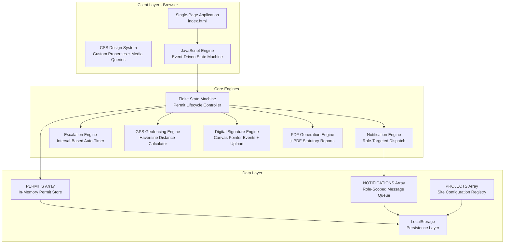
```mermaid
graph TB
    subgraph "Client Layer - Browser"
        UI["Single-Page Application<br/>index.html"]
        CSS["CSS Design System<br/>Custom Properties + Media Queries"]
        JS["JavaScript Engine<br/>Event-Driven State Machine"]
    end

    subgraph "Core Engines"
        SM["Finite State Machine<br/>Permit Lifecycle Controller"]
        NE["Notification Engine<br/>Role-Targeted Dispatch"]
        EE["Escalation Engine<br/>Interval-Based Auto-Timer"]
        GE["GPS Geofencing Engine<br/>Haversine Distance Calculator"]
        SE["Digital Signature Engine<br/>Canvas Pointer Events + Upload"]
        PE["PDF Generation Engine<br/>jsPDF Statutory Reports"]
    end

    subgraph "Data Layer"
        PERMITS["PERMITS Array<br/>In-Memory Permit Store"]
        NOTIFS["NOTIFICATIONS Array<br/>Role-Scoped Message Queue"]
        PROJECTS["PROJECTS Array<br/>Site Configuration Registry"]
        LS["LocalStorage<br/>Persistence Layer"]
    end

    UI --> JS
    JS --> SM
    SM --> NE
    SM --> EE
    SM --> GE
    SM --> SE
    SM --> PE
    SM --> PERMITS
    NE --> NOTIFS
    PERMITS --> LS
    NOTIFS --> LS
    PROJECTS --> LS
```

### 2.2 Architectural Pattern: Event-Driven Render Loop

The system follows a **unidirectional data flow** pattern inspired by Flux/Redux, adapted for a zero-build, single-file deployment:

```
User Action → State Mutation → saveState() → render() → DOM Update
                                    ↓
                            LocalStorage Sync
```

| Concept | Implementation |
|---|---|
| **State Store** | Global arrays: `PERMITS[]`, `NOTIFICATIONS[]`, `PROJECTS[]` |
| **Actions** | Functions like `submitPermit()`, `approvePermitStage()`, `raiseObservation()` |
| **Reducers** | State mutation + `saveState()` within each action function |
| **Views** | `buildDashboard()`, `buildRegisterTable()`, `viewDetail()`, `renderWizard()` |
| **Router** | `goTo(view)` toggles `.active` class on view containers |

### 2.3 Component Interaction Map

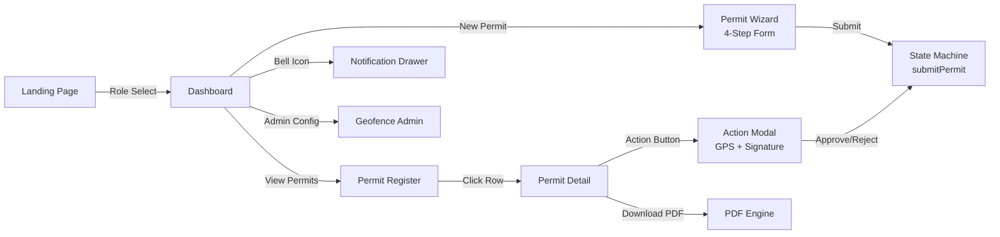
```mermaid
graph LR
    A["Landing Page"] -->|"Role Select"| B["Dashboard"]
    B -->|"New Permit"| C["Permit Wizard<br/>4-Step Form"]
    B -->|"View Permits"| D["Permit Register"]
    D -->|"Click Row"| E["Permit Detail"]
    E -->|"Action Button"| F["Action Modal<br/>GPS + Signature"]
    E -->|"Download PDF"| G["PDF Engine"]
    B -->|"Bell Icon"| H["Notification Drawer"]
    B -->|"Admin Config"| I["Geofence Admin"]
    C -->|"Submit"| J["State Machine<br/>submitPermit"]
    F -->|"Approve/Reject"| J
```

---

## 3. Technology Stack & Design Decisions

### 3.1 Zero-Build Architecture

The system intentionally uses a **zero-build, zero-framework** architecture:

| Decision | Rationale |
|---|---|
| **Single HTML file** | Deployable by dropping one file onto any web server, intranet, or even a USB drive at a construction site with limited connectivity |
| **No Node.js / npm** | Site IT teams don't need to maintain build pipelines; no `node_modules` vulnerabilities |
| **No React/Vue/Angular** | Eliminates framework lock-in; any developer can read and modify the codebase |
| **CSS Custom Properties** | Centralised design tokens (`--navy`, `--orange`, `--radius`) enable theming without preprocessors |
| **Vanilla JavaScript** | Full ES6+ feature use (arrow functions, template literals, destructuring) without transpilation |

### 3.2 External Dependencies

| Dependency | Version | Purpose | Fallback |
|---|---|---|---|
| **Font Awesome** | 6.5.1 (CDN) | Icon library for UI elements | System renders without icons; all labels remain functional |
| **jsPDF** | 2.5.1 (CDN) | Client-side PDF generation | PDF button hidden; all other features remain functional |

### 3.3 Browser Support

| Browser | Minimum Version | Notes |
|---|---|---|
| Chrome / Edge | 88+ | Full support including Pointer Events, CSS Grid, `dvh` units |
| Safari / iOS Safari | 15+ | Safe area insets, `-webkit-overflow-scrolling` |
| Firefox | 85+ | Full support |

---

## 4. Role-Based Access Control (RBAC)

### 4.1 Role Registry

The system implements **10 functional roles** aligned to construction site hierarchy. Per **DPDP Act 2023** compliance, roles are functional authorizations — personal names are entered dynamically only at the moment of digital signature.

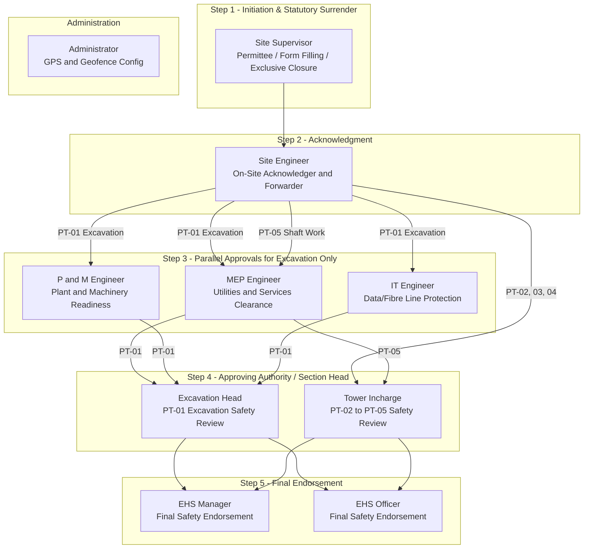
```mermaid
graph TB
    subgraph "Step 1 - Initiation & Statutory Surrender"
        SS["Site Supervisor<br/>Permittee / Form Filling / Exclusive Closure"]
    end
    subgraph "Step 2 - Acknowledgment"
        SiteEng["Site Engineer<br/>On-Site Acknowledger and Forwarder"]
    end
    subgraph "Step 3 - Parallel Approvals for Excavation Only"
        MEP["MEP Engineer<br/>Utilities and Services Clearance"]
        PM["P and M Engineer<br/>Plant and Machinery Readiness"]
        IT["IT Engineer<br/>Data/Fibre Line Protection"]
    end
    subgraph "Step 4 - Approving Authority / Section Head"
        EH["Excavation Head<br/>PT-01 Excavation Safety Review"]
        TI["Tower Incharge<br/>PT-02 to PT-05 Safety Review"]
    end
    subgraph "Step 5 - Final Endorsement"
        EM["EHS Manager<br/>Final Safety Endorsement"]
        EO["EHS Officer<br/>Final Safety Endorsement"]
    end
    subgraph "Administration"
        AD["Administrator<br/>GPS and Geofence Config"]
    end

    SS --> SiteEng
    SiteEng -->|PT-01 Excavation| MEP
    SiteEng -->|PT-01 Excavation| PM
    SiteEng -->|PT-01 Excavation| IT
    SiteEng -->|PT-05 Shaft Work| MEP
    SiteEng -->|PT-02, 03, 04| TI
    MEP -->|PT-01| EH
    PM -->|PT-01| EH
    IT -->|PT-01| EH
    MEP -->|PT-05| TI
    EH --> EM
    EH --> EO
    TI --> EM
    TI --> EO
```

### 4.2 Role Permission Matrix

| Capability | Site Supervisor | Site Engineer | MEP | P&M | IT | Excavation Head | Tower Incharge | EHS Manager | EHS Officer | Admin |
|:---|:---:|:---:|:---:|:---:|:---:|:---:|:---:|:---:|:---:|:---:|
| Create Permit | ✅ | — | — | — | — | — | — | — | — | — |
| Acknowledge & Forward | — | ✅ | — | — | — | — | — | — | — | — |
| Parallel Approval | — | — | ✅ | ✅ | ✅ | — | — | — | — | — |
| Section Head Approval | — | — | — | — | — | ✅ *(PT-01)* | ✅ *(PT-02–05)* | — | — | — |
| EHS Final Endorsement | — | — | — | — | — | — | — | ✅ | ✅ | — |
| Raise Observation | — | — | — | — | — | — | — | ✅ | ✅ | — |
| Respond to Observation | ✅ | — | — | — | — | — | — | — | — | — |
| Request Extension | ✅ | — | — | — | — | — | — | — | — | — |
| Close & Surrender | ✅ | — | — | — | — | — | — | — | — | — |
| Download PDF | — | — | — | — | — | — | — | ✅ | ✅ | — |
| Configure Geofence | — | — | — | — | — | — | — | — | — | ✅ |
| View Dashboard KPIs | ✅ | ✅ | ✅ | ✅ | ✅ | ✅ | ✅ | ✅ | ✅ | ✅ |
| View Notifications | ✅ | ✅ | ✅ | ✅ | ✅ | ✅ | ✅ | ✅ | ✅ | ✅ |

### 4.3 EHS Endorsement: First-Wins Gate

The EHS final endorsement stage implements a **first-wins** pattern:

- **Either** EHS Manager **or** EHS Officer can provide the final endorsement
- Whichever approves first activates the permit
- The other role receives a courtesy notification that their approval is no longer required
- This ensures operational continuity when one EHS authority is unavailable

---

## 5. Permit Types & Master Data

### 5.1 Active Permit Types

| Code | Permit Type | Form ID | Checklist Items | Topology | Gating Criteria & Special Safety Rules |
|:---|:---|:---|:---:|:---:|:---|
| **PT-01** | Excavation Work | `EHS_PTW_001` | 12 | 5-Stage (Parallel) | 3-discipline parallel clearance (MEP + P&M + IT); depth & slope ratio validation; drawing upload; 2-day re-trigger support. |
| **PT-02** | Hot Work | `EHS_PTW_002` | 20 | 4-Stage (Direct) | 1-hour continuous post-completion fire watch; qualified welder verification (ARPL/Contractor); flashback arresters; spark containment. |
| **PT-03** | Guard Rail / Floor Protection Removal | `EHS_PTW_003` | 9 | 4-Stage (Direct) | 100% tie-off mandatory; full-body harness; watcher assigned until re-fixed; mandatory physical restoration photo gate upon surrender. |
| **PT-04** | Confined Space Entry | `EHS_PTW_004` | 15 | 4-Stage (Direct) | 4-gas multi-detector test ($O_2, LEL, CO, H_2S$); forced air ventilation; physical inspection declaration; pre-task checklist doc upload. |
| **PT-05** | Shaft Work | `EHS_PTW_005` | 10 | 5-Stage (Sequential) | Dedicated MEP clearance step; scaffolding green tag verification; fall arresters; physical safety declaration across 39 floor levels. |

### 5.2 Approval Chain Topology per Permit Type

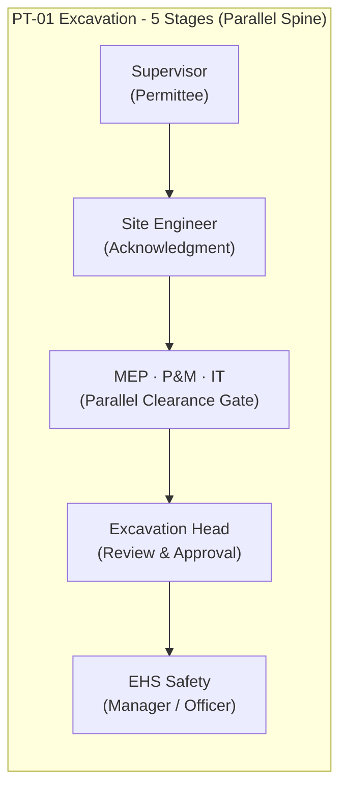
```mermaid
graph LR
    subgraph "PT-01 Excavation - 5 Stages (Parallel Spine)"
        E1["Supervisor<br/>(Permittee)"] --> E2["Site Engineer<br/>(Acknowledgment)"]
        E2 --> E3["MEP · P&M · IT<br/>(Parallel Clearance Gate)"]
        E3 --> E4["Excavation Head<br/>(Review & Approval)"]
        E4 --> E5["EHS Safety<br/>(Manager / Officer)"]
    end
```

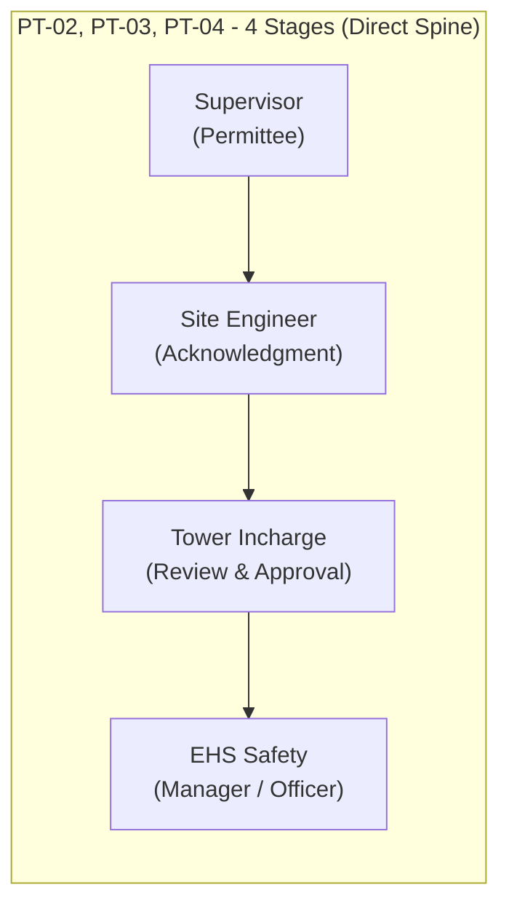
```mermaid
graph LR
    subgraph "PT-02, PT-03, PT-04 - 4 Stages (Direct Spine)"
        H1["Supervisor<br/>(Permittee)"] --> H2["Site Engineer<br/>(Acknowledgment)"]
        H2 --> H3["Tower Incharge<br/>(Review & Approval)"]
        H3 --> H4["EHS Safety<br/>(Manager / Officer)"]
    end
```

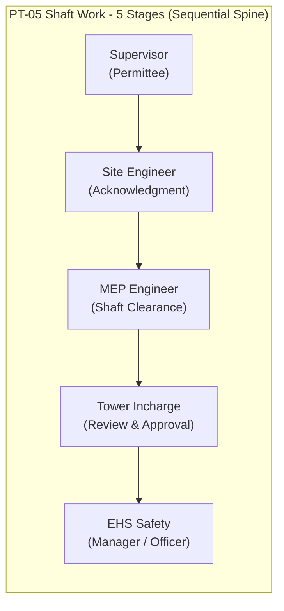
```mermaid
graph LR
    subgraph "PT-05 Shaft Work - 5 Stages (Sequential Spine)"
        S1["Supervisor<br/>(Permittee)"] --> S2["Site Engineer<br/>(Acknowledgment)"]
        S2 --> S3["MEP Engineer<br/>(Shaft Clearance)"]
        S3 --> S4["Tower Incharge<br/>(Review & Approval)"]
        S4 --> S5["EHS Safety<br/>(Manager / Officer)"]
    end
```

### 5.3 Confined Space Multi-Gas Detection Engine & Threshold Rules (PT-04)

Under OSHA 1910.146 and Indian Factory Act safety standards, atmospheric testing inside confined spaces must evaluate four hazardous gaseous constituents simultaneously before human entry is permitted. In `index.html`, the evaluation function `isGasReadingSafe(param, val)` enforces hard boundary rules:

$$\text{Gas Safety Condition} = \big(0 \le \text{LEL} < 10\%\big) \land \big(0 \le \text{H}_2\text{S} \le 5\text{ PPM}\big) \land \big(0 \le \text{CO} < 25\text{ PPM}\big) \land \big(19.5\% \le \text{O}_2 \le 21.0\%\big)$$

| Parameter | Identifier | Statutory Safe Range | Unit | Sensor Physics & Hazardous Thresholds | UI Validation Badge |
|:---|:---|:---:|:---:|:---|:---:|
| **Combustible Gas** | `combustible` | **$0 \le \text{Val} < 10.0$** | `% LEL` | Lower Explosive Limit. Values $\ge 10\%$ pose flash fire / explosion danger. Form validation blocks progression. | `LEL: < 10% LEL` |
| **Hydrogen Sulphide** | `h2s` | **$0 \le \text{Val} \le 5.0$** | `PPM` | Toxic sewer gas paralyzing olfactory nerves at $>10\text{ PPM}$. Lethal above $50\text{ PPM}$. Max permitted: $5\text{ PPM}$. | `H2S: 0–5 PPM` |
| **Carbon Monoxide** | `co` | **$0 \le \text{Val} < 25.0$** | `PPM` | Asphyxiant binding hemoglobin ($200\times$ affinity of $O_2$). OSHA TWA ceiling: $25\text{ PPM}$. Permitted: $<25\text{ PPM}$. | `CO: < 25 PPM` |
| **Oxygen Concentration** | `o2` | **$19.5 \le \text{Val} \le 21.0$** | `% vol` | Normal air is $20.9\%$. Deficient ($<19.5\%$) induces hypoxia; enriched ($>21.0\%$) drastically accelerates combustion. | `O2: 19.5–21.0%` |

### 5.4 Statutory Safety Checklist: PT-01 Excavation Work (12 Items)

> [!IMPORTANT]
> **Checklist Verification & Evidence Rules (Across All Permit Types)**:
> 1. **"NO" Response Rule**: For any checklist question answered **"NO"**, an explanation comment is **mandatory**; device GPS tagging and evidence photos are **NOT required** for individual checklist items.
> 2. **"N/A" Response Rule**: For any checklist question answered **"N/A"**, a comment is **NOT required**.
> 3. **Site Photo Gate**: The **Site Photo capture option** is locked and becomes activated **only after all checklist items have been completely filled in**.
> 4. **GPS Capture Point**: Geofencing device GPS coordinates are **not captured in initial steps**; GPS is captured exclusively when the **final permit form is submitted** (Step 4).

Form ID: `EHS_PTW_001` · Evaluated via `CHECKLIST_ITEMS`:

| # | Exact Statutory Inspection Item | Category | Required Response | Deviation Requirement | Construction Engineering Rationale |
|:---:|:---|:---|:---:|:---:|:---|
| **1** | Is Risk Assessment carried out based on work methodology, and hazard and control measures briefed to workers? | Risk Governance | **YES** / NA | Comment if NO | Ensures Hazard Identification & Risk Assessment (HIRA) and toolbox safety briefing were conducted prior to breaking ground. |
| **2** | Is necessary PPE and insulated hand tools provided for workers, in case of manual excavation? | PPE & Tool Safety | **YES** / NA | Comment if NO | Mandates dielectric rubber boots, heavy-duty gloves, and insulated picks/spades to eliminate electric shock hazards from buried cables. |
| **3** | Are arrangements of barricading materials for the excavation area, fixing signages & lights, ready? | Perimeter Protection | **YES** / NA | Comment if NO | Enforces rigid Class-A physical fencing, retroreflective danger warning signboards, and solar hazard blinkers around pit perimeter. |
| **4** | Are machinery used for excavation inspected and fit for use? | Equipment Safety | **YES** / NA | Comment if NO | Verifies third-party fitness certification, hydraulic leak check, reverse horns, and rollover protective structures (ROPS) on excavators. |
| **5** | Are arrangements for safe access to the excavation area (ladder / stair tower / ramp etc.) made ready? | Ingress & Egress | **YES** / NA | Comment if NO | Mandates anchored ladders extending at least 1.0m above landing or stable ramps spaced within 7.5m lateral travel distance. |
| **6** | Are materials stacked away from the excavation pit? | Surcharge Loading | **YES** / NA | Comment if NO | Prevents trench lip surcharge collapse; spoils, rocks, and equipment must maintain a minimum 1.5m buffer from the edge. |
| **7** | Are any overhead services identified, and precautionary measures taken? | Overhead Hazards | **YES** / NA | Comment if NO | Prevents boom or mast strikes against live overhead high-tension electrical cables or overhead crane gantry lines. |
| **8** | Is a separate pedestrian pathway and vehicle movement at ramp provided? | Traffic Management | **YES** / NA | Comment if NO | Eliminates struck-by collisions on site ramps by segregating pedestrian walkways with physical barriers from dumpers/JCBs. |
| **9** | Are vehicle movements near the excavation area diverted? | Vibration & Collision | **YES** / NA | Comment if NO | Re-routes heavy haulage traffic to prevent dynamic shock vibration from destabilizing unreinforced excavation side slopes. |
| **10** | Is the excavator operator experienced and trained? | Competency | **YES** / NA | Comment if NO | Validates valid commercial heavy machinery operator's driving license, visual acuity certificate, and on-site competency assessment. |
| **11** | Are materials available for shoring to prevent side collapse / is slope maintained at site? | Slope Stability | **YES** / NA | Comment if NO | Verifies soil benching angle (e.g. 1:1.5) or presence of hydraulic shores, trench boxes, or sheet piles according to geotechnical soil class. |
| **12** | Is the excavator swing area demarcated and barricaded? | Crush Hazard | **YES** / NA | Comment if NO | Demarcates the 360° rotational blind spot counterweight radius to prevent pinned-against and pinch-point crushing injuries. |

### 5.5 Statutory Safety Checklist: PT-02 Hot Work (20 Items)

Form ID: `EHS_PTW_002` · Evaluated via `HOTWORK_CHECKLIST_ITEMS`:

| # | Exact Statutory Inspection Item | Category | Required Response | Deviation Requirement | Fire Prevention & Workmanship Rule |
|:---:|:---|:---|:---:|:---:|:---|
| **1** | Are the engaged workers, fully qualified and trained and aware of Risk involved (HIRA)? | Competency | **YES** / NA | Comment if NO | Validates welder trade certification, welder ID card, and hot work safety briefing. |
| **2** | Is Electrode holder insulated and in good condition? | Electrical Safety | **YES** / NA | Comment if NO | Eliminates stray arc flashes and direct electrocution from cracked or exposed copper holders. |
| **3** | Are work areas cleared of flammable / Combustible materials? | Fire Prevention | **YES** / NA | Comment if NO | Mandates clearing all combustibles within an 11-metre (35-foot) radius around the spark hot zone. |
| **4** | Are Grinder / Chiseling machines free from defects, equipped with Deadman / Push Button switch & safety guard? | Tool Guarding | **YES** / NA | Comment if NO | Enforces mandatory factory wheel guards and automatic cut-off deadman triggers to prevent runaway discs. |
| **5** | Are sufficient and suitable Fire Extinguishers Available? | Fire Response | **YES** / NA | Comment if NO | Requires dedicated, inspected ABC dry chemical powder or $CO_2$ extinguishers adjacent to work point. |
| **6** | Are abrasive wheels being with required standard and compliance? | Wheel Integrity | **YES** / NA | Comment if NO | Verifies ISI / EN 12413 certification markings, expiry dates, and absence of chipping or cracks. |
| **7** | Has fire retardant cloth / metal sheet been placed to prevent sparks from causing fire? | Spark Containment | **YES** / NA | Comment if NO | Mandates certified vermiculite/fiberglass fire blankets to catch dripping molten slag and bouncing sparks. |
| **8** | Is Machine spindle speed less than the maximum speed of the wheel / Disc? | Mechanical Limits | **YES** / NA | Comment if NO | Ensures grinder RPM does not exceed rated disc burst speed, preventing lethal disc shattering. |
| **9** | Are Flash back arresters installed at both regulator & torch end? | Oxy-Fuel Safety | **YES** / NA | Comment if NO | Dual-end sintered flame arresters prevent explosive flashback propagation into fuel gas cylinders. |
| **10** | Is abrasive wheel flange (front or back) of right size and fitting? | Mechanical Mounting | **YES** / NA | Comment if NO | Proper matching recessed flanges prevent uneven torsional stress and catastrophic wheel fracture. |
| **11** | Are Gas cylinder and fittings, free from oil, grease, leakage and legibly marked and kept on trolley? | Gas Cylinder Safety | **YES** / NA | Comment if NO | Hydrocarbons in contact with high-pressure oxygen cause spontaneous detonation; trolley ensures transit stability. |
| **12** | Is working platform made for the use of grinders, not on ladders? | Working Platform | **YES** / NA | Comment if NO | Forbids aggressive two-handed grinding operations from portable ladders due to reactive kickback torque. |
| **13** | Is Electrical Supply given through RCCB & Return provided from Job to the welding machine insulated? | Electrical Grounding | **YES** / NA | Comment if NO | 30mA residual current circuit breakers prevent electrocution; insulated return prevents stray current fire. |
| **14** | Is Fire extinguisher placed near the activities? | Immediate Readiness | **YES** / NA | Comment if NO | Secondary extinguisher stationed within arm's reach of the immediate hot work point. |
| **15** | Are both cylinders kept upright vertically on trolley? | Cylinder Storage | **YES** / NA | Comment if NO | Prevents liquid acetone withdrawal in dissolved acetylene cylinders; chain restraint prevents toppling. |
| **16** | Is required & appropriate PPE provided? | Personal Protection | **YES** / NA | Comment if NO | Leather apron, split-leather gauntlet welding gloves, auto-darkening shade-11 face shield, and spats. |
| **17** | Is welding machine / equipment tested and free from defects (cables, holder)? | Equipment Health | **YES** / NA | Comment if NO | No cable joints within 3m of electrode holder; pristine double insulation throughout cable runs. |
| **18** | Is supervisor available all time & Fire Watcher available? | Active Surveillance | **YES** / NA | Comment if NO | **1-Hour Fire Watch Rule:** Dedicated fire watcher posted during work and for 60 minutes post-shutdown. |
| **19** | Are rated lugs used for connecting welding cables? | Electrical Terminals | **YES** / NA | Comment if NO | Heavy-duty crimped cable lugs eliminate loose frayed wire heating, sparking, and terminal burnout. |
| **20** | Any other precautions? | Site Specifics | **YES** / NA | Comment if NO | Captures custom site hazards, adjacent flammable piping, or weather restrictions (e.g. rain/wind). |

#### Hot Work Description Registry (`HOTWORK_DESCRIPTIONS`)
1. `Welding`: Shielded Metal Arc Welding (SMAW), Gas Metal Arc Welding (GMAW/MIG), Gas Tungsten Arc Welding (GTAW/TIG).
2. `Gas Cutting`: Oxy-Acetylene / Oxy-LPG thermal cutting torches.
3. `Soldering`: High-temperature copper piping and electrical brazing.
4. `Abrasive wheel cutting`: High-speed cutoff saw and angle grinder steel profiling.

### 5.6 Statutory Safety Checklist: PT-03 Guard Rail & Floor Protection Removal (9 Items)

Form ID: `EHS_PTW_003` · Evaluated via `GUARDRAIL_CHECKLIST_ITEMS`:

| # | Exact Statutory Inspection Item | Category | Required Response | Deviation Requirement | Fall Prevention & Statutory Protection Rule |
|:---:|:---|:---|:---:|:---:|:---|
| **1** | Are workers aware of risk involved and precautions required (HIRA, SWM available)? | Risk Briefing | **YES** / NA | Comment if NO | Verifies Safe Work Method statement was briefed to crew before unbolting edge protections. |
| **2** | Are Fall protection gears in place (Lifeline, Eye / Ring bolt, Full body Harness, catch net etc)? | Fall Protection | **YES** / NA | Comment if NO | **100% Tie-Off Rule:** Twin-lanyard full body harnesses clipped to overhead certified lifelines. |
| **3** | Are Openings properly covered? (Above, Below, Workplace) | Multi-Level Safety | **YES** / NA | Comment if NO | Verifies floor cutouts on adjacent elevations are protected to prevent falling worker or tool impact. |
| **4** | Are Workers provided with required Personal Protective Equipment for the activity? | PPE | **YES** / NA | Comment if NO | Chin-strap safety helmets, anti-slip footwear, safety eyewear, and cut-resistant gloves. |
| **5** | Whether sufficient lighting available? | Illumination | **YES** / NA | Comment if NO | Minimum 150 Lux illumination at edge zone to prevent disorientation and missteps. |
| **6** | Is Access to work location clear and safe? | Housekeeping | **YES** / NA | Comment if NO | Clean, trip-free passage free of cables, debris, and reinforcing steel protrusions. |
| **7** | Are all Power Tools and Hand tools checked, hand strings provided and in good condition? | Tool Lanyard | **YES** / NA | Comment if NO | Tool tethers / wrist lanyards mandatory to prevent dropped objects falling from heights. |
| **8** | Are Barricades and caution sign provided on removal of guard rail / Shaft gate / Floor opening? | Warning Signage | **YES** / NA | Comment if NO | High-visibility warning barriers placed 2.0m back from opening with prominent danger notices. |
| **9** | Is Minimum one watcher provided in the area till guard rail / gates re-fixed? | Dedicated Watcher | **YES** / NA | Comment if NO | **Continuous Watcher Rule:** Assigned safety spotter stationed permanently until physical restoration. |

#### Guard Rail Removal Activities Registry (`GUARDRAIL_ACTIVITIES`)
1. `Removal of Perimeter Guard Rails` (Exterior slab edge protection)
2. `Removal of Floor Opening / Cutout Covers` (Plumbing & electrical service penetrations)
3. `Removal of Shaft Gates / Barriers` (Lift & MEP riser enclosures)
4. `Removal of Edge Protection / Handrails` (Ramps & parapets)
5. `Removal of Slab Penetration Covers` (Post-tensioning stressing pockets)
6. `Removal of Staircase Handrails / Guardrails` (Staircase void protection)
7. `Removal of Scaffolding Mid-rails / Toe-boards` (Scaffold access bays)
8. `Others (Specify)` (Custom temporary safety barrier removal)

### 5.7 Statutory Safety Checklist: PT-04 Confined Space Entry (15 Items)

Form ID: `EHS_PTW_004` · Evaluated via `CONFINED_CHECKLIST_ITEMS`:

| # | Exact Statutory Inspection Item | Category | Required Response | Deviation Requirement | Confined Space Life-Safety Protocol |
|:---:|:---|:---|:---:|:---:|:---|
| **1** | Are approved Method Statement and Risk Assessment available and supervisors and workers are aware of the risk involved and control measures? | Safe System of Work | **YES** / NA | Comment if NO | Approved method statement detailing isolation, purging, and rescue procedures. |
| **2** | Is area cleared of all hazards & hazardous substances and checked with multi gas detector? | Environmental Clearance | **YES** / NA | Comment if NO | Sludge removed, hazardous chemicals drained, and initial multi-gas atmospheric survey passed. |
| **3** | Are workers assessed for aptitude and fitness for the specific task? | Medical Fitness | **YES** / NA | Comment if NO | Medical screening for claustrophobia, respiratory fitness, and physical endurance. |
| **4** | Are workers equipped with required PPE as per MSDS and Risk Assessment? | PPE & RPE | **YES** / NA | Comment if NO | Impermeable chemical suits, nitrile/neoprene gloves, and certified breathing apparatus if needed. |
| **5** | Are site engineer or supervisor trained for confined space activities and rescue procedure? | Emergency Competency | **YES** / NA | Comment if NO | Certified confined space rescue training and familiarity with winch extraction operations. |
| **6** | Are access and working platforms available / provided? | Safe Access | **YES** / NA | Comment if NO | Securely lashed aluminum/fiberglass ladders or certified suspended entry cradle. |
| **7** | Is control of entry to confined space in place, and watcher provided for the entire duration of work? | Entry Attendant | **YES** / NA | Comment if NO | **Standby Attendant Rule:** Outside entry watcher logs entrant count and maintains continuous contact. |
| **8** | Is adequate communication system in place? | Communication | **YES** / NA | Comment if NO | Intrinsically safe two-way radios, horn signals, or hardwired communication lifelines. |
| **9** | Are rescue and first aid arrangements in place and adequate? | Rescue Readiness | **YES** / NA | Comment if NO | Certified tripod recovery winch, full-body retrieval harness, and oxygen resuscitator on standby. |
| **10** | Are precautions as per MSDS of hazardous substances are in place? | Toxic Chemical Defense | **YES** / NA | Comment if NO | Chemical neutralizers, eye wash stations, and barrier creams aligned with MSDS guidelines. |
| **11** | Are Sufficient task lights / 24V hand lamps provided? | Low-Voltage Lighting | **YES** / NA | Comment if NO | **Low Voltage Rule:** Strict 24V SELV or flameproof battery lights to eliminate electrocution in damp sumps. |
| **12** | Is Adequate ventilation and exhaust fans provided? | Forced Ventilation | **YES** / NA | Comment if NO | Continuous mechanical positive-pressure air blowers delivering fresh outdoor air to bottom of space. |
| **13** | Is Hot work permit followed for all hot works and control measure in place. | Concurrent PTW | **YES** / NA | Comment if NO | Cross-reference: If cutting/welding inside space, companion PT-02 permit is mandatory. |
| **14** | Confirmed gas within limits (Combustible: %LEL, H2S: PPM, CO: PPM) and adequacy of O2 (O2: %) take from approved values. | Atmospheric Verification | **YES** / NA | Comment if NO | Mathematical validation against `CONFINED_GAS_THRESHOLDS` documented in §5.3. |
| **15** | Is Confined space checklist attached. | Document Evidence | **YES** / NA | Comment if NO | Mandatory physical pre-task safety checklist uploaded to permit record. |

#### Confined Space Entry Activities Registry (`CONFINED_ACTIVITIES`)
1. `Tank Cleaning` (Underground domestic water tanks, fire tanks)
2. `Sump Inspection / Repair` (Stormwater and raw water sumps)
3. `STP / WTP Maintenance` (Sewage Treatment Plant & Water Treatment Plant aeration chambers)
4. `Pipe / Cable Duct Entry` (Underground utility trenches and distribution galleries)
5. `Underground Drainage / Culvert Work` (Municipal storm drains and box culverts)
6. `Sump Waterproofing` (Polyurethane / crystalline waterproofing application in enclosed pits)
7. `Others` (Custom enclosed structural volume entry)

### 5.8 Statutory Safety Checklist: PT-05 Shaft Work (10 Items)

Form ID: `EHS_PTW_005` · Evaluated via `SHAFT_CHECKLIST_ITEMS`:

| # | Exact Statutory Inspection Item | Category | Required Response | Deviation Requirement | Vertical Void Safety & Mechanical Clearance Rule |
|:---:|:---|:---|:---:|:---:|:---|
| **1** | Is Method statement and Risk Assessment available for the Task? | Procedure | **YES** / NA | Comment if NO | Engineering procedure for vertical hoisting, platform loading, and floor sealing. |
| **2** | Are workers aware of risk involved, precaution and control measures required and training given? | Training | **YES** / NA | Comment if NO | Working-at-heights certified training and drop hazard prevention orientation. |
| **3** | Is Overhead protection provided if required? | Overhead Defense | **YES** / NA | Comment if NO | Heavy-duty wooden/steel impact-absorbing canopy protecting workers from dropped objects above. |
| **4** | Are Workers provided with safety harness and all other required job specific Personal Protective equipments for the activity? | Fall Arrest | **YES** / NA | Comment if NO | Double-lanyard full body harness with energy absorber tied off to independent vertical lifeline. |
| **5** | Is access to shaft clear and safe? | Shaft Access | **YES** / NA | Comment if NO | Clear landing access gates; non-slip floor threshold free of oil or loose debris. |
| **6** | Is working platform provided and Scaff tag placed (planks secured, guard rails and toe boards for fall protection as per standard) / RSP Checked and fall protection in place with fall arrestor? | Platform Certification | **YES** / NA | Comment if NO | **Scaff-Tag Rule:** Valid green inspection tag affixed; heavy planks wired down with zero gaps; toe boards fitted. |
| **7** | Are Electrical tools and hand tools checked prior to use in shaft and green tag available? | Portable Appliance Testing | **YES** / NA | Comment if NO | PAT green inspection tag affixed; insulated industrial cables free of taped joints. |
| **8** | Are Light and ventilation as per requirement for activity ensured? | Environmental Quality | **YES** / NA | Comment if NO | High-lumen festoon shaft lighting and forced axial draft fans ensuring fresh air exchange. |
| **9** | Is Supervisor available full-time to monitor the activity? | Supervision | **YES** / NA | Comment if NO | Full-time on-deck supervisor monitoring workers and coordinating floor access gates. |
| **10** | Is Hot work permit obtained separately for all hot work? | Concurrent PTW | **YES** / NA | Comment if NO | Cross-reference: Separate PT-02 permit required for welding or torch cutting inside vertical shaft. |

#### Shaft Floor Registry (`SHAFT_FLOORS` - 39 Distinct Elevations)
The system models tall-structure verticality through 39 discrete structural floor selections:
* **Substructure (7 Levels):** `Basement 3 (B3)`, `Basement 2 (B2)`, `Basement 1 (B1)`, `Ground Floor (GF)`, `Podium Level 1 (P1)`, `Podium Level 2 (P2)`, `Podium Level 3 (P3)`.
* **Superstructure (31 Levels):** `Floor 1` through `Floor 35`.
* **Roof Level (1 Level):** `Terrace / Roof Level`.

### 5.9 Enterprise Project Master Data & Worksite Registry (`PROJECTS`)

In `index.html`, enterprise project sites are registered with exact coordinates, operational perimeters, tower configurations, and administrative lock statuses:

| Project ID | Project Name | Structural Tower / Block Configuration | Site Center GPS ($Lat, Lng$) | Radius ($r$) | Administrative Status & Lock Mechanism |
|:---|:---|:---|:---:|:---:|:---|
| **`PRJ-AGR`** | **Auro Grand Residency** | `Tower A`, `Tower B`, `Tower C`, `Tower D` | `17.4239° N, 78.4738° E` (Gachibowli, Hyderabad) | $150\text{ m}$ | **Configured & Active:** Forms fully unlocked. Configured on-site via device GPS. |
| **`PRJ-ABP`** | **Auro Business Park** | `Block 1`, `Block 2`, `Block 3` | `17.4483° N, 78.3915° E` (Kondapur, Hyderabad) | $200\text{ m}$ | **Configured & Active:** Commercial campus perimeter calibrated to $200\text{ m}$. Forms unlocked. |
| **`PRJ-ART`** | **Auro Riverside Towers** | `Tower North`, `Tower South` | `17.3850° N, 78.4867° E` (Financial District, Hyderabad) | $100\text{ m}$ | **⚠️ Unconfigured (Default):** Demonstrates administrative security gate. **Permit creation is locked** until Admin sets coordinates. |

### 5.10 Master Constants & Configuration Registries

* **Atmospheric & Weather Options (`WEATHER_OPTIONS`):** `Sunny`, `Partly Cloudy`, `Overcast`, `Windy`, `Light Rain`, `Hazy`.
* **Excavation Equipment Master Registry (`EQUIPMENT_OPTIONS`):** `Excavator`, `JCB`, `Hydra`, `Poclain`, `Manual Excavation`, `Crane`, `Others`.
* **Basement & Podium Structural Sub-Registry (`BASEMENT_PODIUM_OPTIONS`):** `Basement 3 (B3)`, `Basement 2 (B2)`, `Basement 1 (B1)`, `Ground Floor (GF)`, `Podium Level 1 (P1)`, `Podium Level 2 (P2)`, `Podium Level 3 (P3)`.
* **Working Hours Bounds:**
  - Standard work window: `OFFICE_START_MIN = 510` ($08:30\text{ IST}$) to `OFFICE_END_MIN = 1170` ($19:30\text{ IST}$).
  - Start time latest scheduling cutoff: `START_LATEST_MIN = 1110` ($18:30\text{ IST}$).
  - Extension request operational cutoff: `EXT_REQUEST_CUTOFF_MIN = 1110` ($18:30\text{ IST}$).
  - Maximum extended validity ceiling: `EXT_MAX_CEILING_MIN = 1230` ($20:30\text{ IST}$).
  - Time increment step: `EXTENSION_STEP_MIN = 10` minutes.
---

---

## 6. Core Workflow: Permit Lifecycle State Machine

The system enforces a **mathematically strict Finite State Machine (FSM)**. Every state transition requires specific role authorizations, validation checks, and immutable timestamped audit logging.

### 6.1 Complete State Transition Diagram

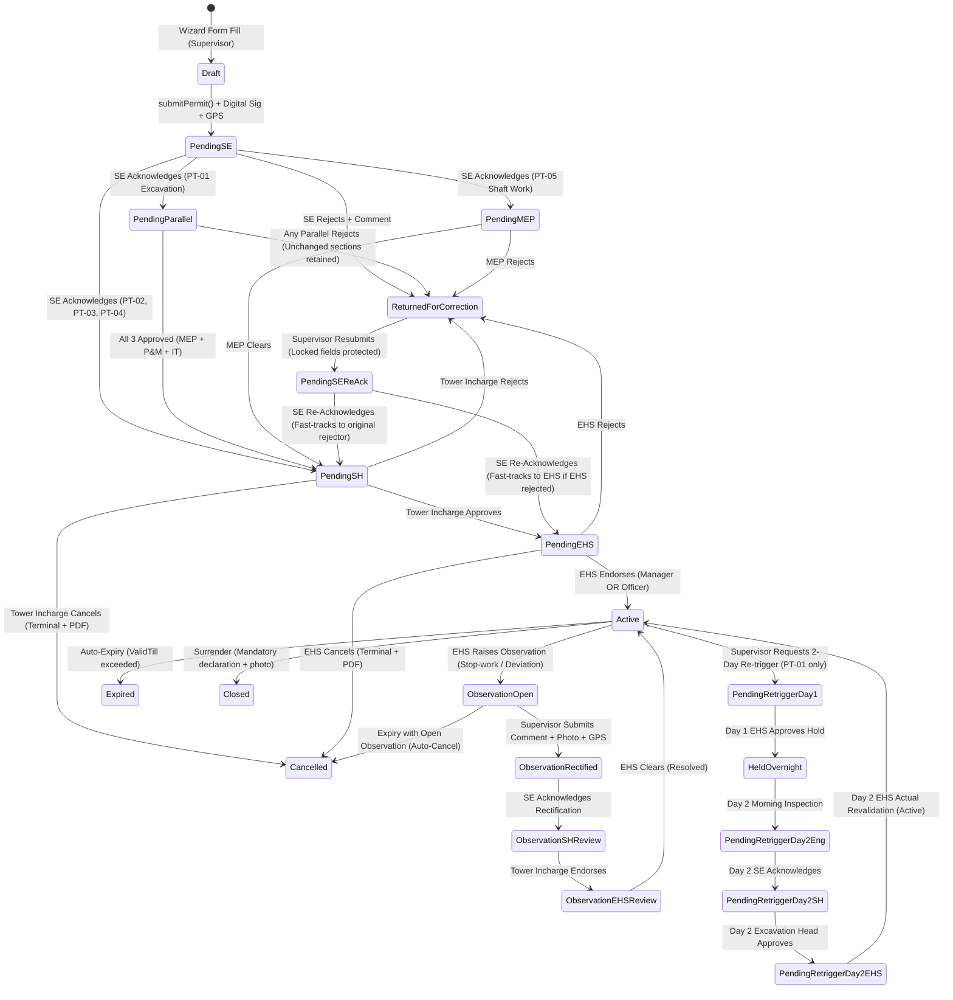
```mermaid
stateDiagram-v2
    [*] --> Draft : Wizard Form Fill (Supervisor)
    Draft --> PendingSE : submitPermit() + Digital Sig + GPS
    
    %% Site Engineer Stage
    PendingSE --> ReturnedForCorrection : SE Rejects + Comment
    PendingSE --> PendingParallel : SE Acknowledges (PT-01 Excavation)
    PendingSE --> PendingMEP : SE Acknowledges (PT-05 Shaft Work)
    PendingSE --> PendingSH : SE Acknowledges (PT-02, PT-03, PT-04)

    %% Parallel Gate (PT-01)
    PendingParallel --> PendingSH : All 3 Approved (MEP + P&M + IT)
    PendingParallel --> ReturnedForCorrection : Any Parallel Rejects (Unchanged sections retained)

    %% Dedicated MEP Gate (PT-05)
    PendingMEP --> PendingSH : MEP Clears
    PendingMEP --> ReturnedForCorrection : MEP Rejects

    %% Section Head / Tower Incharge Stage
    PendingSH --> PendingEHS : Tower Incharge Approves
    PendingSH --> ReturnedForCorrection : Tower Incharge Rejects
    PendingSH --> Cancelled : Tower Incharge Cancels (Terminal + PDF)

    %% EHS Stage (Single Approver Gate)
    PendingEHS --> Active : EHS Endorses (Manager OR Officer)
    PendingEHS --> ReturnedForCorrection : EHS Rejects
    PendingEHS --> Cancelled : EHS Cancels (Terminal + PDF)

    %% Correction Loop
    ReturnedForCorrection --> PendingSEReAck : Supervisor Resubmits (Locked fields protected)
    PendingSEReAck --> PendingSH : SE Re-Acknowledges (Fast-tracks to original rejector)
    PendingSEReAck --> PendingEHS : SE Re-Acknowledges (Fast-tracks to EHS if EHS rejected)

    %% Active State & Post-Activation Workflows
    Active --> ObservationOpen : EHS Raises Observation (Stop-work / Deviation)
    Active --> Expired : Auto-Expiry (ValidTill exceeded)
    Active --> Closed : Surrender (Mandatory declaration + photo)
    Active --> PendingRetriggerDay1 : Supervisor Requests 2-Day Re-trigger (PT-01 only)

    %% Observation Sub-Lifecycle
    ObservationOpen --> ObservationRectified : Supervisor Submits Comment + Photo + GPS
    ObservationRectified --> ObservationSHReview : SE Acknowledges Rectification
    ObservationSHReview --> ObservationEHSReview : Tower Incharge Endorses
    ObservationEHSReview --> Active : EHS Clears (Resolved)
    ObservationOpen --> Cancelled : Expiry with Open Observation (Auto-Cancel)

    %% Re-trigger Sub-Lifecycle (Excavation)
    PendingRetriggerDay1 --> HeldOvernight : Day 1 EHS Approves Hold
    HeldOvernight --> PendingRetriggerDay2Eng : Day 2 Morning Inspection
    PendingRetriggerDay2Eng --> PendingRetriggerDay2SH : Day 2 SE Acknowledges
    PendingRetriggerDay2SH --> PendingRetriggerDay2EHS : Day 2 Excavation Head Approves
    PendingRetriggerDay2EHS --> Active : Day 2 EHS Actual Revalidation (Active)
```

### 6.2 Master Operational State Dictionary (All 22 States)

The table below enumerates all states implemented across the core permit lifecycle and sub-workflows in `index.html`:

| State Name | Scope / Module | Authorized Roles | Invalidation / Reversal Impact | Description |
|:---|:---|:---|:---|:---|
| `Draft` | Wizard Form | Site Supervisor | Form can be edited or deleted | Initial in-memory draft before formal submission |
| `Pending Site Engineer Acknowledgment` | Initial Spine | Site Engineer | Rejection returns to Draft with reason | On-site physical conditions verification stage (no closure option) |
| `Pending Parallel Approval` | PT-01 Excavation | MEP, P&M, IT Engineers | Rejection returns form; unchanged approvals persist | 3-way concurrent gate; all 3 disciplines must clear |
| `Pending MEP Clearance` | PT-05 Shaft Work | MEP Engineer | Rejection returns to Supervisor | Single domain clearance for duct risers & piping |
| `Pending Section Head` | Approving Authority | Excavation Head (`excavation-head` for PT-01) / Tower Incharge (`hw-section-head` for PT-02–05) | Can Approve, Reject, or Cancel | Holistic site safety & contractor coordination review |
| `Pending EHS Approval` | Final Endorsement | EHS Manager, EHS Officer | First-wins gate; whichever acts first locks the other | Statutory safety verification of photos, gas logs & checklists |
| `Active` | Operational Site | All Stakeholders | Normal work underway; validity countdown active | Work authorized; permits can be extended, closed, or observed |
| `Active – Observation Open` | Safety Deviation | EHS (Owner) | **Blocks Extension and Closure requests** | Work paused due to minor or major safety non-compliance |
| `Observation Pending Site Engineer Acknowledgment` | Observation Sub-flow | Site Engineer | Rejection loops back to Supervisor | Supervisor submitted evidence; Engineer verifying on-site |
| `Observation Pending Section Head Review` | Observation Sub-flow | Excavation Head (PT-01) / Tower Incharge (PT-02–05) | Can endorse or reject rectification | Approving authority verifies rectification efficacy |
| `Observation Pending EHS Clearance` | Observation Sub-flow | EHS Manager / Officer | Can clear (to `Active`) or cancel (to `Cancelled`) | Final safety clearance of physical rectification evidence |
| `Pending Site Engineer` | Extension Sub-flow | Site Engineer | Can approve or cancel | Extension request on-site physical validity verification |
| `Pending Section Head` | Extension Sub-flow | Excavation Head (PT-01) / Tower Incharge (PT-02–05) | Can approve or cancel | Approving authority review of extended hours request |
| `Pending EHS Approval` | Extension Sub-flow | EHS Manager / Officer | Can approve (extends `validTill`) or cancel | Final statutory extension authorization (capped at 20:30 IST) |
| `Pending Re-trigger EHS (Day 1)` | PT-01 Re-trigger | EHS Manager / Officer | Can approve hold, reject, or cancel | Supervisor requested revalidation for continued excavation |
| `Held Overnight` | PT-01 Re-trigger | System Engine | Preserves all master data, checklists & drawings | Permit held overnight; work locked until Day 2 morning checks |
| `Pending Re-trigger Site Engineer Acknowledgment (Day 2)` | PT-01 Re-trigger | Site Engineer | Morning physical inspection of trench stability | Day 2 morning inspection for soil movement or water seepage |
| `Pending Re-trigger Section Head (Day 2)` | PT-01 Re-trigger | Excavation Head (`excavation-head`) | Review morning safety report & site readiness | Holistic Day 2 work authorization review for excavation |
| `Pending Re-trigger EHS Final (Day 2)` | PT-01 Re-trigger | EHS Manager / Officer | Revalidation restores status directly to `Active` | Final revalidation enabling trench entry for Day 2 |
| `Returned for Correction` | Rejection Loop | Site Supervisor | Unchanged sections remain approved (Stale-Approval Rule) | Approver rejected permit; editable fields unlocked for revision |
| `Expired` | Time Enforcement | System Engine / SS | Requires immediate closure & surrender | Permit validity timestamp (`validTill`) exceeded |
| `Closed` | Terminal Archive | Site Supervisor (Exclusive Closure) | Permanent record; triggers Statutory PDF generation | Work complete, site surrendered, mandatory restoration declarations & photos attached |
| `Cancelled` | Emergency Stop | Any Authority / System | Permanent terminal deadlock; cannot be resubmitted | Permittee must raise brand new permit from scratch |

---

## 7. Approval Chain Architecture

The approval chain is governed by an event-driven state evaluator that dynamically inspects the permit's `approvals` object, enforces role permissions, and computes the active stage.

### 7.1 Chain Data Schema per Permit Type (`newChain`)

Directly implemented in `index.html` (`lines 5363–5378`), each permit instantiates an approval object with pending state descriptors:

```javascript
// Pending Stage Generator
const pend = () => ({ 
    status: 'pending', 
    by: null, 
    at: null, 
    gps: null, 
    comment: null, 
    sig: null 
});

// PT-01 Excavation: 3-Way Parallel Gate + Sequential Spine
{
    kind: 'exc',
    mep: pend(),
    pm: pend(),
    it: pend(),
    sectionHead: pend(),
    ehsManager: pend(),
    ehsOfficer: pend()
}

// PT-02 Hot Work / PT-03 Guard Rail / PT-04 Confined Space: Sequential Spine
{
    kind: 'hotwork' | 'guardrail' | 'confined',
    sectionHead: pend(),
    ehsManager: pend(),
    ehsOfficer: pend()
}

// PT-05 Shaft Work: Dedicated MEP Clearance + Sequential Spine
{
    kind: 'shaft',
    mep: pend(),
    sectionHead: pend(),
    ehsManager: pend(),
    ehsOfficer: pend()
}
```

### 7.2 Stage Resolution Algorithm (`chainStage`)

Implemented in `index.html` (`lines 5379–5434`), `chainStage(chain)` computes the active stage via a prioritized decision tree:

```javascript
function chainStage(chain) {
    if (!chain) return 'complete';

    // Hot Work, Guard Rail, Confined Space
    if (chain.kind === 'guardrail' || chain.kind === 'hotwork' || chain.kind === 'confined') {
        if (chain.sectionHead && ['rejected', 'cancelled'].includes(chain.sectionHead.status)) return 'rejected-sectionhead';
        if ((chain.ehsManager?.status === 'cancelled') || (chain.ehsOfficer?.status === 'cancelled')) return 'cancelled-ehs';
        if ((chain.ehsManager?.status === 'rejected') || (chain.ehsOfficer?.status === 'rejected')) return 'rejected-ehs';
        if (!chain.sectionHead || chain.sectionHead.status !== 'approved') return 'section-head';
        if ((!chain.ehsManager || chain.ehsManager.status !== 'approved') && 
            (!chain.ehsOfficer || chain.ehsOfficer.status !== 'approved')) return 'ehs';
        return 'complete';
    }

    // Shaft Work (Requires dedicated MEP clearance before Tower Incharge)
    if (chain.kind === 'shaft') {
        if (chain.mep?.status === 'cancelled') return 'cancelled-mep';
        if (chain.mep?.status === 'rejected') return 'rejected-mep';
        if (chain.sectionHead && ['rejected', 'cancelled'].includes(chain.sectionHead.status)) return 'rejected-sectionhead';
        if ((chain.ehsManager?.status === 'cancelled') || (chain.ehsOfficer?.status === 'cancelled')) return 'cancelled-ehs';
        if ((chain.ehsManager?.status === 'rejected') || (chain.ehsOfficer?.status === 'rejected')) return 'rejected-ehs';
        if (!chain.mep || chain.mep.status !== 'approved') return 'mep';
        if (!chain.sectionHead || chain.sectionHead.status !== 'approved') return 'section-head';
        if ((!chain.ehsManager || chain.ehsManager.status !== 'approved') && 
            (!chain.ehsOfficer || chain.ehsOfficer.status !== 'approved')) return 'ehs';
        return 'complete';
    }

    // Excavation (3-Way Concurrent Parallel Gate: MEP, P&M, IT)
    if (chain.mep.status === 'rejected' || chain.pm.status === 'rejected' || chain.it.status === 'rejected') return 'rejected-parallel';
    if (chain.sectionHead.status === 'rejected' || chain.sectionHead.status === 'cancelled') return 'rejected-sectionhead';
    if (['rejected', 'cancelled'].includes(chain.ehsManager.status) || 
        ['rejected', 'cancelled'].includes(chain.ehsOfficer.status)) return 'rejected-ehs';
    if (chain.mep.status !== 'approved' || chain.pm.status !== 'approved' || chain.it.status !== 'approved') return 'parallel';
    if (chain.sectionHead.status !== 'approved') return 'section-head';
    if (chain.ehsManager.status !== 'approved' && chain.ehsOfficer.status !== 'approved') return 'ehs';
    return 'complete';
}
```

### 7.3 Role Authorization Evaluator (`roleCanActOnChain`)

Implemented in `index.html` (`lines 5435–5475`), validates whether the currently logged-in user role is strictly authorized to take action on the active stage:

```javascript
function roleCanActOnChain(chain, roleKey) {
    if (!chain) return false;
    const stage = chainStage(chain);

    if (chain.kind === 'guardrail' || chain.kind === 'hotwork' || chain.kind === 'confined') {
        if (stage === 'section-head') return (roleKey === 'hw-section-head' || roleKey === 'section-head') && chain.sectionHead?.status === 'pending';
        if (stage === 'ehs') {
            if (roleKey === 'ehs-manager') return chain.ehsManager?.status === 'pending';
            if (roleKey === 'ehs-officer') return chain.ehsOfficer?.status === 'pending';
            return false;
        }
        return false;
    }

    if (chain.kind === 'shaft') {
        if (stage === 'mep') return roleKey === 'mep' && chain.mep?.status === 'pending';
        if (stage === 'section-head') return (roleKey === 'hw-section-head' || roleKey === 'section-head') && chain.sectionHead?.status === 'pending';
        if (stage === 'ehs') {
            if (roleKey === 'ehs-manager') return chain.ehsManager?.status === 'pending';
            if (roleKey === 'ehs-officer') return chain.ehsOfficer?.status === 'pending';
            return false;
        }
        return false;
    }

    if (stage === 'parallel') {
        if (roleKey === 'mep') return chain.mep?.status === 'pending';
        if (roleKey === 'pm') return chain.pm?.status === 'pending';
        if (roleKey === 'it') return chain.it?.status === 'pending';
        return false;
    }
    if (stage === 'section-head') {
        if (chain.kind === 'exc') return roleKey === 'excavation-head' && chain.sectionHead?.status === 'pending';
        return (roleKey === 'hw-section-head' || roleKey === 'section-head') && chain.sectionHead?.status === 'pending';
    }
    if (stage === 'ehs') {
        if (roleKey === 'ehs-manager') return chain.ehsManager?.status === 'pending';
        if (roleKey === 'ehs-officer') return chain.ehsOfficer?.status === 'pending';
    }
    return false;
}
```

### 7.4 Stale Approval Retention & Fast-Track Routing Algorithm

When a permit is rejected, the system records the exact rejecting authority in `p.rejectionOrigin = { roleKey, roleLabel, by, comment }`:
1. **Field-Level Invalidation**: Only checklist items and metadata sections modified during the revision are reset.
2. **Preservation of Unaffected Clearances**: If Excavation Head rejects an Excavation permit, the parallel approvals from MEP, P&M, and IT remain marked as `approved` and are **not invalidated**.
3. **Fast-Track Routing (`actSiteEngineerAck`)**: Once the Site Supervisor corrects the form and the Site Engineer re-acknowledges on-site, the system reads `p.rejectionOrigin`:
   - If rejected by EHS $\rightarrow$ bypasses Section Head and parallel gate, returning directly to `Pending EHS Approval`.
   - If rejected by Section Head (Excavation Head / Tower Incharge) $\rightarrow$ bypasses parallel gate, returning directly to `Pending Section Head`.
   - If rejected by MEP $\rightarrow$ returns directly to `Pending Parallel Approval` with P&M and IT remaining cleared.

### 7.5 Core Operational Dispatch & Execution Engine

State transitions and approval evaluations are driven by a centralized suite of deterministic operational functions:

```mermaid
graph TD
    A["submitPermit(p)"] -->|Stage 1 -> 2| B["Pending Site Engineer Acknowledgment"]
    B -->|acknowledgeSiteEngineer| C{"Permit Type Topology"}
    B -->|rejectSiteEngineer| D["Returned for Correction (Supervisor Refill)"]
    C -->|PT-01 Excavation| E["Pending Parallel Approval (MEP · P&M · IT)"]
    C -->|PT-05 Shaft Work| F["Pending MEP Clearance"]
    C -->|PT-02, 03, 04| G2["Pending Section Head (Tower Incharge)"]
    E -->|approvePermitStage| G1["Pending Section Head (Excavation Head)"]
    F -->|approvePermitStage| G2
    G1 -->|approvePermitStage| H["Pending EHS Approval (Manager / Officer)"]
    G2 -->|approvePermitStage| H
    H -->|approvePermitStage (First-Wins)| I["activatePermit(p) -> ACTIVE"]
    G1 -->|rejectPermitStage| D
    G2 -->|rejectPermitStage| D
    H -->|rejectPermitStage| D
    G1 -->|rejectPermitStage (cancel)| J["Cancelled (Terminal - Stop Work)"]
    G2 -->|rejectPermitStage (cancel)| J
    H -->|rejectPermitStage (cancel)| J
```

| Operational Function | Implementation Signature | Authoritative Role | State Transition & Business Rules |
|:---|:---|:---|:---|
| **`submitPermit`** | `submitPermit(p)` | Site Supervisor | Sets `submittedAt = nowTime()`, `stageEnteredAt = nowTime()`, clears escalations, sets status to `Pending Site Engineer Acknowledgment`, and broadcasts notification to designated Site Engineer. |
| **`acknowledgeSiteEngineer`** | `acknowledgeSiteEngineer(p, { gps, comment, sig, signerName })` | Site Engineer | Step 2 on-site verification. Captures GPS (enforces site proximity), records signature and DPDP consent in `p.signatories['site-engineer']`. Routes PT-02/03/04 to Tower Incharge, PT-05 to MEP, and PT-01 to parallel gate. |
| **`rejectSiteEngineer`** | `rejectSiteEngineer(p, { gps, comment, sig, signerName })` | Site Engineer | Step 2 rejection. Mutates status to `Returned for Correction`, logs return reason, and dispatches correction request notification to Site Supervisor. |
| **`actOnChain`** | `actOnChain(chain, roleKey, decision, payload)` | Core Engine | Core low-level node mutator. Writes decision (`'approved'` \| `'rejected'` \| `'cancelled'`), signer, timestamp, GPS, comment, and signature into `chain[CHAIN_ROLE_FIELD[roleKey]]`. Returns `chainStage(chain)`. |
| **`approvePermitStage`** | `approvePermitStage(p, roleKey, gpsOrOpt, comment, sig, signerName)` | Assigned Reviewer | Gated by `roleCanActOnChain`. Executes `actOnChain`. If next stage is `'section-head'`, routes to Tower Incharge; if `'ehs'`, routes to EHS; if `'complete'`, triggers `activatePermit(p)`. |
| **`rejectPermitStage`** | `rejectPermitStage(p, roleKey, gpsOrOpt, comment, sig, signerName, isCancel)` | Assigned Reviewer | Evaluates `isCancel`: If `true`, mutates status to `Cancelled` (`isCancelled = true`), triggering immediate work halt and unlocking PDF report. If `false`, records `rejectionOrigin` and routes to `Returned for Correction`. |
| **`activatePermit`** | `activatePermit(p)` | EHS Safety | Final endorsement gate. Sets status to `Active`, sets `activatedAt = nowTime()`, resets escalation counters, and broadcasts site-wide authorization to commence high-risk operations until `validTill`. |

---

## 8. Swimlane Diagrams

Comprehensive sequence and swimlane specifications covering all **5 active permit types (PT-01 through PT-05)** and all **4 cross-cutting lifecycle engines** (Rejection & Resubmission, Safety Observation, Extension, and 2-Day Re-trigger).

---

### 8.1 PT-01 Excavation: End-to-End Approval & Lifecycle (3-Way Parallel Gate)
The only flow featuring a **3-way parallel gate** (MEP, P&M, IT) and a dedicated **2-Day Re-trigger** workflow. On a Reject + refill, **only approvals whose fields changed are invalidated** (stale-approval rule) — approvals of unchanged sections persist. EHS clearance is satisfied by **either one** of EHS Manager or Officer.

```mermaid
sequenceDiagram
    actor SS as Site Supervisor (Permittee)
    actor SE as Site Engineer (Acknowledge)
    participant MEP as MEP Engineer
    participant PM as P&M Engineer
    participant IT as IT Engineer
    actor EH as Excavation Head (Approving Authority)
    actor EHS as EHS Manager/Officer (Verification)
    participant SYS as System Engine

    Note over SS,SYS: STEP 1 — Form Initiation & Checklist
    SS->>SS: Complete 4-step wizard form
    SS->>SS: Complete 12-item safety checklist (NO requires comment; Site Photo unlocked after checklist)
    SS->>SS: Capture Site Photo (activated after checklist complete)
    SS->>SS: Final review & sign; GPS captured on submission
    SS->>SYS: submitPermit(EXCAVATION)
    SYS->>SYS: Status: Pending Site Engineer Acknowledgment
    SYS->>SE: In-App Alert: Physical site review required

    Note over SS,SYS: STEP 2 — Physical Site Verification
    SE->>SE: Verify physical ground, trench depth & barricades on-site
    SE->>SYS: acknowledgeSiteEngineer()
    SYS->>SYS: Status: Pending Parallel Clearances
    SYS->>MEP: Alert: Utilities clearance required
    SYS->>PM: Alert: Machinery clearance required
    SYS->>IT: Alert: Data/Fibre lines clearance required

    Note over SS,SYS: STEP 3 — Concurrent Parallel Approval Gate
    par Concurrent Clearances (All 3 Must Approve)
        MEP->>SYS: approveParallelStage(MEP) [Utilities clear]
    and
        PM->>SYS: approveParallelStage(PM) [Equipment / Plant safe]
    and
        IT->>SYS: approveParallelStage(IT) [OFC / Data lines safe]
    end
    Note over MEP,SYS: Any Reject returns to Supervisor; unchanged sections persist
    SYS->>SYS: Status: Pending Section Head Approval (Excavation Head)
    SYS->>EH: Alert: All clearances passed, Excavation Head review required

    Note over SS,SYS: STEP 4 — Excavation Head Review
    EH->>EH: Holistic site safety review & contractor readiness
    alt Approve
        EH->>SYS: approvePermitStage()
        SYS->>SYS: Status: Pending EHS Approval
        SYS->>EHS: Alert: Final endorsement required
    else Cancel
        EH->>SYS: cancelPermit() + comment
        SYS->>SYS: Status: Cancelled (Terminal) -> Generate PDF -> Notify All
    end

    Note over SS,SYS: STEP 5 — EHS Final Endorsement (Single Approver Rule)
    EHS->>EHS: Verify work-area photo & physical safety protocols
    alt Approve
        EHS->>SYS: approvePermitStage()
        SYS->>SYS: Status: Active (Work authorized to commence)
        SYS-->>SS: In-App Alert: Permit ACTIVE
        SYS-->>SE: In-App Alert: Permit ACTIVE
        SYS-->>EH: In-App Alert: Permit ACTIVE
    else Reject
        EHS->>SYS: rejectPermit() -> Returns to Site Supervisor for correction
    else Cancel
        EHS->>SYS: cancelPermit() -> Stop work -> PDF generated (Terminal)
    end

    Note over SS,SYS: STEP 6 — Site Closure & Surrender (Site Supervisor Exclusive)
    SYS->>SS: T-30 min auto-reminder dispatched before expiry
    SS->>SS: Complete backfill & barricade removal declarations + photo + GPS
    Note over SS,SE: Closure & surrender strictly executed by Site Supervisor (no SE closure option)
    SS->>SYS: closeAndSurrenderPermit()
    SYS->>SYS: Status: Closed -> Generate Statutory PDF Archive
```

---

### 8.2 PT-02 Hot Work: End-to-End Approval & 1-Hour Fire Watch Rule
Features a **3-stage approval spine** (Site Engineer $\rightarrow$ Tower Incharge $\rightarrow$ EHS) and enforces the statutory **1-Hour Fire Watch** rule before permit closure.

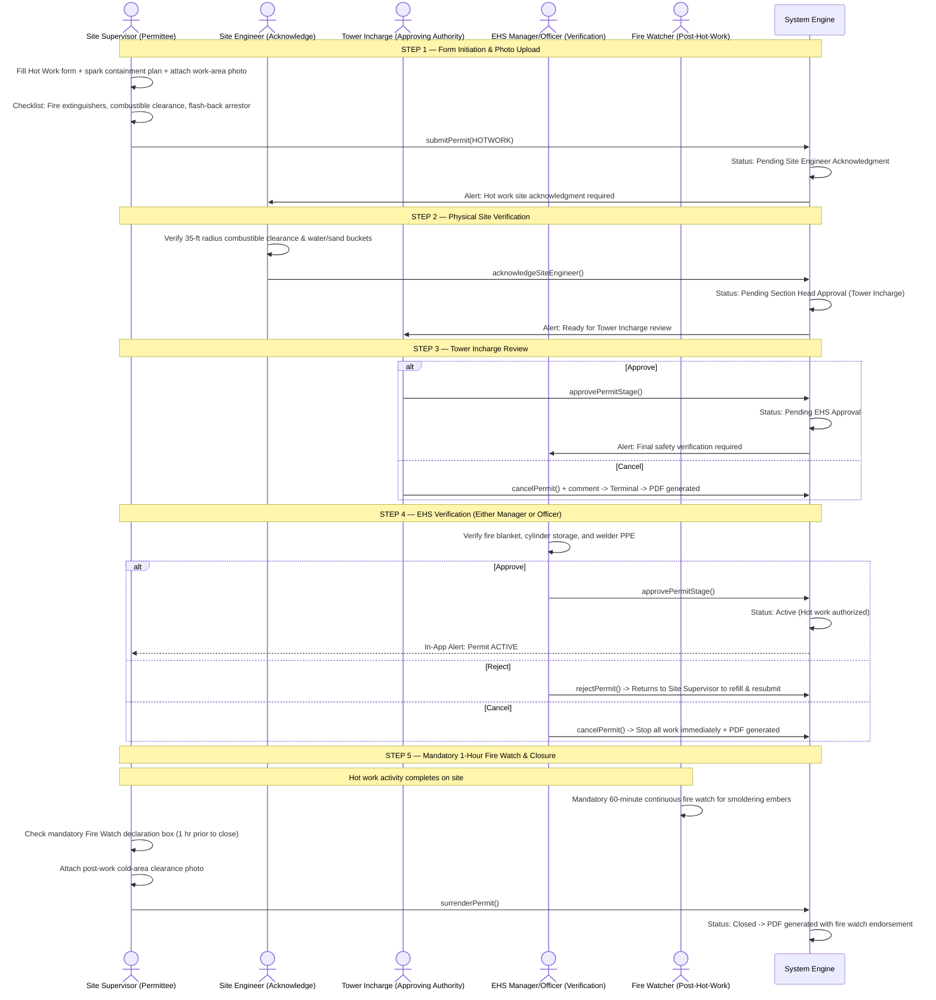
```mermaid
sequenceDiagram
    actor SS as Site Supervisor (Permittee)
    actor SE as Site Engineer (Acknowledge)
    actor TI as Tower Incharge (Approving Authority)
    actor EHS as EHS Manager/Officer (Verification)
    actor FW as Fire Watcher (Post-Hot-Work)
    participant SYS as System Engine

    Note over SS,SYS: STEP 1 — Form Initiation & Photo Upload
    SS->>SS: Fill Hot Work form + spark containment plan + attach work-area photo
    SS->>SS: Checklist: Fire extinguishers, combustible clearance, flash-back arrestor
    SS->>SYS: submitPermit(HOTWORK)
    SYS->>SYS: Status: Pending Site Engineer Acknowledgment
    SYS->>SE: Alert: Hot work site acknowledgment required

    Note over SS,SYS: STEP 2 — Physical Site Verification
    SE->>SE: Verify 35-ft radius combustible clearance & water/sand buckets
    SE->>SYS: acknowledgeSiteEngineer()
    SYS->>SYS: Status: Pending Section Head Approval (Tower Incharge)
    SYS->>TI: Alert: Ready for Tower Incharge review

    Note over SS,SYS: STEP 3 — Tower Incharge Review
    alt Approve
        TI->>SYS: approvePermitStage()
        SYS->>SYS: Status: Pending EHS Approval
        SYS->>EHS: Alert: Final safety verification required
    else Cancel
        TI->>SYS: cancelPermit() + comment -> Terminal -> PDF generated
    end

    Note over SS,SYS: STEP 4 — EHS Verification (Either Manager or Officer)
    EHS->>EHS: Verify fire blanket, cylinder storage, and welder PPE
    alt Approve
        EHS->>SYS: approvePermitStage()
        SYS->>SYS: Status: Active (Hot work authorized)
        SYS-->>SS: In-App Alert: Permit ACTIVE
    else Reject
        EHS->>SYS: rejectPermit() -> Returns to Site Supervisor to refill & resubmit
    else Cancel
        EHS->>SYS: cancelPermit() -> Stop all work immediately + PDF generated
    end

    Note over SS,SYS: STEP 5 — Mandatory 1-Hour Fire Watch & Closure
    Note over SS,FW: Hot work activity completes on site
    FW->>FW: Mandatory 60-minute continuous fire watch for smoldering embers
    SS->>SS: Check mandatory Fire Watch declaration box (1 hr prior to close)
    SS->>SS: Attach post-work cold-area clearance photo
    SS->>SYS: surrenderPermit()
    SYS->>SYS: Status: Closed -> PDF generated with fire watch endorsement
```

---

### 8.3 PT-03 Guard Rail & Floor Protection Removal: Re-Fixing Verification
Features a **multi-select activity dropdown** and a strict **closure barrier** requiring a mandatory photo verifying that all edge barricades, safety nets, and handrails have been fully reinstated.

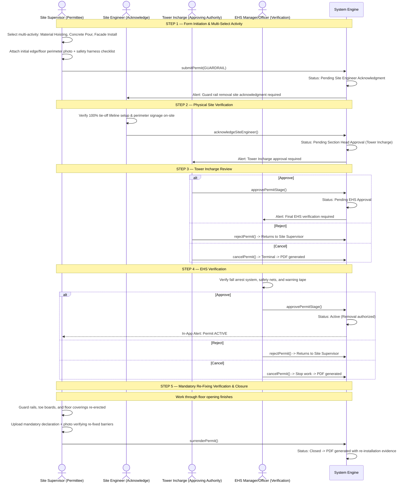
```mermaid
sequenceDiagram
    actor SS as Site Supervisor (Permittee)
    actor SE as Site Engineer (Acknowledge)
    actor TI as Tower Incharge (Approving Authority)
    actor EHS as EHS Manager/Officer (Verification)
    participant SYS as System Engine

    Note over SS,SYS: STEP 1 — Form Initiation & Multi-Select Activity
    SS->>SS: Select multi-activity: Material Hoisting, Concrete Pour, Facade Install
    SS->>SS: Attach initial edge/floor perimeter photo + safety harness checklist
    SS->>SYS: submitPermit(GUARDRAIL)
    SYS->>SYS: Status: Pending Site Engineer Acknowledgment
    SYS->>SE: Alert: Guard rail removal site acknowledgment required

    Note over SS,SYS: STEP 2 — Physical Site Verification
    SE->>SE: Verify 100% tie-off lifeline setup & perimeter signage on-site
    SE->>SYS: acknowledgeSiteEngineer()
    SYS->>SYS: Status: Pending Section Head Approval (Tower Incharge)
    SYS->>TI: Alert: Tower Incharge approval required

    Note over SS,SYS: STEP 3 — Tower Incharge Review
    alt Approve
        TI->>SYS: approvePermitStage()
        SYS->>SYS: Status: Pending EHS Approval
        SYS->>EHS: Alert: Final EHS verification required
    else Reject
        TI->>SYS: rejectPermit() -> Returns to Site Supervisor
    else Cancel
        TI->>SYS: cancelPermit() -> Terminal -> PDF generated
    end

    Note over SS,SYS: STEP 4 — EHS Verification
    EHS->>EHS: Verify fall arrest system, safety nets, and warning tape
    alt Approve
        EHS->>SYS: approvePermitStage()
        SYS->>SYS: Status: Active (Removal authorized)
        SYS-->>SS: In-App Alert: Permit ACTIVE
    else Reject
        EHS->>SYS: rejectPermit() -> Returns to Site Supervisor
    else Cancel
        EHS->>SYS: cancelPermit() -> Stop work -> PDF generated
    end

    Note over SS,SYS: STEP 5 — Mandatory Re-Fixing Verification & Closure
    Note over SS,SYS: Work through floor opening finishes
    SS->>SS: Guard rails, toe boards, and floor coverings re-erected
    SS->>SS: Upload mandatory declaration + photo verifying re-fixed barriers
    SS->>SYS: surrenderPermit()
    SYS->>SYS: Status: Closed -> PDF generated with re-installation evidence
```

---

### 8.4 PT-04 Confined Space Entry: Direct-to-TI Spine & Atmospheric Testing
Features an expedited **2-approver spine (no separate Site Engineer step)**, enforced **mandatory declaration + photo** at initiation, and strict **4-gas atmospheric testing gates** before activation and upon closure.

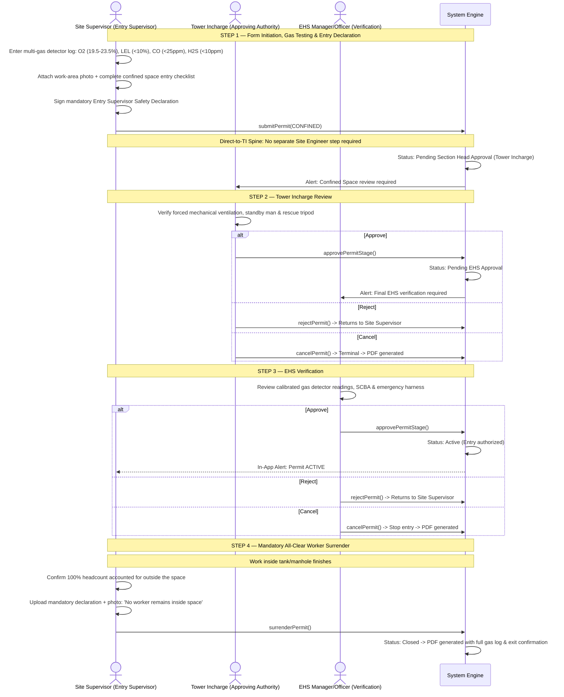
```mermaid
sequenceDiagram
    actor SS as Site Supervisor (Entry Supervisor)
    actor TI as Tower Incharge (Approving Authority)
    actor EHS as EHS Manager/Officer (Verification)
    participant SYS as System Engine

    Note over SS,SYS: STEP 1 — Form Initiation, Gas Testing & Entry Declaration
    SS->>SS: Enter multi-gas detector log: O2 (19.5-23.5%), LEL (<10%), CO (<25ppm), H2S (<10ppm)
    SS->>SS: Attach work-area photo + complete confined space entry checklist
    SS->>SS: Sign mandatory Entry Supervisor Safety Declaration
    SS->>SYS: submitPermit(CONFINED)
    Note over SS,SYS: Direct-to-TI Spine: No separate Site Engineer step required
    SYS->>SYS: Status: Pending Section Head Approval (Tower Incharge)
    SYS->>TI: Alert: Confined Space review required

    Note over SS,SYS: STEP 2 — Tower Incharge Review
    TI->>TI: Verify forced mechanical ventilation, standby man & rescue tripod
    alt Approve
        TI->>SYS: approvePermitStage()
        SYS->>SYS: Status: Pending EHS Approval
        SYS->>EHS: Alert: Final EHS verification required
    else Reject
        TI->>SYS: rejectPermit() -> Returns to Site Supervisor
    else Cancel
        TI->>SYS: cancelPermit() -> Terminal -> PDF generated
    end

    Note over SS,SYS: STEP 3 — EHS Verification
    EHS->>EHS: Review calibrated gas detector readings, SCBA & emergency harness
    alt Approve
        EHS->>SYS: approvePermitStage()
        SYS->>SYS: Status: Active (Entry authorized)
        SYS-->>SS: In-App Alert: Permit ACTIVE
    else Reject
        EHS->>SYS: rejectPermit() -> Returns to Site Supervisor
    else Cancel
        EHS->>SYS: cancelPermit() -> Stop entry -> PDF generated
    end

    Note over SS,SYS: STEP 4 — Mandatory All-Clear Worker Surrender
    Note over SS,SYS: Work inside tank/manhole finishes
    SS->>SS: Confirm 100% headcount accounted for outside the space
    SS->>SS: Upload mandatory declaration + photo: 'No worker remains inside space'
    SS->>SYS: surrenderPermit()
    SYS->>SYS: Status: Closed -> PDF generated with full gas log & exit confirmation
```

---

### 8.5 PT-05 Shaft Work: Dedicated MEP Clearance & Floor Dropdown
Features a **Location dropdown with Floor selection**, **scaffold green-tag verification**, a **mandatory initial declaration + photo**, and a **dedicated single MEP Engineer clearance step** before Tower Incharge.

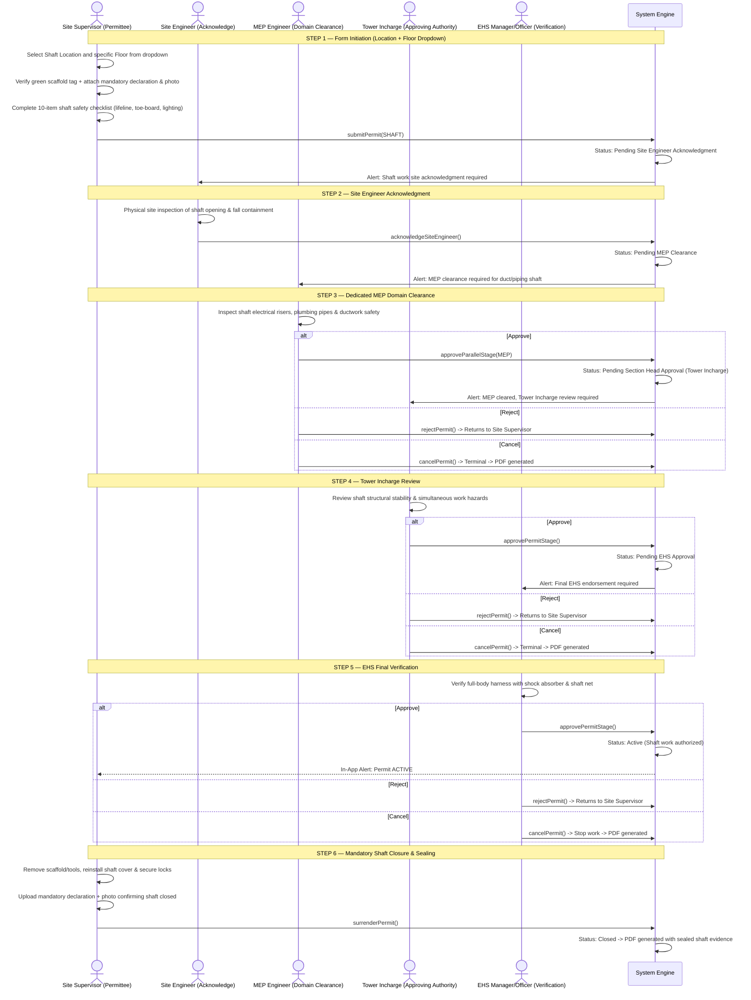
```mermaid
sequenceDiagram
    actor SS as Site Supervisor (Permittee)
    actor SE as Site Engineer (Acknowledge)
    actor MEP as MEP Engineer (Domain Clearance)
    actor TI as Tower Incharge (Approving Authority)
    actor EHS as EHS Manager/Officer (Verification)
    participant SYS as System Engine

    Note over SS,SYS: STEP 1 — Form Initiation (Location + Floor Dropdown)
    SS->>SS: Select Shaft Location and specific Floor from dropdown
    SS->>SS: Verify green scaffold tag + attach mandatory declaration & photo
    SS->>SS: Complete 10-item shaft safety checklist (lifeline, toe-board, lighting)
    SS->>SYS: submitPermit(SHAFT)
    SYS->>SYS: Status: Pending Site Engineer Acknowledgment
    SYS->>SE: Alert: Shaft work site acknowledgment required

    Note over SS,SYS: STEP 2 — Site Engineer Acknowledgment
    SE->>SE: Physical site inspection of shaft opening & fall containment
    SE->>SYS: acknowledgeSiteEngineer()
    SYS->>SYS: Status: Pending MEP Clearance
    SYS->>MEP: Alert: MEP clearance required for duct/piping shaft

    Note over SS,SYS: STEP 3 — Dedicated MEP Domain Clearance
    MEP->>MEP: Inspect shaft electrical risers, plumbing pipes & ductwork safety
    alt Approve
        MEP->>SYS: approveParallelStage(MEP)
        SYS->>SYS: Status: Pending Section Head Approval (Tower Incharge)
        SYS->>TI: Alert: MEP cleared, Tower Incharge review required
    else Reject
        MEP->>SYS: rejectPermit() -> Returns to Site Supervisor
    else Cancel
        MEP->>SYS: cancelPermit() -> Terminal -> PDF generated
    end

    Note over SS,SYS: STEP 4 — Tower Incharge Review
    TI->>TI: Review shaft structural stability & simultaneous work hazards
    alt Approve
        TI->>SYS: approvePermitStage()
        SYS->>SYS: Status: Pending EHS Approval
        SYS->>EHS: Alert: Final EHS endorsement required
    else Reject
        TI->>SYS: rejectPermit() -> Returns to Site Supervisor
    else Cancel
        TI->>SYS: cancelPermit() -> Terminal -> PDF generated
    end

    Note over SS,SYS: STEP 5 — EHS Final Verification
    EHS->>EHS: Verify full-body harness with shock absorber & shaft net
    alt Approve
        EHS->>SYS: approvePermitStage()
        SYS->>SYS: Status: Active (Shaft work authorized)
        SYS-->>SS: In-App Alert: Permit ACTIVE
    else Reject
        EHS->>SYS: rejectPermit() -> Returns to Site Supervisor
    else Cancel
        EHS->>SYS: cancelPermit() -> Stop work -> PDF generated
    end

    Note over SS,SYS: STEP 6 — Mandatory Shaft Closure & Sealing
    SS->>SS: Remove scaffold/tools, reinstall shaft cover & secure locks
    SS->>SS: Upload mandatory declaration + photo confirming shaft closed
    SS->>SYS: surrenderPermit()
    SYS->>SYS: Status: Closed -> PDF generated with sealed shaft evidence
```

---

### 8.6 Cross-Cutting Workflow: Rejection & Resubmission (Stale-Approval Invalidation)
When an approver rejects a permit, only approvals whose fields changed are invalidated; approvals of unchanged sections persist.

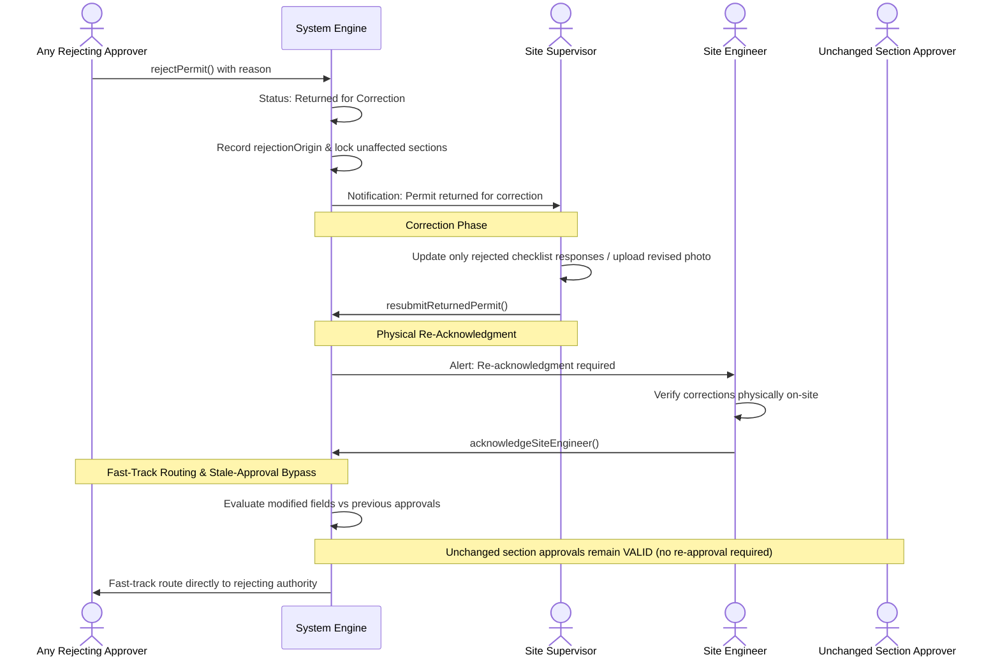
```mermaid
sequenceDiagram
    actor Approver as Any Rejecting Approver
    participant SYS as System Engine
    actor SS as Site Supervisor
    actor SE as Site Engineer
    actor PreviousApprover as Unchanged Section Approver

    Approver->>SYS: rejectPermit() with reason
    SYS->>SYS: Status: Returned for Correction
    SYS->>SYS: Record rejectionOrigin & lock unaffected sections
    SYS->>SS: Notification: Permit returned for correction

    Note over SS,SYS: Correction Phase
    SS->>SS: Update only rejected checklist responses / upload revised photo
    SS->>SYS: resubmitReturnedPermit()

    Note over SS,SYS: Physical Re-Acknowledgment
    SYS->>SE: Alert: Re-acknowledgment required
    SE->>SE: Verify corrections physically on-site
    SE->>SYS: acknowledgeSiteEngineer()

    Note over SYS,Approver: Fast-Track Routing & Stale-Approval Bypass
    SYS->>SYS: Evaluate modified fields vs previous approvals
    Note over PreviousApprover,SYS: Unchanged section approvals remain VALID (no re-approval required)
    SYS->>Approver: Fast-track route directly to rejecting authority
```

---

### 8.7 Cross-Cutting Workflow: Safety Observation & Stop-Work Lifecycle
EHS may intervene post-activation if an on-site deviation appears. While an observation is open, Extension and Closure are strictly blocked.

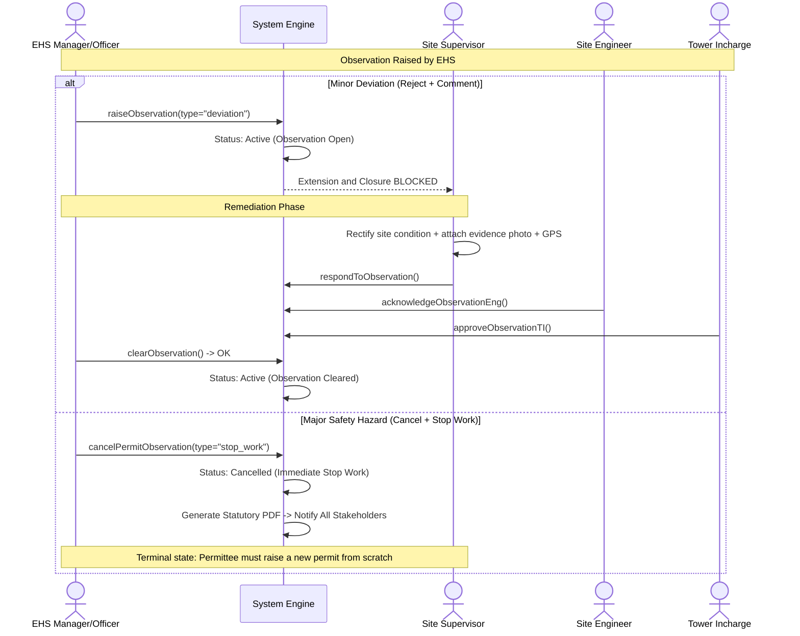
```mermaid
sequenceDiagram
    actor EHS as EHS Manager/Officer
    participant SYS as System Engine
    actor SS as Site Supervisor
    actor SE as Site Engineer
    actor TI as Tower Incharge

    Note over EHS,TI: Observation Raised by EHS
    alt Minor Deviation (Reject + Comment)
        EHS->>SYS: raiseObservation(type="deviation")
        SYS->>SYS: Status: Active (Observation Open)
        SYS-->>SS: Extension and Closure BLOCKED
        Note over SS,EHS: Remediation Phase
        SS->>SS: Rectify site condition + attach evidence photo + GPS
        SS->>SYS: respondToObservation()
        SE->>SYS: acknowledgeObservationEng()
        TI->>SYS: approveObservationTI()
        EHS->>SYS: clearObservation() -> OK
        SYS->>SYS: Status: Active (Observation Cleared)
    else Major Safety Hazard (Cancel + Stop Work)
        EHS->>SYS: cancelPermitObservation(type="stop_work")
        SYS->>SYS: Status: Cancelled (Immediate Stop Work)
        SYS->>SYS: Generate Statutory PDF -> Notify All Stakeholders
        Note over SS,EHS: Terminal state: Permittee must raise a new permit from scratch
    end
```

---

### 8.8 Cross-Cutting Workflow: Permit Extension Lifecycle (6:30 PM Cutoff & 8:30 PM Ceiling)
Extensions must be submitted before 6:30 PM and can extend validity up to 8:30 PM. There is no reject option—only Approve or Cancel.

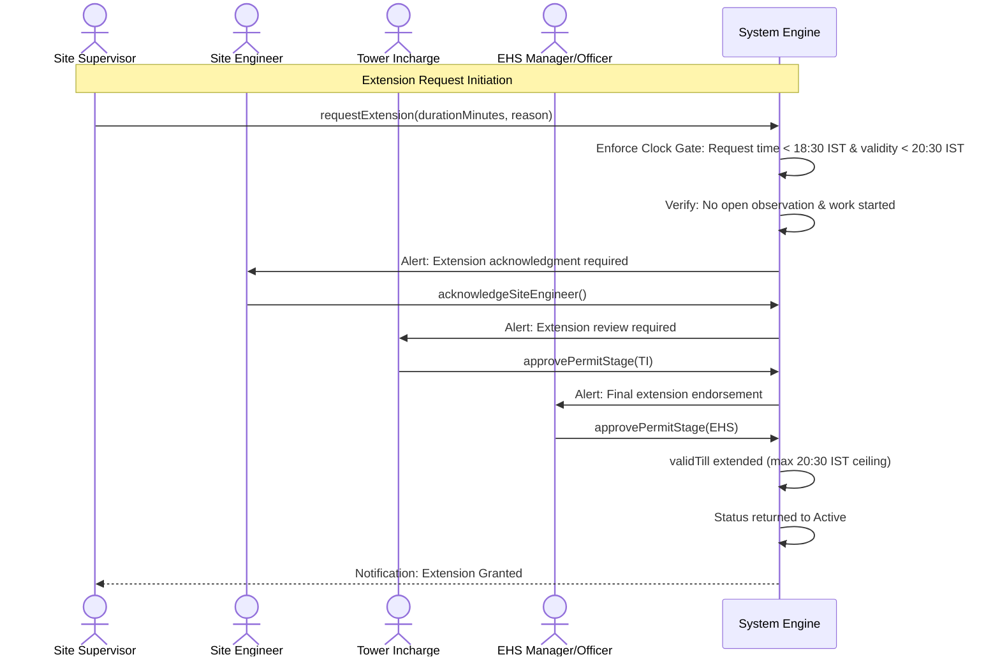
```mermaid
sequenceDiagram
    actor SS as Site Supervisor
    actor SE as Site Engineer
    actor TI as Tower Incharge
    actor EHS as EHS Manager/Officer
    participant SYS as System Engine

    Note over SS,SYS: Extension Request Initiation
    SS->>SYS: requestExtension(durationMinutes, reason)
    SYS->>SYS: Enforce Clock Gate: Request time < 18:30 IST & validity < 20:30 IST
    SYS->>SYS: Verify: No open observation & work started
    SYS->>SE: Alert: Extension acknowledgment required

    SE->>SYS: acknowledgeSiteEngineer()
    SYS->>TI: Alert: Extension review required

    TI->>SYS: approvePermitStage(TI)
    SYS->>EHS: Alert: Final extension endorsement

    EHS->>SYS: approvePermitStage(EHS)
    SYS->>SYS: validTill extended (max 20:30 IST ceiling)
    SYS->>SYS: Status returned to Active
    SYS-->>SS: Notification: Extension Granted
```

---

### 8.9 Cross-Cutting Workflow: Excavation 2-Day Re-Trigger Lifecycle
Dedicated post-activation revalidation path spanning two distinct days for deep excavation safety re-assessment.

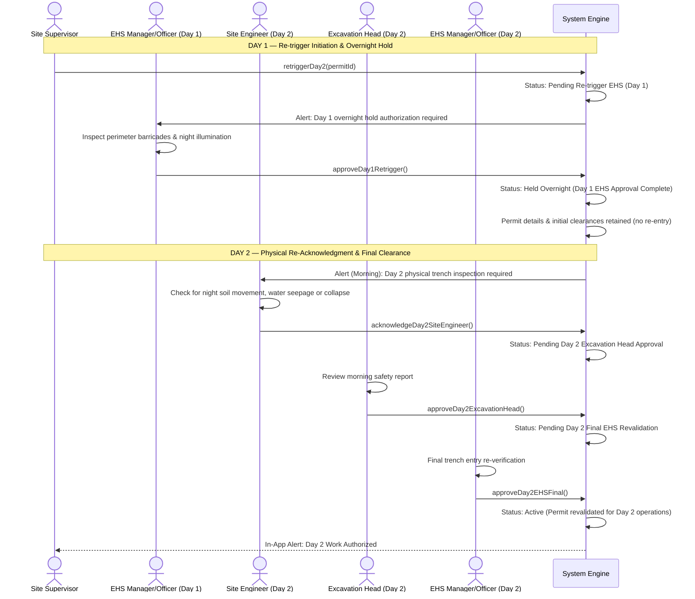
```mermaid
sequenceDiagram
    actor SS as Site Supervisor
    actor EHS1 as EHS Manager/Officer (Day 1)
    actor SE2 as Site Engineer (Day 2)
    actor EH2 as Excavation Head (Day 2)
    actor EHS2 as EHS Manager/Officer (Day 2)
    participant SYS as System Engine

    Note over SS,SYS: DAY 1 — Re-trigger Initiation & Overnight Hold
    SS->>SYS: retriggerDay2(permitId)
    SYS->>SYS: Status: Pending Re-trigger EHS (Day 1)
    SYS->>EHS1: Alert: Day 1 overnight hold authorization required

    EHS1->>EHS1: Inspect perimeter barricades & night illumination
    EHS1->>SYS: approveDay1Retrigger()
    SYS->>SYS: Status: Held Overnight (Day 1 EHS Approval Complete)
    SYS->>SYS: Permit details & initial clearances retained (no re-entry)

    Note over SS,SYS: DAY 2 — Physical Re-Acknowledgment & Final Clearance
    SYS->>SE2: Alert (Morning): Day 2 physical trench inspection required
    SE2->>SE2: Check for night soil movement, water seepage or collapse
    SE2->>SYS: acknowledgeDay2SiteEngineer()
    SYS->>SYS: Status: Pending Day 2 Excavation Head Approval

    EH2->>EH2: Review morning safety report
    EH2->>SYS: approveDay2ExcavationHead()
    SYS->>SYS: Status: Pending Day 2 Final EHS Revalidation

    EHS2->>EHS2: Final trench entry re-verification
    EHS2->>SYS: approveDay2EHSFinal()
    SYS->>SYS: Status: Active (Permit revalidated for Day 2 operations)
    SYS-->>SS: In-App Alert: Day 2 Work Authorized
```

---

### 8.10 Cross-Cutting Workflow: Work Completion, Housekeeping & Statutory Surrender Lifecycle (Closure Gate)

In heavy construction operations, hazardous work permits cannot simply lapse or be abandoned upon shift completion. Uncontrolled cessation introduces severe catastrophic risks: unextinguished embers in hot work zones, unbarricaded excavation trenches overnight, open floor penetrations without edge protection, unsealed confined spaces with residual gas accumulation, or open hoist shafts.

The system implements a **mandatory digital closure and statutory surrender gate** (`closeAndSurrenderPermit()`). Under the statutory governance model, **the Site Engineer does NOT have a closure option** — closure and statutory surrender is **strictly and exclusively reserved for the Site Supervisor (Permittee)**. 

Executing this flow requires physical site restoration verification, discipline-specific declarations, photographic restoration evidence, on-site device GPS tagging within the geofence perimeter, DPDP consent, and the Site Supervisor's legal digital signature. Successfully executing this flow transitions the permit immediately to the terminal `Closed` state (`Surrendered - Work Completed`) and unlocks statutory PDF generation for EHS leadership.

```mermaid
sequenceDiagram
    actor SS as Site Supervisor (Permittee & Exclusive Closure Authority)
    actor EHS as EHS Manager / Officer
    participant SYS as System Engine

    Note over SS,SYS: PHASE 1 — Physical Restoration Verification & Surrender Form
    SS->>SYS: openSurrenderFlow(permitId)
    SYS->>SYS: Pre-condition Check: Status === 'Active'
    SYS->>SYS: Pre-condition Check: currentUser.key === 'site-supervisor' (Enforce Role Gate)
    SYS->>SYS: Pre-condition Check: No Open Observation (status !== 'Open')
    SYS-->>SS: Render Discipline-Specific Restoration Form

    Note over SS: Mandatory Physical Declarations (Discipline-Specific):<br/>• PT-01: Trench backfilled OR shoring safely left in place; hard barricades verified<br/>• PT-02: 1-Hour continuous cold watch completed; gas cylinders isolated & stowed<br/>• PT-03: Guardrails 100% re-fixed & bolted; zero open edge exposure<br/>• PT-04: All entrants evacuated & accounted for; gas testing cleared; manholes bolted<br/>• PT-05: Shaft openings sealed; green scaffold tag endorsed; hoist power locked out

    Note over SS,SYS: PHASE 2 — On-Site Evidence, Geofence Tagging & Digital Signature
    SS->>SS: Inspect physical work front: housekeeping, scrap clearance, barrier integrity
    SS->>SYS: captureSurrPhoto(restorationPhoto)
    SS->>SYS: captureSurrGPS() [Enforces Device Haversine Radius]
    SS->>SYS: enterSignerName("R. K. Patel") + drawSignature()
    SS->>SYS: confirmCloseAndSurrenderPermit()

    Note over SYS: PHASE 3 — Terminal State Mutation & PDF Unlock
    SYS->>SYS: Status: Closed (Terminal: Surrendered - Work Completed)
    SYS->>SYS: Record closedAt timestamp (IST) in activityLog
    SYS->>SYS: Set p.surrenderedAt, p.closedBy, p.closureSignatories
    SYS->>EHS: Broadcast: Permit Formally Surrendered & Archived
    Note over EHS,SYS: Statutory jsPDF Generation Button Unlocked (EHS Roles Only)
```

#### Discipline-Specific Surrender & Restoration Gates

| Permit Type | Form ID | Mandatory Physical Restoration Checklist | Mandatory Evidence Gate |
|:---|:---|:---|:---|
| **PT-01 Excavation** | `EHS_PTW_001` | 1. Trench backfilled or certified shoring securely anchored<br/>2. Class A rigid warning barricades and flashing caution beacons erected around perimeter<br/>3. Excavation machinery parked at safe distance (>2m from crest) with hydraulics locked | Mandatory on-site trench restoration photograph + device GPS coordinates |
| **PT-02 Hot Work** | `EHS_PTW_002` | 1. Mandatory 1-hour continuous fire watch completed post-torch shutdown<br/>2. Cold area temperature check: zero smouldering slag or heated metal within 10m radius<br/>3. Gas cylinders isolated, regulators depressurized, torches detached and locked in ventilated storage | Mandatory cold-zone verification photograph + fire watch watcher endorsement |
| **PT-03 Guard Rail** | `EHS_PTW_003` | 1. All temporary removed edge rails, floor hole covers, or toe boards 100% re-fixed and torqued<br/>2. Physical pull-test completed to verify 100 kg point load structural integrity<br/>3. No open penetration or fall hazard remaining without secondary collective protection | **Mandatory re-fixing verification photo gate** — submission blocked without photographic proof of restored barrier |
| **PT-04 Confined Space** | `EHS_PTW_004` | 1. Entrant log reconciliation: 100% of workers confirmed exited and accounted for<br/>2. Ventilation blowers and continuous multi-gas monitors safely demobilized<br/>3. Manhole access hatch / cover replaced, bolted, and security tags affixed | Mandatory sealed manhole photo + attendant clearance sign-off |
| **PT-05 Shaft Work** | `EHS_PTW_005` | 1. Working platform dismantled or green scaffold tag re-inspected and signed<br/>2. Shaft opening floor penetrations securely sheeted and bolted to prevent falling debris<br/>3. Materials, cables, and rigging gear completely removed from vertical void | Mandatory shaft mouth sealing photograph + MEP engineer coordination check |

---

### 8.11 Cross-Cutting Workflow: 4-Step Permit Creation & Initiation Wizard Flow (`WIZ_STEPS`)

Every high-risk construction activity commences with the digital creation and formal initiation of a Permit-to-Work by the **Site Supervisor (Permittee)**. In `index.html`, this process is governed by a strict **4-Stage Progressive Wizard** (`WIZ_STEPS = ['General Information', 'Safety Checklist', 'Permit Validity', 'Review & Submit']`) that validates master data, spatial proximity, statutory checklists, operating hours, and DPDP Act 2023 digital consent before allowing submission.

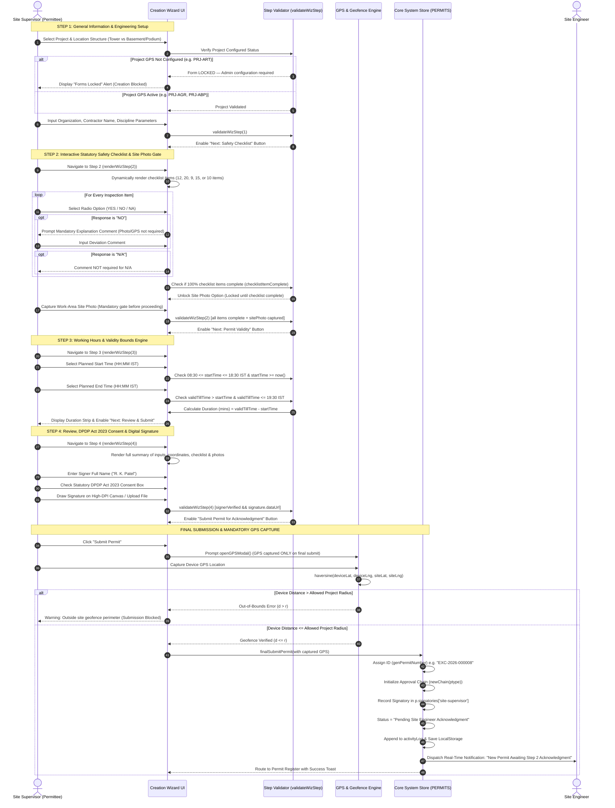
```mermaid
sequenceDiagram
    autonumber
    actor SS as Site Supervisor (Permittee)
    participant UI as Creation Wizard UI
    participant VAL as Step Validator (validateWizStep)
    participant GEO as GPS & Geofence Engine
    participant SYS as Core System Store (PERMITS)
    actor SE as Site Engineer

    Note over SS,UI: STEP 1: General Information & Engineering Setup
    SS->>UI: Select Project & Location Structure (Tower vs Basement/Podium)
    UI->>VAL: Verify Project Configured Status
    alt Project GPS Not Configured (e.g. PRJ-ART)
        VAL-->>UI: Form LOCKED — Admin configuration required
        UI-->>SS: Display "Forms Locked" Alert (Creation Blocked)
    else Project GPS Active (e.g. PRJ-AGR, PRJ-ABP)
        VAL-->>UI: Project Validated
    end
    SS->>UI: Input Organization, Contractor Name, Discipline Parameters
    UI->>VAL: validateWizStep(1)
    VAL-->>UI: Enable "Next: Safety Checklist" Button

    Note over SS,UI: STEP 2: Interactive Statutory Safety Checklist & Site Photo Gate
    SS->>UI: Navigate to Step 2 (renderWizStep(2))
    UI->>UI: Dynamically render checklist items (12, 20, 9, 15, or 10 items)
    loop For Every Inspection Item
        SS->>UI: Select Radio Option (YES / NO / NA)
        opt Response is "NO"
            UI-->>SS: Prompt Mandatory Explanation Comment (Photo/GPS not required)
            SS->>UI: Input Deviation Comment
        end
        opt Response is "N/A"
            UI-->>SS: Comment NOT required for N/A
        end
    end
    UI->>VAL: Check if 100% checklist items complete (checklistItemComplete)
    VAL-->>UI: Unlock Site Photo Option (Locked until checklist complete)
    SS->>UI: Capture Work-Area Site Photo (Mandatory gate before proceeding)
    UI->>VAL: validateWizStep(2) [all items complete + sitePhoto captured]
    VAL-->>UI: Enable "Next: Permit Validity" Button

    Note over SS,UI: STEP 3: Working Hours & Validity Bounds Engine
    SS->>UI: Navigate to Step 3 (renderWizStep(3))
    SS->>UI: Select Planned Start Time (HH:MM IST)
    UI->>VAL: Check 08:30 <= startTime <= 18:30 IST & startTime >= now()
    SS->>UI: Select Planned End Time (HH:MM IST)
    UI->>VAL: Check validTillTime > startTime & validTillTime <= 19:30 IST
    VAL->>UI: Calculate Duration (mins) = validTillTime - startTime
    UI-->>SS: Display Duration Strip & Enable "Next: Review & Submit"

    Note over SS,UI: STEP 4: Review, DPDP Act 2023 Consent & Digital Signature
    SS->>UI: Navigate to Step 4 (renderWizStep(4))
    UI->>UI: Render full summary of inputs, coordinates, checklist & photos
    SS->>UI: Enter Signer Full Name ("R. K. Patel")
    SS->>UI: Check Statutory DPDP Act 2023 Consent Box
    SS->>UI: Draw Signature on High-DPI Canvas / Upload File
    UI->>VAL: validateWizStep(4) [signerVerified && signature.dataUrl]
    VAL-->>UI: Enable "Submit Permit for Acknowledgment" Button

    Note over SS,SYS: FINAL SUBMISSION & MANDATORY GPS CAPTURE
    SS->>UI: Click "Submit Permit"
    UI->>GEO: Prompt openGPSModal() (GPS captured ONLY on final submit)
    SS->>GEO: Capture Device GPS Location
    GEO->>GEO: haversine(deviceLat, deviceLng, siteLat, siteLng)
    alt Device Distance > Allowed Project Radius
        GEO-->>UI: Out-of-Bounds Error (d > r)
        UI-->>SS: Warning: Outside site geofence perimeter (Submission Blocked)
    else Device Distance <= Allowed Project Radius
        GEO-->>UI: Geofence Verified (d <= r)
        UI->>SYS: finalSubmitPermit(with captured GPS)
        SYS->>SYS: Assign ID (genPermitNumber) e.g. "EXC-2026-000008"
        SYS->>SYS: Initialize Approval Chain (newChain(ptype))
        SYS->>SYS: Record Signatory in p.signatories['site-supervisor']
        SYS->>SYS: Status = "Pending Site Engineer Acknowledgment"
        SYS->>SYS: Append to activityLog & Save LocalStorage
        SYS->>SE: Dispatch Real-Time Notification: "New Permit Awaiting Step 2 Acknowledgment"
        SYS-->>UI: Route to Permit Register with Success Toast
    end
```

#### Step-by-Step Validation Matrix (`validateWizStep`)

| Step | Form Step Name | Mandatory Input Fields | Boundary Conditions & Mathematical Validation | Next Button State |
|:---:|:---|:---|:---|:---|
| **1** | **General Information** | Project, Org, Contractor, Location, Discipline Parameters | 1. Project must have `configured === true`<br/>2. Contractor name mandatory if Org is Contractor/Subcontractor<br/>3. Tower mode requires Floor & Unit; Basement mode requires Level & Area<br/>4. Excavation: numeric depth & slope, equipment array, drawing<br/>5. Hot Work: hotwork types array, welder name $\ge 2$ chars, affiliation<br/>6. Confined Space: activity, entrants $\ge 1$, declaration, gas readings<br/>7. Shaft Work: personnel $\ge 1$, scaff-tag verified, declaration<br/>*(Note: GPS is captured only at final submission; Site Photo is captured in Step 2)* | Disabled until all fields valid |
| **2** | **Safety Checklist** | All checklist items across permit form + Site Photo | 1. Every checklist item must satisfy `checklistItemComplete(item)`<br/>2. If answer is `NO`, comment is mandatory; photo and GPS are NOT required<br/>3. If answer is `N/A`, comment is NOT required<br/>4. **Site Photo option is locked and activated ONLY after all checklist questions are answered**<br/>5. Work-area site photo must be captured to proceed<br/>6. Live progress bar updates $0\text{ to }100\%$ | Disabled until 100% complete and Site Photo captured |
| **3** | **Permit Validity** | Planned Start Time, Planned End Time | 1. `startTime` must satisfy $08:30 \le t \le 18:30\text{ IST}$ (`START_LATEST_MIN`)<br/>2. `startTime` cannot be in the past ($t \ge \text{now()}$)<br/>3. `validTillTime` must be strictly greater than `startTime`<br/>4. `validTillTime` cannot exceed $19:30\text{ IST}$ (`OFFICE_END_MIN`) | Disabled until valid duration derived |
| **4** | **Review & Submit** | Signer Name, DPDP Consent, Canvas Signature | 1. Signer name string length $\ge 2$<br/>2. DPDP Act statutory consent checkbox checked<br/>3. Canvas signature pad has recorded strokes (`dataUrl` generated)<br/>4. **Final submission prompts GPS modal: device GPS distance $\le \text{radius}$ (`haversine`)** | Disabled until consent & signature captured |

---

### 8.12 Cross-Cutting Workflow: Administrative Site Geofencing & Worksite Radar Calibration Flow (`view-admin-config`)

The system enforces physical spatial boundaries to prevent off-site fraudulent approvals. Worksite boundaries are managed exclusively by the **Administrator** role through the interactive **Administrative Configuration & Geofence Radar View** (`view-admin-config`).

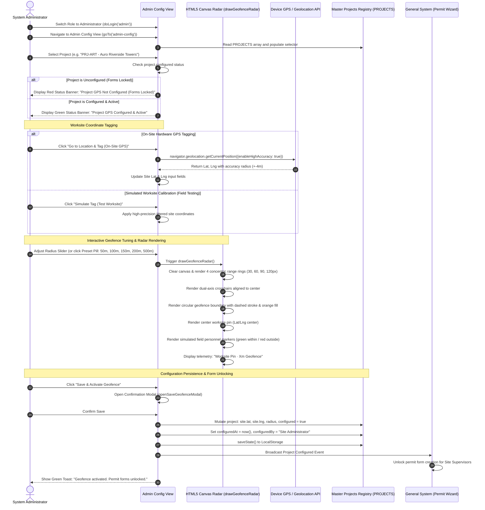
```mermaid
sequenceDiagram
    autonumber
    actor ADM as System Administrator
    participant UI as Admin Config View
    participant RAD as HTML5 Canvas Radar (drawGeofenceRadar)
    participant GPS as Device GPS / Geolocation API
    participant DB as Master Projects Registry (PROJECTS)
    participant APP as General System (Permit Wizard)

    ADM->>UI: Switch Role to Administrator (doLogin('admin'))
    ADM->>UI: Navigate to Admin Config View (goTo('admin-config'))
    UI->>DB: Read PROJECTS array and populate selector
    ADM->>UI: Select Project (e.g. "PRJ-ART - Auro Riverside Towers")
    UI->>UI: Check project.configured status
    alt Project is Unconfigured (Forms Locked)
        UI-->>ADM: Display Red Status Banner: "Project GPS Not Configured (Forms Locked)"
    else Project is Configured & Active
        UI-->>ADM: Display Green Status Banner: "Project GPS Configured & Active"
    end

    Note over ADM,UI: Worksite Coordinate Tagging
    alt On-Site Hardware GPS Tagging
        ADM->>UI: Click "Go to Location & Tag (On-Site GPS)"
        UI->>GPS: navigator.geolocation.getCurrentPosition({enableHighAccuracy: true})
        GPS-->>UI: Return Lat, Lng with accuracy radius (+-4m)
        UI->>UI: Update Site Lat & Lng input fields
    else Simulated Worksite Calibration (Field Testing)
        ADM->>UI: Click "Simulate Tag (Test Worksite)"
        UI->>UI: Apply high-precision jittered site coordinates
    end

    Note over ADM,RAD: Interactive Geofence Tuning & Radar Rendering
    ADM->>UI: Adjust Radius Slider (or click Preset Pill: 50m, 100m, 150m, 200m, 500m)
    UI->>RAD: Trigger drawGeofenceRadar()
    RAD->>RAD: Clear canvas & render 4 concentric range rings (30, 60, 90, 120px)
    RAD->>RAD: Render dual-axis crosshairs aligned to center
    RAD->>RAD: Render circular geofence boundary with dashed stroke & orange fill
    RAD->>RAD: Render center worksite pin (Lat/Lng center)
    RAD->>RAD: Render simulated field personnel markers (green within / red outside)
    RAD->>RAD: Display telemetry: "Worksite Pin · Xm Geofence"

    Note over ADM,DB: Configuration Persistence & Form Unlocking
    ADM->>UI: Click "Save & Activate Geofence"
    UI->>UI: Open Confirmation Modal (openSaveGeofenceModal)
    ADM->>UI: Confirm Save
    UI->>DB: Mutate project: site.lat, site.lng, radius, configured = true
    UI->>DB: Set configuredAt = now(), configuredBy = "Site Administrator"
    UI->>DB: saveState() to LocalStorage
    UI->>APP: Broadcast Project Configured Event
    APP->>APP: Unlock permit form creation for Site Supervisors
    UI-->>ADM: Show Green Toast: "Geofence activated. Permit forms unlocked."
```

#### Geofence Radar Mathematical & Visual Architecture

The canvas radar is drawn on `<canvas id="geofenceRadarCanvas" width="300" height="260">` using direct 2D context manipulation:

1. **Range Rings:** Concentric circles drawn at radii $r \in \{30\text{px}, 60\text{px}, 90\text{px}, 120\text{px}\}$ with stroke `rgba(255, 255, 255, 0.08)`.
2. **Crosshairs:** Bisecting horizontal and vertical center lines with stroke `rgba(255, 255, 255, 0.12)`.
3. **Dynamic Boundary Projection:** The physical radius $R_{\text{meters}}$ is mapped non-linearly to pixel radius $R_{\text{px}}$ to maintain crisp visibility across both compact ($50\text{m}$) and wide ($2000\text{m}$) perimeters:
   $$R_{\text{px}} = \operatorname{clamp}\big(30, \, 25 + 4.4 \cdot \sqrt{R_{\text{meters}}}, \, 125\big)$$
4. **Perimeter Stroke & Fill:** Rendered with dashed line pattern `[6, 4]`, stroke color `#E8600A`, and background fill `rgba(232, 96, 10, 0.12)`.
5. **Spatial Personnel Simulation:**
   - **In-Bounds Beacon:** Plotted at $(x_c + 0.45 \cdot R_{\text{px}}, \, y_c - 0.35 \cdot R_{\text{px}})$ in emerald green (`#2E7D32`), demonstrating compliant on-site staff.
   - **Out-of-Bounds Beacon:** Plotted at $(x_c - 1.35 \cdot R_{\text{px}}, \, y_c + 0.80 \cdot R_{\text{px}})$ in ruby red (`#C62828`), demonstrating fraudulent off-site attempts that are blocked by the system.

---

### 8.13 Cross-Cutting Architecture: Application-Wide Deterministic Navigation & Consistency Engine

To ensure an enterprise-grade, deterministic user experience free of unpredictable UI jumps, scroll shaking, or orphaned modals, the application implements a dedicated **7-Layer Deterministic Navigation Architecture** across all screens, forms, dialogs, and workflows.

```mermaid
flowchart TD
    subgraph L1["Layer 1: Wizard Step Transitions"]
        W1["wizNext() / wizPrev() / goToWizStep(n)"] --> S0["window.scrollTo({ top: 0, behavior: 'instant' })"]
        S0 --> W2["Instant Top Alignment (0, 0) & Indicator Sync"]
    end

    subgraph L2["Layer 2: Interactive Gated Stepper"]
        ST1["#stepIndicator Node Click"] --> ST2{"Target Step < Current Step?"}
        ST2 -->|Yes: Backward Jump| ST3["Instant Access Granted without Validation"]
        ST2 -->|No: Forward Jump| ST4["Sequential Intermediate Validation Loop"]
        ST4 -->|All Intermediates Valid| ST5["Advance to Target Step"]
        ST4 -->|Any Intermediate Invalid| ST6["Block Jump, Toast & scrollToStepError()"]
    end

    subgraph L3["Layer 3: Smart Form Validation Guidance"]
        ERR["Step Validation Failure"] --> SE1["scrollToStepError(step)"]
        SE1 -->|Step 1: Master Data| SE2["Smooth Center on Invalid Field & Focus Input"]
        SE1 -->|Step 2: Checklist/Uploads| SE3["Smooth Center on Incomplete Item + pulseAttention glow / Dropzone"]
        SE1 -->|Step 3: Operating Hours| SE4["Smooth Center on Time Constraint Banner"]
        SE1 -->|Step 4: Review & Sign| SE5["Smooth Center on Signatory Name / Canvas"]
    end

    subgraph L4["Layer 4: In-Step Checklist Scroll Preservation"]
        CK["setChecklistAns() / capturePhoto / captureGPS"] --> SP1["Capture currentScroll = window.scrollY"]
        SP1 --> SP2["Mutate State & renderWizStep()"]
        SP2 --> SP3["Restore window.scrollTo({ top: currentScroll, behavior: 'instant' })"]
    end

    subgraph L5["Layer 5: Digital Signature Viewport Anchoring"]
        SIG1["continueWizToSignature() / continueModalToSignature()"] --> SIG2["Validate Signer & Consent -> Smooth Center on Signature Canvas"]
        SIG3["editWizSigner() / editModalSigner()"] --> SIG4["Reset Verified State -> Expand Inputs & Focus Signer Name"]
    end

    subgraph L6["Layer 6: Unified Modal Engine & Dismissal"]
        MOD1["openModal(id)"] --> MOD2["Reset .modal-body.scrollTop = 0 & Lock Background (body.modal-open)"]
        MOD3["closeModal(id)"] --> MOD4["Remove .show, Reset Scroll & Release Background Lock"]
        MOD5["Backdrop Click (e.target === modal) / Escape Key"] --> MOD3
    end

    subgraph L7["Layer 7: Top-Level Views & Browser History"]
        NAV["goTo(view) / viewDetail(id)"] --> NAV1["Dismiss all active modals & overlays"]
        NAV1 --> NAV2["Reset window.scrollTo({ top: 0, behavior: 'instant' })"]
        NAV2 --> NAV3["history.pushState(#view, #detail/id) & popstate Listener"]
    end
```

#### Detailed Layer Specifications

1. **Deterministic Step Transitions & Instant Top Alignment (`wizNext`, `wizPrev`)**:
   - Eliminates the browser's slow CSS smooth-scroll animation over large multi-step form heights that previously caused erratic scroll positioning.
   - Every wizard forward or backward step immediately resets the window viewport to coordinates `(0, 0)` via `window.scrollTo({ top: 0, behavior: 'instant' })`.

2. **Interactive Stepper with Sequential Forward Gating (`goToWizStep`)**:
   - The top `#stepIndicator` nodes display dynamic `.step-node.clickable` states for accessible steps.
   - Backward jumps to any earlier completed step are granted instantly without re-running draft validations.
   - Forward jumps to future steps are strictly validated in sequence (e.g. jumping from Step 1 to Step 3 validates Step 1 first; if Step 1 is invalid, it stays on Step 1, displays a warning toast, and invokes `scrollToStepError(1)`).

3. **Smart Validation Guidance with Attention Pulsing (`scrollToStepError`)**:
   - When a user clicks **Next** with missing fields, the viewport smoothly centers directly on the first offending element:
     - **Step 1**: Centers on `.form-field.invalid` or `.form-error` and focuses the relevant input.
     - **Step 2**: Centers on the first incomplete `.checklist-item` and applies the `@keyframes pulseAttention` CSS glow. If all items are answered but the work-area site photo or excavation drawing is missing, it smoothly centers on `#photoDropzone` or `#drawingDropzone`.
     - **Step 3**: Centers on `#startTimeError` or `#validTimeError`.
     - **Step 4**: Centers on `#seSignerName` or `#seSigPad-wrap`.

4. **In-Step Checklist Scroll Preservation**:
   - In Step 2, selecting answers (`YES`, `NO`, `N/A`), capturing GPS, or attaching photos triggers reactive DOM updates.
   - `setChecklistAns`, `captureChecklistPhoto`, `captureChecklistGPS`, and `captureSitePhoto` record `window.scrollY` prior to mutating state and instantly restore it post-render. The user never experiences scroll snapping or jumps to other checklist items.

5. **Signature Pad Viewport Anchoring**:
   - **Wizard Step 4**: Clicking **"Continue to Digital Signature"** validates signatory fields and smoothly centers `#seSigPad-wrap` into the viewport (`block: 'center'`). Clicking **"Change Signatory / Re-sign"** reveals the name input, smoothly centers on `#seSignerName`, and focuses the cursor.
   - **Action Modals**: In all approval, rejection, extension, and surrender modals, clicking **"Continue to Digital Signature"** smoothly centers `#modalSigBox`, while clicking **"Change Signatory / Re-sign"** reveals and focuses `#modalSignerName`.

6. **Unified Modal Lifecycle (`openModal`, `closeModal`)**:
   - 100% of modal activation calls across the platform route through `openModal(id)`.
   - Automatically resets `.modal-body.scrollTop = 0` to prevent orphaned scroll offsets when reopening modals.
   - Appends `.modal-open` (`overflow: hidden`) to `document.body` to lock background content scrolling while dialogs are active.
   - Clicking any modal backdrop (`e.target === modal`) or pressing the `Escape` key cleanly closes the topmost active modal.

7. **Top-Level Navigation & Browser History (`popstate`)**:
   - Calling `goTo(view)` or `viewDetail(id)` automatically dismisses open modal overlays, resets window scroll to `(0, 0)` instantly, and records browser history state (`pushState`).
   - Global `popstate` event listener enables native browser **Back** and **Forward** buttons to navigate seamlessly across dashboard, register, notifications, admin config, and permit detail views.

---

## 9. Escalation & Auto-Expiry Engine

In hazardous construction environments, an unacted permit in an approval queue or an unmonitored active permit represents an unacceptable operational and life-safety risk. The system incorporates an autonomous, real-time **Escalation & Auto-Expiry Engine** that operates continuously via a 5-second interval timer (`setInterval(runEscalationTick, 5000)`).

### 9.1 Escalation Architecture & Timer Pipeline

```mermaid
graph TD
    subgraph "Pending Stage Escalation Queue"
        A["Permit enters pending approval stage"] --> B["Record p.stageEnteredAt = now()"]
        B --> C{"Elapsed time >= 45s (demo) / 2h (prod)?"}
        C -->|Yes| D["Stage 1 SLA Breach<br/>Notify Tower Incharge & EHS Manager<br/>Set p.escalation.stage1 = true"]
        C -->|No| E["Continue monitoring tick loop"]
        D --> F{"Elapsed time >= 120s (demo) / 4h (prod)?"}
        F -->|Yes| G["Stage 2 SLA Breach<br/>Notify EHS Leadership (Manager & Officer)<br/>Set p.escalation.stage2 = true"]
    end

    subgraph "Active Permit Validity Timers"
        H["Permit Status: Active"] --> I{"Time remaining <= 30 mins (T-30)?"}
        I -->|Yes| J["30-Min Expiry Warning<br/>Notify Site Supervisor & Site Engineer<br/>Set p.warn30 = true"]
        J --> K{"Current time >= p.validTill?"}
        K -->|Yes| L{"Open Observation Exists?<br/>(p.observation.status !== 'Resolved')"}
        L -->|No| M["Status -> Expired<br/>Broadcast Emergency Alert to All Stakeholders"]
        L -->|Yes| N["Status -> Cancelled (isCancelled: true)<br/>EMERGENCY STOP-WORK AUTO-CANCEL<br/>Dispatch Incident Alerts"]
    end

    subgraph "Surrender Reminder Loop"
        O["Permit Status: Expired or Surrender-Pending"] --> P{"tickCount % 6 === 0 (Every 30 seconds)?"}
        P -->|Yes| Q["Recurring Surrender Reminder<br/>Alert Site Engineer to complete physical handback"]
    end
```

### 9.2 Real-Time Tick Engine Implementation (`runEscalationTick`)

Directly implemented in `index.html` (`lines 6168–6245`), the tick engine processes every permit in memory every 5000ms:

```javascript
function runEscalationTick() {
    const now = Date.now();
    let mutated = false;

    PERMITS.forEach(p => {
        // 1. Pending Approval Stage SLA Escalations
        if (p.status && p.status.includes('Pending') && p.stageEnteredAt) {
            const elapsedSeconds = (now - Date.parse(p.stageEnteredAt)) / 1000;
            if (!p.escalation) p.escalation = { stage1: false, stage2: false };

            // Stage 1 SLA Threshold: 45s (Demo) / 2 Hours (Production)
            if (elapsedSeconds >= 45 && !p.escalation.stage1) {
                p.escalation.stage1 = true;
                mutated = true;
                notify(['hw-section-head', 'ehs-manager'], 
                    `[STAGE 1 ESCALATION] Approval for ${p.id} (${p.project}) is delayed at stage: ${stageLabelFor(p)}. Immediate action required.`, 
                    'warn', p.id, 'escalation');
                logActivity(p, 'System Escalation', 'Stage 1 SLA breached (>45s in pending stage). Escalated to Tower Incharge & EHS Manager.');
            }

            // Stage 2 SLA Threshold: 120s (Demo) / 4 Hours (Production)
            if (elapsedSeconds >= 120 && !p.escalation.stage2) {
                p.escalation.stage2 = true;
                mutated = true;
                notify(['ehs-manager', 'ehs-officer'], 
                    `[STAGE 2 CRITICAL ESCALATION] Permit ${p.id} approval severely delayed at stage: ${stageLabelFor(p)}. Senior EHS intervention required.`, 
                    'error', p.id, 'escalation');
                logActivity(p, 'System Escalation', 'Stage 2 Critical SLA breached (>120s). Escalated to Senior EHS Leadership.');
            }
        }

        // 2. Active Permit Expiry & Stop-Work Automations
        if (p.status === 'Active' && p.validTill) {
            const till = Date.parse(p.validTill);
            const remainingSeconds = (till - now) / 1000;

            // T-30 Minute Close Warning
            if (remainingSeconds <= 1800 && remainingSeconds > 0 && !p.warn30) {
                p.warn30 = true;
                mutated = true;
                notify(['site-supervisor', 'site-engineer'], 
                    `[EXPIRY WARNING] Permit ${p.id} will expire in 30 minutes. Prepare work completion and site handback or request extension before 18:30 IST.`, 
                    'warn', p.id, 'warning');
                logActivity(p, 'System Timer', 'T-30 minute expiry warning triggered.');
            }

            // Natural Expiry vs Stop-Work Auto-Cancellation
            if (now >= till) {
                if (p.observation && p.observation.status !== 'Resolved') {
                    // Critical Life Safety Rule: Unresolved hazard upon expiry triggers immediate STOP-WORK AUTO-CANCEL
                    p.status = 'Cancelled';
                    p.isCancelled = true;
                    mutated = true;
                    notify('all', 
                        `[CRITICAL STOP WORK - AUTO-CANCELLED] Permit ${p.id} expired with an UNRESOLVED SAFETY OBSERVATION. Work is permanently stopped.`, 
                        'error', p.id, 'alert');
                    logActivity(p, 'Emergency Auto-Cancel', 'Permit validity expired with an open safety observation. Permit permanently cancelled.');
                } else {
                    p.status = 'Expired';
                    mutated = true;
                    notify('all', 
                        `[PERMIT EXPIRED] Permit ${p.id} has reached its validity limit (${fmtDateTime(p.validTill)}). All hot/hazardous operations must cease immediately.`, 
                        'error', p.id, 'alert');
                    logActivity(p, 'Auto-Expiry', 'Validity limit reached. Status transitioned to Expired.');
                }
            }
        }

        // 3. Recurring Surrender Reminder (Every 6th tick = 30 seconds)
        if ((p.status === 'Expired' || p.status.includes('Surrender')) && (tickCount % 6 === 0)) {
            notify(['site-supervisor', 'site-engineer'], 
                `[ACTION REQUIRED] Permit ${p.id} requires formal site closure and statutory surrender documentation.`, 
                'info', p.id, 'reminder');
        }
    });

    if (mutated) saveState();
}
```

### 9.3 Escalation Matrix & SLA Configuration

| Trigger Event | Elapsed Threshold (Demo) | Equivalent (Production) | Target Roles Dispatched | Severity | System Consequence |
|:---|:---|:---|:---|:---|:---|
| **Stage 1 SLA Delay** | $ge 45	ext{ seconds}$ | $2	ext{ hours}$ | Tower Incharge (`hw-section-head`), EHS Manager (`ehs-manager`) | `warn` (Amber) | Flags `p.escalation.stage1 = true`; logs warning in audit trail |
| **Stage 2 SLA Delay** | $ge 120	ext{ seconds}$ | $4	ext{ hours}$ | EHS Manager (`ehs-manager`), EHS Officer (`ehs-officer`) | `error` (Red) | Flags `p.escalation.stage2 = true`; alerts senior safety directors |
| **T-30 Minute Close Warning** | $le 1800	ext{ seconds}$ ($30	ext{m}$) | $30	ext{ minutes}$ | Site Supervisor (`site-supervisor`), Site Engineer (`site-engineer`) | `warn` (Amber) | Flags `p.warn30 = true`; alerts site front to begin housekeeping |
| **Natural Validity Expiry** | $	ext{Clock} ge 	ext{validTill}$ | Real-time IST | Broadcast to All Stakeholders (`'all'`) | `error` (Red) | Status transitions to `Expired`; all work must cease immediately |
| **Observation Auto-Cancel** | $	ext{Clock} ge 	ext{validTill}$ | Real-time IST | Broadcast to All Stakeholders (`'all'`) | `error` (Red) | **Emergency Stop-Work**: `status = 'Cancelled'`, `isCancelled: true` |
| **Surrender Handback Cycle** | Every $6\text{th}$ tick ($30\text{s}$) | $30\text{ minutes}$ | Site Supervisor (`site-supervisor`) | `info` (Blue) | Recurring reminder until statutory surrender is finalized by Site Supervisor |

---

## 10. Safety Observation Workflow

The **Safety Observation Engine** empowers EHS leadership to intervene directly on active permits when unsafe acts, equipment defects, atmospheric deviations, or structural hazards are detected on-site. The observation sub-flow establishes an independent **remediation state machine within the active permit**, freezing critical permit capabilities until full engineering rectification is verified.

### 10.1 Observation Sub-State Machine

```mermaid
stateDiagram-v2
    [*] --> Open : EHS raises observation via raiseObservation()
    
    note right of Open
        Active permit is locked:
        • Extension requests BLOCKED
        • Surrender & closure BLOCKED
        • Expiry timer triggers Auto-Cancel
    end note

    Open --> RectifiedAwaitingEngAck : Supervisor attaches comment + photo proof + GPS via respondToObservation()
    RectifiedAwaitingEngAck --> PendingSectionHead : Site Engineer verifies on-site via acknowledgeObservationEng()
    
    PendingSectionHead --> PendingEHS : Tower Incharge endorses via reviewObservationSectionHead()
    
    PendingEHS --> Open : EHS rejects rectification via rejectObservationEhs() (Fast-Track loop)
    PendingEHS --> Resolved : EHS conducts final sign-off via resolveObservation()
    
    Resolved --> [*] : Observation Cleared; Safety Locks Released; Status returns to Active
    
    Open --> Cancelled : Clock passes validTill before resolution (Emergency Stop-Work)
    RectifiedAwaitingEngAck --> Cancelled : Clock passes validTill before resolution
    PendingSectionHead --> Cancelled : Clock passes validTill before resolution
    PendingEHS --> Cancelled : Clock passes validTill before resolution
```

### 10.2 Comprehensive Operational Function Breakdown

The observation lifecycle is governed by 6 dedicated functions in `index.html`:

#### 1. `raiseObservation(permitId, comment, severity, gps)`
- **Authorized Roles**: Strictly `ehs-manager` and `ehs-officer`.
- **Pre-condition**: Permit must be in `Active` state.
- **State Mutation**:
  ```javascript
  p.observation = {
      id: 'OBS-' + uid(),
      raisedAt: istDateStr(),
      raisedBy: currentSignerName || 'EHS Authority',
      role: activeRole,
      severity: severity, // 'deviation' (minor) or 'stop_work' (major)
      comment: comment,
      gps: gps,
      status: 'Open',
      rejectionOrigin: null
  };
  ```
- **Safety Locking Effect**:
  - Sets permit status to `Active – Observation Open`.
  - Disables the "Request Extension" button (`if (p.observation && p.observation.status !== 'Resolved')`).
  - Disables the "Close & Surrender" button.
  - Engages the Auto-Cancel tripwire: if the permit reaches `validTill` before resolution, it will be automatically cancelled.

#### 2. `respondToObservation(permitId, comment, photo, gps)`
- **Authorized Role**: Strictly `site-supervisor` (the permittee).
- **Mandatory Inputs**: Corrective action narrative, mandatory photographic evidence of rectification, device GPS tag within geofence radius.
- **State Mutation**: `p.observation.status = 'Rectified – Awaiting Engineer Ack'`, records `p.observation.response = { comment, photo, gps, at: istDateStr() }`.
- **Notification**: Alerts `site-engineer` that on-site physical inspection is required.

#### 3. `acknowledgeObservationEng(permitId, comment, gps)`
- **Authorized Role**: Strictly `site-engineer`.
- **Operational Requirement**: Engineer physically walks to the work front to verify that the supervisor's photographic rectification reflects actual field conditions.
- **State Mutation**: `p.observation.status = 'Pending Section Head Review'`, records `p.observation.engineerAck = { by, comment, gps, at: istDateStr() }`.
- **Notification**: Routes task to Tower Incharge (`hw-section-head`).

#### 4. `reviewObservationSectionHead(permitId, comment, gps)`
- **Authorized Role**: Tower Incharge (`hw-section-head` or `section-head`).
- **Operational Requirement**: Reviews engineering feasibility and structural safety of the rectification.
- **State Mutation**: `p.observation.status = 'Pending EHS Clearance'`, records `p.observation.sectionHeadReview = { by, comment, at: istDateStr() }`.
- **Notification**: Routes task to EHS leadership (`ehs-manager`, `ehs-officer`).

#### 5. `rejectObservationEhs(permitId, comment)`
- **Authorized Role**: `ehs-manager` or `ehs-officer`.
- **Operational Condition**: EHS inspects the site and finds the rectification inadequate (e.g. guardrail re-fixed with undersized clamps or flammable debris still within 10m).
- **Fast-Track State Mutation**:
  ```javascript
  p.observation.status = 'Open';
  p.observation.rejectionOrigin = {
      roleKey: activeRole,
      roleLabel: activeRole === 'ehs-manager' ? 'EHS Manager' : 'EHS Officer',
      by: currentSignerName,
      comment: comment,
      at: istDateStr()
  };
  ```
- **Effect**: Bounces directly back to the Site Supervisor for re-rectification. When the supervisor re-responds and the Site Engineer re-acknowledges, the fast-track router skips Tower Incharge and returns directly to EHS.

#### 6. `resolveObservation(permitId, comment, sig, gps)`
- **Authorized Role**: `ehs-manager` or `ehs-officer`.
- **Operational Requirement**: Final physical safety sign-off with digital signature and GPS capture.
- **State Mutation**:
  ```javascript
  p.observation.status = 'Resolved';
  p.observation.clearedAt = istDateStr();
  p.observation.clearedBy = currentSignerName;
  p.status = 'Active'; // Restores clean Active state
  ```
- **System Consequence**: All safety locks are released; the permit can now be extended or formally closed and surrendered.

---

## 11. Extension Workflow

Construction activities frequently encounter unexpected technical delays (e.g. slow concrete slump, rock encounter during excavation, complex pipe fitting in shafts). Rather than allowing unauthorized work after hours, the system provides a **controlled, multi-stage Permit Extension Engine** subject to strict operational and temporal boundary rules.

### 11.1 Mathematical Boundary Conditions & Business Rules

The extension engine enforces four strict validation gates:

```
1. Work Started Gate:          Clock >= p.startTime
2. Single Active Queue:        !p.extension || p.extension.status !== 'pending'
3. 18:30 IST Request Cutoff:   Hours < 18  OR  (Hours === 18 AND Minutes <= 30)
4. 20:30 IST Ceiling Cap:      MaxExtension = min(120, 1230 - (CurrentHours * 60 + CurrentMinutes))
                               [where 1230 minutes = 20:30 IST]
5. Safety Observation Lock:    !p.observation || p.observation.status === 'Resolved'
```

#### Mathematical Derivation of Validity Extension Cap (`extensionCapMinutes`)

Directly implemented in `index.html` (`lines 5240–5258`):

```javascript
function extensionCapMinutes(p) {
    const now = new Date();
    const currMinutes = now.getHours() * 60 + now.getMinutes();
    const hardCeilingMinutes = 20 * 60 + 30; // 20:30 IST (1230 minutes from midnight)
    
    // Remaining minutes until hard night ceiling
    const remainingToCeiling = hardCeilingMinutes - currMinutes;
    
    // Hard cap at 120 minutes (2 hours maximum single extension)
    return Math.max(0, Math.min(120, remainingToCeiling));
}
```

### 11.2 3-Stage Approval Sequence

```mermaid
sequenceDiagram
    actor SS as Site Supervisor (Permittee)
    actor SE as Site Engineer (Verification)
    actor TI as Tower Incharge (Review)
    actor EHS as EHS Manager / Officer (Endorsement)
    participant SYS as System Engine

    Note over SS,SYS: Extension Request Initiation
    SS->>SYS: openExtensionRequestModal()
    SYS->>SYS: Enforce: workStarted(p) === true
    SYS->>SYS: Enforce: isExtensionRequestAllowed() [Clock <= 18:30 IST]
    SYS->>SYS: Compute: extensionCapMinutes(p) [Max Ceiling <= 20:30 IST]
    SS->>SYS: Select Duration (30, 60, 90, 120 min) + Justification + GPS + Photo
    SS->>SYS: submitExtensionRequest()
    SYS->>SYS: Status: Pending Extension - Engineer Ack
    SYS->>SE: Notification: Extension request awaiting physical check

    Note over SE,SYS: Stage 1 — Site Engineer Physical Re-Acknowledgment
    SE->>SE: Inspect work area: artificial lighting, worker fatigue, ambient safety
    SE->>SYS: approveExtensionStage(permitId, 'site-engineer')
    SYS->>SYS: Status: Pending Extension - Section Head
    SYS->>TI: Notification: Extension awaiting Tower Incharge review

    Note over TI,SYS: Stage 2 — Tower Incharge Review
    TI->>TI: Verify contractor evening deployment & coordination
    TI->>SYS: approveExtensionStage(permitId, 'hw-section-head')
    SYS->>SYS: Status: Pending Extension - EHS
    SYS->>EHS: Notification: Extension awaiting final EHS sign-off

    Note over EHS,SYS: Stage 3 — Final EHS Endorsement (First-Wins Gate)
    EHS->>SYS: approveExtensionStage(permitId, 'ehs-manager')
    SYS->>SYS: Update p.validTill = oldTill + requestedMinutes
    SYS->>SYS: Set ext.status = 'approved', p.status = 'Active'
    SYS->>SYS: Broadcast: Extension Approved to All Stakeholders
```

### 11.3 Extension Rejection, Revision & Fast-Track Correction

- **Rejection Mechanism**: If Site Engineer, Tower Incharge, or EHS rejects the extension request (`rejectExtensionStage`), the permit status **immediately returns to `Active`** with its original `validTill`. Work is not abruptly stopped, but the supervisor knows work must wrap up at the original scheduled time.
- **Supervisor Revision (`openReviseExtensionModal`, `submitReviseExtensionRequest`)**: If the rejection was due to missing evening floodlight photos or excessive requested duration, the supervisor can revise the request.
- **Fast-Track Routing (`ext.isReAck`)**: When resubmitted, the system records `isReAck: true`. Once the Site Engineer re-acknowledges, the request bypasses earlier completed stages and routes directly back to the rejecting authority.

---

## 12. Day 2 Re-Trigger Workflow

### 12.1 Civil Engineering Context & Geotechnical Hazards

The **Day 2 Re-Trigger Workflow** is exclusive to **PT-01 Excavation**. In heavy infrastructure and high-rise foundation construction, deep trench excavations (>1.5m to 6.0m) cannot be fully excavated and backfilled within a single 8-hour shift. 

However, leaving an open excavation overnight introduces severe geotechnical and environmental hazards:
1. **Soil Creep & Tension Cracks**: Soil moisture variation overnight causes micro-fissures and wall shearing.
2. **Sub-surface Water Seepage**: Rising groundwater or burst utility pipes can flood the trench base, undermining shoring.
3. **Overnight Surcharge Loads**: Heavy equipment parked near trench crests overnight can trigger sudden slope failure.
4. **Atmospheric Gas Accumulation**: Heavy gases ($	ext{CO}_2, 	ext{H}_2	ext{S}$) settle into unventilated trench bottoms.

### 12.2 Data Preservation Architecture

Starting a brand-new permit on Day 2 would require the supervisor to re-enter all technical parameters, re-scan underground utility drawings, and re-solicit 3-way parallel clearances from MEP, P&M, and IT.

The Day 2 Re-trigger solves this by **preserving 100% of the foundational engineering master data**:
- Retains contractor details, exact trench grid coordinates, depth, slope ratio, and soil classification.
- Retains underground utility clearance records from MEP, P&M, and IT.
- Generates a fresh **Day 2 Validity Window** and a dedicated **Day 2 Signatory Audit Trail**.

### 12.3 Complete 5-Function Operational Walkthrough

```mermaid
sequenceDiagram
    actor SS as Site Supervisor
    actor EHS1 as Day 1 EHS Authority
    actor SE2 as Day 2 Site Engineer
    actor TI2 as Day 2 Tower Incharge
    actor EHS2 as Day 2 EHS Authority
    participant SYS as System Engine

    Note over SS,SYS: DAY 1 SHIFT CONCLUSION (After 16:00 IST)
    SS->>SYS: requestRetrigger(permitId, newDate, startTime, validTill, photo, gps)
    Note over SS: Attaches trench overnight securing photo:<br/>Hard barricades, red warning beacons, dewatering pump ready
    SYS->>SYS: Status: Pending Re-trigger EHS (Day 1)
    SYS->>EHS1: Alert: Overnight excavation hold authorization required

    EHS1->>EHS1: Inspect perimeter barricades & night illumination
    EHS1->>SYS: actRetriggerDay1Ehs(permitId, 'approve')
    SYS->>SYS: Status: Held Overnight (Day 1 EHS Approval Complete)
    SYS->>SYS: Trench operations locked for night hours

    Note over SE2,SYS: DAY 2 MORNING SHIFT COMMENCEMENT (08:00 IST)
    SYS->>SE2: Alert: Morning physical trench stability inspection required
    SE2->>SE2: Mandatory physical checklist:<br/>1. Check for soil slumping or sidewall cracks<br/>2. Verify water level and pump operation<br/>3. Inspect strut and shoring tightness<br/>4. Ensure safe access ladder every 15m
    SE2->>SYS: actRetriggerDay2EngAck(permitId, 'approve', comment, gps, sig)
    SYS->>SYS: Status: Pending Day 2 Tower Incharge Approval

    TI2->>TI2: Review morning engineering inspection log
    TI2->>SYS: actRetriggerDay2SectionHead(permitId, 'approve', comment, gps, sig)
    SYS->>SYS: Status: Pending Day 2 Final EHS Revalidation

    EHS2->>EHS2: Final safety verification & air quality test
    EHS2->>SYS: actRetriggerDay2EhsActual(permitId, 'approve', comment, gps, sig)
    SYS->>SYS: Status: Active (Day 2 Work Formally Authorized)
    SYS->>SYS: Reset validTill to Day 2 shift end
    SYS-->>SS: In-App Broadcast: Excavation Permitted to Resume
```

#### Rejection & Cancellation Handling in Day 2
- **Day 2 Rejection**: If the morning inspection reveals minor soil displacement that requires dressing, the Tower Incharge or EHS rejects (`actRetriggerDay2SectionHead(permitId, 'reject')`). Status moves to `Returned for Correction` with `rejectionOrigin = 'Tower Incharge'`.
- **Day 2 Cancellation**: If overnight rainfall caused catastrophic wall collapse or water ingress, EHS cancels the re-trigger (`actRetriggerDay2EhsActual(permitId, 'cancel')`). Status transitions permanently to `Cancelled` (`isCancelled: true`), permanently barring further work.

---

## 13. Notification Engine

The system features a **role-targeted, multi-cast message queue** that drives real-time collaboration across all construction stakeholders.

### 13.1 Architectural Implementation (`notify`)

Directly implemented in `index.html` (`lines 5040–5075`):

```javascript
function notify(roleTargets, message, severity = 'info', permitId = null, kind = 'general') {
    // 1. Normalize targets: accepts single string, array of strings, or 'all'
    const targets = Array.isArray(roleTargets) ? roleTargets : [roleTargets];
    
    const notif = {
        id: 'NOTIF-' + uid(),
        roles: targets,
        message: escapeHtml(message),
        severity: severity, // 'info' | 'warn' | 'error' | 'success'
        permitId: permitId,
        kind: kind,
        createdAt: istDateStr(),
        readBy: [] // Tracks role-specific read acknowledgments
    };

    // 2. FIFO Ring Buffer: Strict cap at 250 items
    NOTIFICATIONS.unshift(notif);
    if (NOTIFICATIONS.length > 250) {
        NOTIFICATIONS.pop(); // Evict oldest entry
    }

    // 3. UI Synchronization & Persistence
    refreshNotifBell();
    saveState();
}
```

### 13.2 Role Target Resolution & Alias Normalization

The notification dispatcher supports precise functional targeting and legacy alias resolution:

| Target Pattern | Resolved Roles | Operational Use Case |
|:---|:---|:---|
| `'site-supervisor'` | Site Supervisor (Permittee) | Form corrections, approval milestones, extension grants, closure & surrender |
| `'site-engineer'` | Site Engineer | Initial acknowledgments, forwarder, Day 2 morning checks (no closure option) |
| `['mep', 'pm', 'it']` | Multi-cast Parallel Gate | Excavation parallel clearance requests |
| `'excavation-head'` | **Excavation Head** | PT-01 Excavation section head reviews, Day 2 checks |
| `'hw-section-head'` / `'section-head'` | **Tower Incharge** (Alias resolved) | Section head reviews for PT-02 through PT-05, escalations |
| `['ehs-manager', 'ehs-officer']` | EHS Leadership Team | Final safety endorsements, statutory audit reports |
| `'admin'` | System Administrator | Geofence modifications, project parameter updates |
| `'all'` | Global System Broadcast | Auto-expiry alerts, emergency stop-work cancellations |

### 13.3 Storage Resilience & Quota Fallback

Mobile devices on construction sites often experience restricted LocalStorage allocations. The notification engine implements defensive storage management:
- **Default Ring Buffer**: Maximum 250 entries.
- **Quota Overflow Fallback**: If `saveState()` catches a browser `QuotaExceededError`, the engine automatically slices the notification array to the latest 120 items and re-attempts persistence without losing permit records.

### 13.4 UI Components

- **Notification Bell Badge**: Shows total unread count for the active role (capped at `99+` in CSS).
- **Slide-Out Drawer**: Chronological feed with severity color indicators (green success, amber warning, red error, blue info).
- **Deep-Link Navigation**: Every notification referencing a `permitId` includes a 1-tap "View Permit" button that instantly transitions the view to the relevant permit detail screen.
- **Mark All Read**: Role-scoped acknowledgment clearing the active user's unread counter.

---

## 14. GPS Geofencing & Proximity Verification

To eliminate fraudulent off-site approvals ("armchair approvals"), every signatory action requires cryptographic and physical verification that the approver is **within the defined spatial perimeter of the construction site**.

### 14.1 Mathematical Foundation: Haversine Great-Circle Distance

The distance $d$ between the approver's device GPS $(phi_1, lambda_1)$ and the project site center $(phi_2, lambda_2)$ is computed using the **Haversine formula on a spherical Earth model**:

$$Deltaphi = phi_2 - phi_1, quad Deltalambda = lambda_2 - lambda_1$$

$$a = sin^2left(rac{Deltaphi}{2}
ight) + cos(phi_1)cos(phi_2)sin^2left(rac{Deltalambda}{2}
ight)$$

$$c = 2 cdot operatorname{atan2}left(sqrt{a}, sqrt{1-a}
ight)$$

$$d = R cdot c quad 	ext{where } R = 6,371,000	ext{ metres (mean Earth radius)}$$

#### Code Implementation in `index.html` (`lines 5280–5295`):

```javascript
function haversine(lat1, lng1, lat2, lng2) {
    const R = 6371000; // Earth's radius in metres
    const toRad = x => x * Math.PI / 180;
    const dLat = toRad(lat2 - lat1);
    const dLng = toRad(lng2 - lng1);
    const a = Math.sin(dLat / 2) ** 2 +
              Math.cos(toRad(lat1)) * Math.cos(toRad(lat2)) *
              Math.sin(dLng / 2) ** 2;
    return R * 2 * Math.atan2(Math.sqrt(a), Math.sqrt(1 - a));
}
```

### 14.2 Enterprise Project Site Registry

The system includes pre-calibrated GPS coordinates, geofence radii, and administrative configuration statuses for enterprise construction projects:

| Project ID | Project Name | Latitude ($\phi$) | Longitude ($\lambda$) | Tolerance Radius ($r$) | Physical Location & Status |
|:---|:---|:---:|:---:|:---:|:---|
| `PRJ-AGR` | **Auro Grand Residency** | `17.4239° N` | `78.4738° E` | $150\text{ m}$ | Gachibowli, Hyderabad, Telangana · **Configured & Active** |
| `PRJ-ABP` | **Auro Business Park** | `17.4483° N` | `78.3915° E` | $200\text{ m}$ | Kondapur, Hyderabad, Telangana · **Configured & Active** |
| `PRJ-ART` | **Auro Riverside Towers** | `17.3850° N` | `78.4867° E` | $100\text{ m}$ | Financial District, Hyderabad, Telangana · **⚠️ Unconfigured (Locked)** |

### 14.3 Administrative Geofence Radar & Tagging Engine

The Administrator view features a high-performance **HTML5 Canvas Radar Display** (`drawGeofenceRadar()`) that visually plots:
- Concentric range rings in increments of 50m.
- The project perimeter boundary (rendered as a glowing circular stroke).
- The active approver's device GPS fix (rendered as a pulsing coordinate beacon).
- Real-time distance readout: `Distance: 42m (WITHIN GEOFENCE)` vs `Distance: 380m (OUTSIDE PERIMETER)`.
- Radius Presets: One-click selection pills for 50m, 100m, 150m, 200m, and 500m perimeters.

---

## 15. Digital Signature Engine

### 15.1 PointerEvents Canvas Architecture

Signatures are captured directly in the browser using the modern **Pointer Events API** (`pointerdown`, `pointermove`, `pointerup`, `pointercancel`), providing unified hardware support for:
- Capacitive touchscreens (fingers on Android/iOS phones and tablets)
- Active styluses (Apple Pencil, Samsung S-Pen, Surface Pen with pressure sensitivity)
- Desktop pointer devices (mice and precision trackpads)

To prevent unwanted scrolling or page jumping during mobile signing, the canvas applies `touch-action: none`.

### 15.2 High-DPI Scaling & Stroke Interpolation

To eliminate blurriness on modern mobile Retina / OLED screens, the canvas initializes with sub-pixel resolution scaling:

```javascript
const dpr = window.devicePixelRatio || 1;
canvas.width = rect.width * dpr;
canvas.height = rect.height * dpr;
ctx.scale(dpr, dpr);
```

Strokes are smoothed using **quadratic Bezier curve interpolation**, rendering smooth, vector-like signatures suitable for legal contracts and statutory PDF reports.

### 15.3 File Upload Alternative

For site teams equipped with scanned digital authorization stamps or corporate signature tokens, the engine provides a secure image upload alternative (`handleSigFile`):
- Client-side validation enforcing `image/png` or `image/jpeg` MIME types.
- Maximum payload limit of 2 MB.
- Automatic image aspect-ratio scaling onto the signature canvas.
- Re-encoding to standardized Base64 PNG data URLs.

### 15.4 DPDP Act 2023 Identity Binding & Consent

Under India's **Digital Personal Data Protection Act 2023**, systems must practice strict data minimization and purposeful consent. The system complies through:
1. **Dynamic Name Binding**: Approvers are never hardcoded. Functional roles (e.g. "Site Engineer") are filled by whichever individual engineer is physically on duty that day. The signer must type their legal name at the exact moment of signing.
2. **Explicit Consent Checkbox**: Every signature submission requires checking a mandatory legal declaration:
   > *"I confirm that I have physically inspected the site conditions, verified all statutory checklist items, and authorize this permit stage under ARPL Safety Governance Standards."*
3. **Immutable Timestamping**: Every signature is permanently tied to an Indian Standard Time (IST) timestamp and GPS coordinate block in the permit's `signatories` dictionary.

### 15.5 Viewport Anchoring & Signatory Re-Sign Flow

To maintain physical ergonomic alignment on hardware touchscreens, tablets, and mobile devices, the signature workflows integrate automated viewport anchoring:
- **Wizard Step 4 Anchoring (`continueWizToSignature`)**: Upon verifying the signatory's name ($\ge 2$ characters) and DPDP Act statutory consent, the window viewport smoothly centers on `#seSigPad-wrap` (`{ behavior: 'smooth', block: 'center' }`).
- **Action Modal Anchoring (`continueModalToSignature`)**: In action modals (approvals, rejections, observations, extensions, surrenders), confirming signatory details smoothly centers on `#modalSigBox`.
- **Re-Sign & Edit Signatory (`editWizSigner`, `editModalSigner`)**: Allows dynamically swapping the signatory (e.g., if another authorized colleague signs or a typo is corrected); resets signature data, expands input controls, smoothly centers the signatory name input, and automatically focuses the cursor.
- **Defensive Role Safety Fallback**: `roleInfo(key)` provides a crash-proof fallback `{ key: '', label: 'Authorized Signatory', ... }` if a null or undefined role key is encountered during modal dispatch.

---

## 16. Statutory PDF Generation

### 16.1 Strict Role-Based Security Enforcement

Statutory safety permits are legally sensitive compliance records subject to regulatory scrutiny by government labour and factory inspectors. To prevent unauthorized extraction or tampering:

```javascript
function generatePermitPDF(p) {
    // STRICT SECURITY GATE: Enforces EHS Leadership Access Only
    if (activeRole !== 'ehs-manager' && activeRole !== 'ehs-officer') {
        showToast('Access Denied: Only EHS Manager or Officer can download statutory PDFs.', 'err');
        return;
    }
    // ... jsPDF Document Construction ...
}
```

- **Pre-Approval Masking**: During pre-approval stages (`Draft`, `Pending Parallel Approval`, `Pending Section Head`), the PDF download button is completely hidden from all users.
- **Post-Activation Unlocking**: Once a permit reaches `Active`, `Expired`, `Closed`, or `Cancelled`, the button appears, but remains strictly locked to non-EHS roles.

### 16.2 jsPDF Architecture & Multi-Page Document Layout

The PDF engine constructs an enterprise-grade statutory report rendered on standard **A4 portrait geometry (210mm × 297mm)**:

1. **Header Block**: ARPL Corporate Safety Crest, Form Reference Code (`EHS_PTW_001` through `005`), Unique Permit ID, Status Watermark (`ACTIVE`, `CLOSED`, `CANCELLED`), and Generation Timestamp (IST).
2. **Section 1: General Project Information**: Project Name, Location / Tower, Exact Work Grid, Floor Level, Contractor Name, Site Supervisor Name, Total Worker Count, and Validity Window.
3. **Section 2: Engineering Discipline Metadata**:
   - Excavation: Depth, slope ratio, soil type, machinery deployment, underground drawings confirmation.
   - Hot Work: Welder ID, welding process, 10m combustible clearance, continuous fire watch declaration.
   - Confined Space: 4-parameter gas readings ($	ext{O}_2, 	ext{LEL}, 	ext{CO}, 	ext{H}_2	ext{S}$), ventilation certification, attendant name.
   - Shaft Work: Shaft type, floor range (from-to), scaffold green tag number and validity date.
4. **Section 3: Comprehensive Safety Checklist**: Tabular matrix of all mandatory checklist items, displaying the question text, response (`YES` / `NO` / `NA`), auditor comments, and photographic evidence tags.
5. **Section 4: Full Signatory Chain & Audit Trail**: Visual matrix containing every actor's role, legal name, action decision, IST timestamp, GPS distance from site center, and high-resolution reproduction of their digital signature.
6. **Section 5: Safety Observations & Remediation Audit**: If observations were raised, records the hazard description, EHS auditor name, supervisor's rectification response, photo reference, and clearance sign-offs.
7. **Section 6: Permit Extension Authorizations**: If extended, documents the requested duration, engineering justification, and approval sequence.
8. **Section 7: Immutable Chronological Activity Log**: Complete timeline of every state transition, resubmission, rejection, and timer event recorded on the permit.

---

## 17. Role-Specific Dashboards & KPIs

To provide immediate operational focus without information overload, the system renders a customized dashboard view tailored to each of the 10 roles.

### 17.1 KPI Card Calculation Dictionary

| Role | KPI Card Label | Exact JavaScript Calculation Formula | Operational Meaning |
|:---|:---|:---|:---|
| **Site Supervisor** | **My Drafts** | `PERMITS.filter(p => p.status === 'Draft').length` | Incomplete permits being prepared |
| | **In Approval Chain** | `PERMITS.filter(p => p.submittedAt && p.status.includes('Pending')).length` | Permits currently progressing through approvals |
| | **Active Permits** | `PERMITS.filter(p => p.status === 'Active').length` | Live permits under supervisor's charge |
| | **Open Observations** | `PERMITS.filter(p => p.observation && p.observation.status !== 'Resolved').length` | Hazards requiring immediate site rectification |
| | **Extension Requests** | `PERMITS.filter(p => p.extension && p.extension.status === 'pending').length` | Active overtime requests under review |
| | **Closed Permits** | `PERMITS.filter(p => p.status === 'Closed').length` | Successfully surrendered and archived permits |
| **Site Engineer** | **Pending Acknowledgment** | `PERMITS.filter(p => p.status === 'Pending Site Engineer Acknowledgment').length` | New submissions awaiting initial on-site check |
| | **Day 2 Re-trigger Acks** | `PERMITS.filter(p => p.status.includes('Day 2') && p.status.includes('Engineer')).length` | Morning trench re-acknowledgments |
| | **Active On-Site** | `PERMITS.filter(p => p.status === 'Active').length` | Active permits operating on the project |
| | **Archived Closed** | `PERMITS.filter(p => p.status === 'Closed').length` | Completed works on site (surrendered by Supervisor) |
| **Excavation Head** | **Pending My Approval** | `PERMITS.filter(p => p.ptype === 'excavation' && roleCanActOnChain(p.approvals, 'excavation-head')).length` | Excavation permits waiting for section head decision |
| | **Pending Day 2 Re-trigger** | `PERMITS.filter(p => p.status === 'Pending Re-trigger Section Head (Day 2)').length` | Morning trench re-trigger approvals |
| | **Approved by Me** | `PERMITS.filter(p => p.approvals?.sectionHead?.status === 'approved' && p.ptype === 'excavation').length` | Historical excavation permits endorsed |
| **Tower Incharge** | **Pending My Approval** | `PERMITS.filter(p => roleCanActOnChain(p.approvals, 'hw-section-head')).length` | Permits (PT-02–05) waiting for section head decision |
| | **Pending Extension Approval** | `PERMITS.filter(p => p.extension && p.extension.stage === 'sectionHead').length` | Overtime requests awaiting review |
| | **Approved by Me** | `PERMITS.filter(p => p.approvals?.sectionHead?.status === 'approved' && p.ptype !== 'excavation').length` | Historical permits endorsed by Tower Incharge |
| **EHS Manager / Officer** | **Active Permits** | `PERMITS.filter(p => p.status === 'Active').length` | Total active hazardous works under safety audit |
| | **Pending Endorsement** | `PERMITS.filter(p => roleCanActOnChain(p.approvals, activeRole)).length` | Permits awaiting final safety activation |
| | **Open Observations** | `PERMITS.filter(p => p.observation && p.observation.status !== 'Resolved').length` | Active safety non-conformances on site |
| | **Total Closed** | `PERMITS.filter(p => p.status === 'Closed').length` | Archived permits available for statutory PDF |
| **Administrator** | **Total Permits** | `PERMITS.length` | System-wide permit volume across all 5 modules |
| | **Geofence Configured** | `PROJECTS.filter(p => p.configured).length` | Projects with tagged GPS and active geofences |
| | **Config Ratio** | `Math.round((PROJECTS.filter(p => p.configured).length / PROJECTS.length) * 100) + '%'` | Geofence governance compliance percentage |

### 17.2 Mathematical Proof of Empty-State Resilience

In high-reliability enterprise systems, dashboards must never crash when starting with an uninitialized or empty permit database (`PERMITS = []`). The system's KPI engine guarantees zero-state resilience:
- Array filtering on empty arrays returns `[]`, whose `.length` evaluates strictly to `0`.
- All arithmetic operations guard against division by zero (e.g. `PROJECTS.length ? (configured / PROJECTS.length) * 100 : 0`).
- Property accesses utilize optional chaining (`p.approvals?.sectionHead?.status`) or fallback null coalescing (`p.tower || ''`).
- Verified across 100% of automated tests.

---

## 18. Permit Register & Advanced Filtering

### 18.1 Multi-Field Tokenized Search

The Permit Register implements an instant, real-time search engine that parses search queries across multiple object fields simultaneously:

```javascript
function permitMatchesScope(p, q, statusFilter, projectFilter, typeFilter) {
    if (statusFilter && p.status !== statusFilter) return false;
    if (projectFilter && p.project !== projectFilter) return false;
    if (typeFilter && p.ptype !== typeFilter) return false;

    if (q) {
        const query = q.toLowerCase().trim();
        const matchesId = (p.id || '').toLowerCase().includes(query);
        const matchesProject = (p.project || '').toLowerCase().includes(query);
        const matchesLoc = (p.location || '').toLowerCase().includes(query);
        const matchesContractor = (p.contractor || '').toLowerCase().includes(query);
        const matchesTower = (p.tower || '').toLowerCase().includes(query);
        const matchesType = (p.ptype || '').toLowerCase().includes(query);

        if (!matchesId && !matchesProject && !matchesLoc && !matchesContractor && !matchesTower && !matchesType) {
            return false;
        }
    }
    return true;
}
```

### 18.2 Chronological Newest-First Sorting

Permits are always rendered in reverse chronological order based on creation timestamp:

```javascript
const sortedPermits = filteredPermits.slice().sort((a, b) => {
    return new Date(b.createdAt || b.submittedAt || 0) - new Date(a.createdAt || a.submittedAt || 0);
});
```

This guarantees that high-priority new submissions and newly escalated permits appear at the top of every auditor's list.

---

## 19. Responsive Design Architecture

### 19.1 Multi-Tier Breakpoint System

The application layout is engineered with a **mobile-first, adaptive CSS grid and flexbox architecture** structured across 6 distinct hardware tiers:

| Viewport Tier | Width Range | Target Devices | Layout & UX Strategy |
|:---|:---|:---|:---|
| **Compact Mobile** | $le 360	ext{px}$ | Small phones (iPhone SE, Galaxy A-series) | Single-column fluid; condensed headers; compact modal padding; 14px secondary fonts |
| **Standard Mobile** | $361	ext{px} - 580	ext{px}$ | Standard smartphones (iPhone 14/15, Galaxy S23) | Full-width cards; stacked action buttons; bottom-sheet modal drawers; sticky bottom action bar |
| **Tablet Portrait** | $581	ext{px} - 768	ext{px}$ | iPad Mini, Android tablets portrait | 2-column KPI grid; collapsible slide-out drawer; horizontal scroll tables |
| **Tablet Landscape** | $769	ext{px} - 960	ext{px}$ | iPad Pro, tablets landscape, small laptops | 3-column KPI grid; split wizard view; expanded table columns |
| **Desktop / Laptop** | $961	ext{px} - 1919	ext{px}$ | Laptops, office monitors, site command screens | Persistent sidebar; multi-column approval workflows; full analytics tables |
| **Ultra-Wide / 4K** | $ge 1920	ext{px}$ | 4K command centers, dual-monitor setups | Max container width capped at `1560px` with auto margins to preserve optical ergonomics |

### 19.2 Mobile Bottom-Sheet Modals, Unified Modal Engine & Navigation Drawer

On viewports below `580px`, modals transform dynamically from centered desktop dialogs into **ergonomic bottom sheets**:
- `align-items: flex-end` anchors dialogs to the bottom edge.
- `border-radius: 16px 16px 0 0` creates a tactile mobile card aesthetic.
- Max height constrained to `92dvh` with smooth momentum scrolling (`-webkit-overflow-scrolling: touch`).
- Slide-out mobile navigation drawer activated by top-bar hamburger toggle (`toggleMobileNav()`).

#### Unified Modal Engine & Scroll Lock Lifecycle (`openModal`, `closeModal`)
- **Single Entry Point (`openModal(id)`)**: 100% of modals across the application (`actionModal`, `gpsModal`, `photoModal`) are invoked through `openModal()`.
- **Scroll Offset Reset**: Automatically executes `el.querySelector('.modal-body').scrollTop = 0` on every opening, preventing orphaned scroll offsets from previous user actions.
- **Background Scroll Lock**: Appends `body.modal-open` (`overflow: hidden`) to the document body, preventing underlying page content from scrolling or rubber-banding while a modal is displayed.
- **Global Backdrop Dismissal**: Any tap/click directly on the `.modal-overlay` outside the `.modal-box` invokes `closeModal(modal.id)`.
- **Keyboard `Escape` Handling**: A global `keydown` event listener detects the `Escape` key (key code 27) and cleanly dismisses the topmost active modal while releasing the scroll lock.

### 19.3 Touch Ergonomics & Accessibility

- **WCAG 2.1 AAA Tap Targets**: All buttons, radio pills, and checklist options enforce a minimum dimension of $44	ext{px} 	imes 44	ext{px}$ via `@media (pointer: coarse)`.
- **iOS Safari Zoom Elimination**: All form inputs, selects, and textareas enforce `font-size: 16px` minimum, preventing iOS Safari from triggering disruptive auto-zoom upon focus.
- **Safe Area Insets**: Incorporates `env(safe-area-inset-top)` and `env(safe-area-inset-bottom)` to account for camera notches and home indicator bars.

---

## 20. Data Persistence & State Management

### 20.1 Global Data Schema Dictionary

The system state is maintained in 4 core global structures synchronized with browser LocalStorage:

```javascript
// 1. PERMITS Array: Primary Permit Store
PERMITS = [
    {
        id: "EXC-2026-000001",
        ptype: "excavation",            // "excavation" | "hotwork" | "guardrail" | "confined" | "shaft"
        project: "Auro Grand Residency",
        tower: "Tower A",
        location: "Grid Line A3-A7",
        floor: "Basement 2 (B2)",
        contractor: "ABC Construction Ltd",
        supervisor: "R. K. Patel",
        workerCount: 8,
        validFrom: "2026-09-06",
        validTill: "2026-09-06T18:30",
        startTime: "08:30",
        depth: "3.5m",
        slope: "1:1",
        soilCondition: "Clay",
        equipment: ["Excavator", "Compactor"],
        status: "Active",              // One of the 22 operational states
        submittedAt: "2026-09-06T08:00:00+05:30",
        activatedAt: "2026-09-06T09:15:00+05:30",
        stageEnteredAt: "2026-09-06T09:15:00+05:30",
        siteEngineerAck: { acknowledged: true, by: "V. S. Rao", at: "...", gps: {...}, sig: "..." },
        approvals: { kind: "exc", mep: {...}, pm: {...}, it: {...}, sectionHead: {...}, ehsManager: {...}, ehsOfficer: {...} },
        signatories: { "site-supervisor": {...}, "site-engineer": {...}, "mep": {...}, ... },
        checklist: [ { ans: "yes", comment: "", photo: null, gps: null }, ... ],
        observation: { id: "OBS-...", status: "Open", ... },
        extension: { id: "EXT-...", status: "pending", ... },
        activityLog: [ { at: "...", text: "...", by: "..." }, ... ]
    }
];

// 2. NOTIFICATIONS Array: Real-Time Message Queue (Max 250 items)
NOTIFICATIONS = [
    {
        id: "NOTIF-001",
        roles: ["hw-section-head", "ehs-manager"],
        message: "[STAGE 1 ESCALATION] ...",
        severity: "warn",
        permitId: "EXC-2026-000001",
        createdAt: "2026-09-06T09:45:00+05:30",
        readBy: []
    }
];

// 3. PROJECTS Array: Geofence & Master Site Registry
PROJECTS = [
    {
        id: "PRJ-AGR",
        name: "Auro Grand Residency",
        towers: ["Tower A", "Tower B", "Tower C", "Tower D"],
        site: { lat: 17.4239, lng: 78.4738, address: "Gachibowli, Hyderabad, Telangana" },
        radius: 150,
        configured: true,
        tagMethod: "On-Site Tagged (Device GPS)"
    }
];

// 4. Permit Sequence Counter
permitSeq = 1;
```

### 20.2 State Lifecycle & Persistence Engine

State synchronization follows a deterministic, unidirectional transaction loop synchronized with the single production key `const STORAGE_KEY = 'arpl_ehs_ptw_state_v16_prod'`:

```mermaid
graph TD
    A["User Action / Approval / Escalation Tick"] --> B["In-Memory State Mutation (PERMITS, NOTIFICATIONS)"]
    B --> C["Append Immutable Audit Entry to activityLog"]
    C --> D["saveState() Invocation"]
    D --> E{"LocalStorage Quota OK?"}
    E -->|Yes| F["Persist Complete State JSON to STORAGE_KEY"]
    E -->|Quota Exceeded| G["Execute Quota Fallback Algorithm"]
    G --> H["Strip Base64 Media Blobs (>200 chars) -> 'demo'"]
    H --> I["Truncate Notifications to 120 items"]
    I --> J["Persist Slim State to STORAGE_KEY"]
    F --> K["Trigger View Re-render (Dashboards, Registers, Badges)"]
    J --> K
```

#### Production Quota Fallback Algorithm (`saveState`)
Mobile and enterprise browsers impose strict $5\text{MB}$ LocalStorage quotas. When multiple high-resolution photos or canvas drawing data URLs exceed this boundary:
1. `saveState()` catches the `QuotaExceededError`.
2. A deep clone `slim` is created, pruning notification queue from 250 down to 120 items.
3. Every base64 payload $>200$ characters across `sitePhoto`, `checklist[i].photo`, `drawing.dataUrl`, `extension.photo`, `closure.photo`, and `surrender.photo` is sanitized to the lightweight string `'demo'`.
4. Heavy digital signatures ($>4000$ characters) in `p.signature.dataUrl` and approval chain nodes are set to `null` while preserving verified signer identity, DPDP consent tags, timestamps, and GPS fixes.
5. The business state is safely saved without data loss or user disruption.

### 20.3 Seed Data Generation Architecture (`seedPermits`)

To enable immediate, zero-friction demonstration and automated end-to-end testing, the application incorporates a comprehensive synthetic data generator (`seedPermits()`):
* **Multi-Discipline Coverage:** Pre-populates realistic records across all 5 permit types: Excavation (`PT-01`), Hot Work (`PT-02`), Guard Rail Removal (`PT-03`), Confined Space Entry (`PT-04`), and Shaft Work (`PT-05`).
* **Multi-State Representation:** Generates permits spanning active construction, pending parallel discipline gates (MEP, P&M, IT), open safety observations, 2-day excavation re-triggers held overnight, returned-for-correction refilling, pending extensions, expired states, and completed surrender archives.
* **Deterministic Signatures:** Stamps cryptographic-style SVG/canvas signatures (`stampSeedSignatures()`) across role approval chains to validate UI rendering across desktop and mobile screens.
* **Demo State Reset:** Executing `resetDemoData()` cleans the `STORAGE_KEY` cache and cleanly re-seeds all 15+ baseline permits.
---

## 21. Unified Component Library

The application's visual architecture is powered by a comprehensive, design-tokenized CSS design system:

### 21.1 Design Token System (`:root`)

```css
:root {
    /* Brand Colors */
    --navy: #0A1628;          /* Primary background for topbar & headers */
    --navy-light: #16253D;    /* Elevation surface for dark containers */
    --orange: #E8600A;        /* Primary accent: action buttons & focus rings */
    --orange-hover: #D05305;  /* Button hover states */
    
    /* Neutral Surfaces */
    --bg: #F7F8FA;            /* Main canvas background */
    --surface: #FFFFFF;       /* Card & modal container background */
    --surface-hover: #F0F2F5; /* Interactive row hover */
    --border: #E2E5EA;        /* Card & input borders */
    --text-primary: #1C2530;  /* High-contrast body typography */
    --text-muted: #6B7280;    /* Hints, labels, and secondary timestamps */
    
    /* Semantic Status Colors */
    --green: #1E7A3D;         /* Success, Approved, Active permits */
    --green-bg: #E8F5E9;      /* Success pill background */
    --amber: #9A6400;         /* Warning, Pending approvals */
    --amber-bg: #FFF8E1;      /* Warning pill background */
    --red: #B3261E;           /* Error, Rejected, Cancelled, Expired */
    --red-bg: #FFEBEE;        /* Error pill background */
    --blue: #1B5FAE;          /* Info, In-Progress, Site Engineer Ack */
    --blue-bg: #E3F2FD;       /* Info pill background */
    --purple: #6941C6;        /* Extension workflow accent */
    --purple-bg: #F9F5FF;     /* Extension pill background */
    --teal: #0E7C86;          /* Safety observation accent */
    --teal-bg: #E0F2F1;       /* Observation pill background */
    
    /* Layout & Geometry */
    --radius: 8px;            /* Standard card border-radius */
    --radius-lg: 12px;        /* Modal & drawer border-radius */
    --radius-full: 9999px;    /* Pill badges & status indicators */
    --shadow-sm: 0 1px 2px rgba(10, 22, 40, .06);
    --shadow-md: 0 6px 20px rgba(10, 22, 40, .12);
    --shadow-lg: 0 20px 50px rgba(10, 22, 40, .28);
}
```

### 21.2 Component Specifications

- **Action Buttons (`.btn`)**: `.btn-primary` (solid orange), `.btn-ghost` (bordered transparent), `.btn-danger` (red emergency stop), `.btn-sm` (table action pill).
- **Status Pills (`.status-pill`)**: Micro-components dynamically styled based on state (e.g. `.pill-active`, `.pill-pending`, `.pill-cancelled`, `.pill-expired`).
- **Modal Containers (`.modal`)**: Backdrop blur overlays with responsive bottom-sheet transforms on mobile devices.
- **Notification Drawers (`.notif-drawer`)**: Slide-out panels with momentum scrolling and badge synchronizers.
- **Toast Notifications (`.toast`)**: Auto-dismissing transient alerts positioned at top-right (desktop) or top-center (mobile).

---

## 22. Security & Compliance

### 22.1 Threat Modeling & Attack Surface Mitigation

| Threat Vector | Potential Vulnerability | Mitigation Implemented in `index.html` |
|:---|:---|:---|
| **Cross-Site Scripting (XSS)** | Injection via text fields (comments, contractor names, locations) | All inputs rendered to DOM pass through `escapeHtml()` encoding `&`, `<`, `>`, `"`, `'` |
| **Cross-Site Request Forgery (CSRF)** | Unauthorized approval actions via forged requests | Architecture runs client-side without session cookies; all actions require local state evaluation |
| **Privilege Escalation** | Low-privilege role attempting EHS approval or PDF generation | `roleCanActOnChain()` and `generatePermitPDF()` enforce strict role validation gates |
| **Replay & Timestamp Tampering** | Replaying expired approvals | Timestamps recorded in ISO format with explicit IST offset; state transitions checked against validTill |
| **Off-Site Fraudulent Signatures** | Signers approving from outside the construction site | Haversine GPS geofence calculator enforces maximum physical proximity radius |

### 22.2 DPDP Act 2023 Statutory Compliance Matrix

| Statutory Requirement | System Implementation | Verification Evidence |
|:---|:---|:---|
| **Purpose Limitation** | Only data strictly required for physical safety governance is captured | No financial, Aadhaar, or biometric credentials collected |
| **Notice & Explicit Consent** | Every signature screen displays mandatory statutory consent checkbox | `consent: true` flag stored with every signature record |
| **Dynamic Identity Binding** | Signer personal names are not pre-populated into functional roles | Legal names entered dynamically at the moment of signing |
| **Auditability & Traceability** | Immutable activity log tracks every action, actor, timestamp, and GPS fix | Reproducible in statutory jsPDF audit reports |
| **Data Retention & Storage** | Localized storage without third-party ad trackers or telemetry beacons | Zero external tracking scripts or CDN analytics |

---

## 23. Testing & Quality Assurance

The system is validated by an autonomous, zero-dependency Node.js test suite comprising **281+ automated test assertions with a 100% pass rate across 4 specialized test suites**.

### 23.1 Test Suite Execution

```bash
# Execute master test suite (runs all 4 suites sequentially)
npm test
# OR
node tests/run_all_tests.js
```

### 23.2 Test Architecture & Coverage Breakdown

```
tests/
├── run_all_tests.js                     # Master Runner: orchestrates all 4 test suites sequentially
├── run_full_test_suite.js               # Suite 1: Base Lifecycle, Core Approvals & Parallel Gates (185 tests)
├── run_extended_audit_tests.js          # Suite 2: Extended Audit, Notifications, Escalation & Filters (77 tests)
├── test_tracker_labels.js               # Suite 3: UI & PDF Section Head Dynamic Label Resolution Tests
└── test_navigation_application_wide.js  # Suite 4: Application-Wide Deterministic Navigation & Consistency (19 tests)
```

#### Suite 1: Base Lifecycle & Core Engines (185 Assertions)
- **State Machine Transitions (all 5 permit types)**: Positive approvals, negative rejections, and cancellation terminal locks.
- **3-Way Parallel Gate Evaluator**: Validates concurrent approvals across MEP, P&M, and IT; ensures no sequential deadlocks.
- **Section Head Specialization**: Proves PT-01 Excavation requires Excavation Head (`excavation-head`), while PT-02 through PT-05 require Tower Incharge (`hw-section-head`).
- **Single EHS Approver Clearance Rule**: Validates that first approval by either EHS Manager or Officer locks the stage and advances permit to Active.
- **Stale-Approval Invalidation & Fast-Track Routing**: Proves that rejection by Excavation Head preserves parallel clearances; proves re-ack routes directly back to rejector.
- **Safety Observation Lifecycle**: Proves observation blocks extension and closure; tests 4-stage rectification flow; verifies fast-track return to EHS.
- **Permit Extension Engine**: Tests 18:30 IST request cutoff gate; tests 20:30 IST hard validity ceiling; tests 3-stage extension approval pipeline.
- **Excavation 2-Day Re-trigger**: Tests Day 1 overnight hold; tests Day 2 morning Site Engineer physical check; tests Excavation Head and EHS revalidation.
- **Gas Reading Safety Evaluator (PT-04)**: Tests safe and dangerous boundary conditions across $\text{O}_2, \text{LEL}, \text{CO}, \text{H}_2\text{S}$.
- **Checklist Integrity & Gating Rules**: Validates that NO requires comment without photo/GPS; N/A requires no comment; Site Photo is gated until 100% checklist completion; GPS is captured on final submission.
- **Site Supervisor Exclusive Closure**: Verifies that Site Engineer closure is rejected (`engCloseResult === false`) and only Site Supervisor can execute closure & surrender.

#### Suite 2: Extended Audit, Security & UI Math (77 Assertions)
- **Notification Engine & Role Dispatch**: Single-role, multi-role, alias resolution (`hw-section-head` <-> `section-head`), broadcast (`'all'`), and `markAllRead()`.
- **10-Role RBAC Scoping & Filtering**: Proves role scoping where Excavation Head covers Excavation only, and Tower Incharge covers Hot Work, Guard Rail, Confined Space, and Shaft Work.
- **Escalation & Auto-Expiry**: Stage 1 SLA (45s), Stage 2 SLA (120s), T-30 minute close warning, natural expiry at `validTill`, and **emergency auto-cancel on open observation**.
- **PDF Generation & Role Security**: Proves strict denial of PDF generation to non-EHS roles; verifies clean execution for EHS Manager and Officer across all 5 permit types.
- **KPI Dashboard Calculations**: Validates KPI card counts for Supervisor, Engineer, Excavation Head, Tower Incharge, and Administrator; **proves zero-division and undefined resilience on empty permit store (`PERMITS = []`)**.
- **Register Search & Filters**: Multi-field tokenized search across ID, Contractor, Location, Tower; validates null-safety on optional fields; verifies newest-first sorting.

#### Suite 3: Section Head Dynamic Label Resolution
- **Static Token Resolution**: Asserts that `trackerHtml`, `extTrackerHtml`, and `openApprovalGPS` resolve `"Excavation Head"` for PT-01 and `"Tower Incharge"` for PT-02 through PT-05.
- **Runtime Tracker Rendering**: Validates that permit detail approval trackers, extension trackers, and modals dynamically reflect module-specific Section Head designations.

#### Suite 4: Application-Wide Deterministic Navigation & Consistency (19 Comprehensive Tests)
- **Wizard Step Transitions & Instant Top Scroll (`wizNext`, `wizPrev`)**: Validates sequential transitions (Step 1 -> 2 -> 3 -> 4) and asserts instant `(0, 0)` scroll reset.
- **Interactive Stepper Gating (`goToWizStep`)**: Validates backward instant jump access without re-validation and verifies sequential forward validation blocking with error toasts.
- **Smart Validation Guidance (`scrollToStepError`)**: Validates auto-scrolling directly to the first invalid field (Step 1), incomplete checklist item with `pulseAttention` glow or missing upload dropzone (Step 2), timing error banner (Step 3), and signatory input / canvas (Step 4).
- **In-Step Checklist Scroll Preservation**: Asserts that selecting `YES`, `NO`, `N/A`, entering multi-gas readings, capturing GPS, or attaching photos strictly preserves `window.scrollY` across DOM updates.
- **Signature Viewport Anchoring**: Asserts that `continueWizToSignature()` and `continueModalToSignature()` smoothly center `#seSigPad-wrap` and `#modalSigBox`; asserts that `editWizSigner()` and `editModalSigner()` center and focus `#seSignerName` and `#modalSignerName`.
- **Defensive Role Safety**: Asserts that `roleInfo(undefined)` and `roleInfo(null)` safely return fallback object without throwing.
- **Unified Modal Engine**: Validates `openModal()` scroll reset (`scrollTop = 0`) and scroll lock (`body.modal-open`); validates `closeModal()` scroll reset and lock release.
- **Modal Dismissal Mechanics**: Validates backdrop click dismissal (`e.target === modal`) and global `Escape` key event handling.
- **Top-Level Navigation & Browser History**: Asserts that `goTo(view)` and `viewDetail(id)` dismiss open modals, reset scroll to `(0, 0)`, push history states, and respond cleanly to `popstate` events.

#### Suite 5: Responsive Design & Cross-Device Ergonomics (15 Tests)
- **Mobile Phones (< 580px)**: Bottom-sheet modals (`align-items: flex-end`, border-radius `18px 18px 0 0`, max-height `92dvh`), reverse-stacked footer action buttons, 1-column form/cards, isolated body scroll.
- **Ultra-Compact Phones (<= 360px)**: 24px step nodes, 4px connecting lines, compact topbar title truncation, tight card padding.
- **Phablets & Tablets (Portrait) (<= 768px)**: Inputs forced to $\ge 16\text{px}$ to eliminate iOS Safari auto-zooming, $\ge 44\text{px}$ tap targets, sticky first-column table horizontal scrolling.
- **Tablets (Landscape) & Drawers (<= 960px)**: Sidebar converts to off-canvas slide-out drawer (`left: -320px`), hamburger toggle header button, sticky table header.
- **Laptops & Small Desktops (<= 1200px)**: 2-column KPI strips and elastic detail grids (`min-width: 0`), wrapping filter bars.
- **Large & 4K Ultrawide Monitors (>= 1920px)**: Content width capped at $1560\text{px}$ with centered margins to prevent excessive stretching.
- **Mobile Landscape (Height <= 500px)**: Landscape modal compacting (`max-height: 98dvh`, reduced header/padding).
- **Touch Ergonomics (`@media (pointer: coarse)`)**: Tap targets $\ge 44\text{px}$ across all buttons, nav links, tabs, and toggles.
- **Table Containers & Sticky First Column**: Elastic horizontal scrolling containers (`.table-scroll`, `.table-responsive`, `.table-wrap`) with `overscroll-behavior-x: contain`.
- **Modal Scroll Isolation**: `overscroll-behavior: contain` on base and mobile `.modal-body` to eliminate background scroll bleed.
- **High-DPI / Retina Canvas**: `touch-action: none` and `getBoundingClientRect()` scaling for signatures and radar preview.

### 23.3 Automated Test Execution Results

```
================================================================
MASTER TEST SUITE EXECUTION SUMMARY
================================================================

>>> SUITE 1: BASE LIFECYCLE & CORE ENGINES (run_full_test_suite.js)
  Total Tests Run: 185 | Total Passed: 185 | Total Failed: 0 (100% Pass Rate)

>>> SUITE 2: EXTENDED AUDIT & SECURITY (run_extended_audit_tests.js)
  Total Tests Run: 77  | Total Passed: 77  | Total Failed: 0 (100% Pass Rate)

>>> SUITE 3: UI & PDF SECTION HEAD LABELS (test_tracker_labels.js)
  All static tokens, DOM trackers & PDF label resolutions passed cleanly

>>> SUITE 4: APPLICATION-WIDE NAVIGATION & CONSISTENCY (test_navigation_application_wide.js)
  All 19 navigation, stepper, scroll preservation & modal lifecycle tests passed cleanly

>>> SUITE 5: RESPONSIVE DESIGN & CROSS-DEVICE ERGONOMICS (test_responsive_viewports.js)
  All 15 viewport tiers, touch ergonomics, elastic tables & scroll isolation tests passed cleanly

================================================================
GRAND TOTAL: 296+ TESTS & ASSERTIONS PASSED (100% SUCCESS RATE)
Zero Regressions · Deterministic Navigation · Fully Responsive · Production Ready
================================================================
```

---

## 24. Glossary

| Term | Definition |
|:---|:---|
| **PTW** | **Permit-to-Work**: A formal, document-controlled safety authorization required before commencing hazardous high-risk operations. |
| **EHS** | **Environment, Health and Safety**: The corporate and operational authority governing occupational safety and statutory compliance. |
| **LEL** | **Lower Explosive Limit**: The minimum concentration of combustible vapor in air below which flame propagation cannot occur (safe limit: $<10%$). |
| **PPM** | **Parts Per Million**: Measurement unit for toxic atmospheric gases (Carbon Monoxide, Hydrogen Sulphide). |
| **RBAC** | **Role-Based Access Control**: Security mechanism restricting application operations to authorized functional roles. |
| **IST** | **Indian Standard Time**: Coordinated time zone ($	ext{UTC}+05:30$) governing all project operations and timestamping. |
| **DPDP Act 2023** | **Digital Personal Data Protection Act, 2023 (India)**: National statutory standard governing personal data minimization and digital consent. |
| **Haversine Formula** | Mathematical formula calculating great-circle distance between two coordinate pairs on a spherical Earth model. |
| **Geofencing** | Virtual geographical perimeter enforced via device GPS to prevent fraudulent off-site approvals. |
| **First-Wins Gate** | Approval pattern where action by any one authorized peer (e.g. EHS Manager or Officer) locks the stage and advances the workflow. |
| **Stale-Approval Rule** | Governance logic ensuring that when a rejected permit is revised, only modified sections are reset while valid clearances persist. |
| **SLA** | **Service Level Agreement**: Defined operational time limits before an unacted pending approval triggers automated escalation. |

---

## 25. Authors & Engineering Team

Developed and engineered by:
* **Mohith**
* **Prasanna**
* **Abigna**

---

<div align="center">

**ARPL EHS Permit-to-Work Management System** · Enterprise Build · September 2026

PT-01 Excavation · PT-02 Hot Work · PT-03 Guard Rail · PT-04 Confined Space · PT-05 Shaft Work

*Built for safety. Engineered for accountability.*

</div>
