<div align="center">

# 🛡️ ARPL EHS Permit-to-Work Management System

### Enterprise-Grade Digital Safety Governance for Construction Operations

**PT-01 Excavation · PT-02 Hot Work · PT-03 Guard Rail · PT-04 Confined Space · PT-05 Shaft Work**

[](/)
[](/)
[](/)
[](/)
[](/)

---

*A zero-dependency, single-page application implementing the complete Permit-to-Work (PTW) lifecycle — from form initiation through multi-stage parallel approvals, GPS-verified digital signatures, real-time escalation automation, statutory PDF generation, and formal closure & surrender — all enforced through a strict finite-state machine with role-based access control.*

</div>

---

## Table of Contents

1. [Executive Summary](#1-executive-summary)
2. [System Architecture](#2-system-architecture)
3. [Technology Stack & Design Decisions](#3-technology-stack--design-decisions)
4. [Role-Based Access Control (RBAC)](#4-role-based-access-control-rbac)
5. [Permit Types & Master Data](#5-permit-types--master-data)
6. [Core Workflow: Permit Lifecycle State Machine](#6-core-workflow-permit-lifecycle-state-machine)
7. [Approval Chain Architecture](#7-approval-chain-architecture)
8. [Swimlane Diagrams](#8-swimlane-diagrams)
9. [Escalation & Auto-Expiry Engine](#9-escalation--auto-expiry-engine)
10. [Safety Observation Workflow](#10-safety-observation-workflow)
11. [Extension Workflow](#11-extension-workflow)
12. [Day 2 Re-Trigger Workflow](#12-day-2-re-trigger-workflow)
13. [Notification Engine](#13-notification-engine)
14. [GPS Geofencing & Proximity Verification](#14-gps-geofencing--proximity-verification)
15. [Digital Signature Engine](#15-digital-signature-engine)
16. [Statutory PDF Generation](#16-statutory-pdf-generation)
17. [Role-Specific Dashboards & KPIs](#17-role-specific-dashboards--kpis)
18. [Permit Register & Advanced Filtering](#18-permit-register--advanced-filtering)
19. [Responsive Design Architecture](#19-responsive-design-architecture)
20. [Data Persistence & State Management](#20-data-persistence--state-management)
21. [Unified Component Library](#21-unified-component-library)
22. [Security & Compliance](#22-security--compliance)
23. [Testing & Quality Assurance](#23-testing--quality-assurance)
24. [Roadmap: Future Permit Types](#24-roadmap-future-permit-types)
25. [Glossary](#25-glossary)
26. [Authors & Engineering Team](#26-authors--engineering-team)

---

## 1. Executive Summary

The **ARPL EHS Permit-to-Work (PTW) Management System** digitises the entire high-risk work permitting process for large-scale construction projects. It replaces paper-based permit registers with an event-driven, state-machine-controlled web application that ensures:

| Concern | How the System Addresses It |
|---|---|
| **Safety Compliance** | Mandatory checklist verification, multi-gas detector readings, statutory forms |
| **Accountability** | Every action recorded with digital signature, GPS coordinates, and IST timestamp |
| **Speed** | Automated escalation prevents approvals from stalling beyond defined SLAs |
| **Auditability** | Immutable activity log per permit; PDF reports with full signatory chain |
| **Accessibility** | Mobile-first responsive design — works on-site from a phone or tablet |

### Key Metrics

| Metric | Value |
|:---|:---|
| Permit Types (Active) | 5 (PT-01 through PT-05) |
| Permit Types (Roadmap) | 11 total (PT-06 through PT-10) |
| RBAC Roles | 9 distinct roles |
| Approval Steps (Excavation) | 5-step with parallel gate |
| Automated Test Assertions | 239 (100% pass rate) |
| Total Codebase | Single `index.html` (~12,400 lines) |
| External Dependencies | 2 (Font Awesome icons, jsPDF) |

---

## 2. System Architecture

### 2.1 High-Level Architecture Diagram

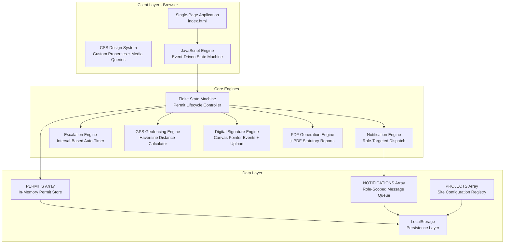

### 2.2 Architectural Pattern: Event-Driven Render Loop

The system follows a **unidirectional data flow** pattern inspired by Flux/Redux, adapted for a zero-build, single-file deployment:

```
User Action → State Mutation → saveState() → render() → DOM Update
                                    ↓
                            LocalStorage Sync
```

| Concept | Implementation |
|---|---|
| **State Store** | Global arrays: `PERMITS[]`, `NOTIFICATIONS[]`, `PROJECTS[]` |
| **Actions** | Functions like `submitPermit()`, `approvePermitStage()`, `raiseObservation()` |
| **Reducers** | State mutation + `saveState()` within each action function |
| **Views** | `buildDashboard()`, `buildRegisterTable()`, `viewDetail()`, `renderWizard()` |
| **Router** | `goTo(view)` toggles `.active` class on view containers |

### 2.3 Component Interaction Map

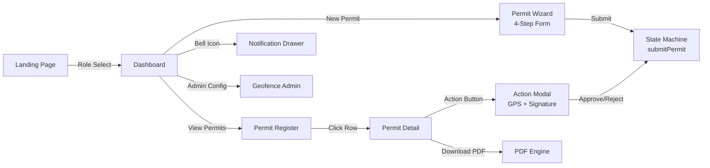

---

## 3. Technology Stack & Design Decisions

### 3.1 Zero-Build Architecture

The system intentionally uses a **zero-build, zero-framework** architecture:

| Decision | Rationale |
|---|---|
| **Single HTML file** | Deployable by dropping one file onto any web server, intranet, or even a USB drive at a construction site with limited connectivity |
| **No Node.js / npm** | Site IT teams don't need to maintain build pipelines; no `node_modules` vulnerabilities |
| **No React/Vue/Angular** | Eliminates framework lock-in; any developer can read and modify the codebase |
| **CSS Custom Properties** | Centralised design tokens (`--navy`, `--orange`, `--radius`) enable theming without preprocessors |
| **Vanilla JavaScript** | Full ES6+ feature use (arrow functions, template literals, destructuring) without transpilation |

### 3.2 External Dependencies

| Dependency | Version | Purpose | Fallback |
|---|---|---|---|
| **Font Awesome** | 6.5.1 (CDN) | Icon library for UI elements | System renders without icons; all labels remain functional |
| **jsPDF** | 2.5.1 (CDN) | Client-side PDF generation | PDF button hidden; all other features remain functional |

### 3.3 Browser Support

| Browser | Minimum Version | Notes |
|---|---|---|
| Chrome / Edge | 88+ | Full support including Pointer Events, CSS Grid, `dvh` units |
| Safari / iOS Safari | 15+ | Safe area insets, `-webkit-overflow-scrolling` |
| Firefox | 85+ | Full support |

---

## 4. Role-Based Access Control (RBAC)

### 4.1 Role Registry

The system implements **9 functional roles** aligned to construction site hierarchy. Per **DPDP Act 2023** compliance, roles are functional authorizations — personal names are entered dynamically only at the moment of digital signature.

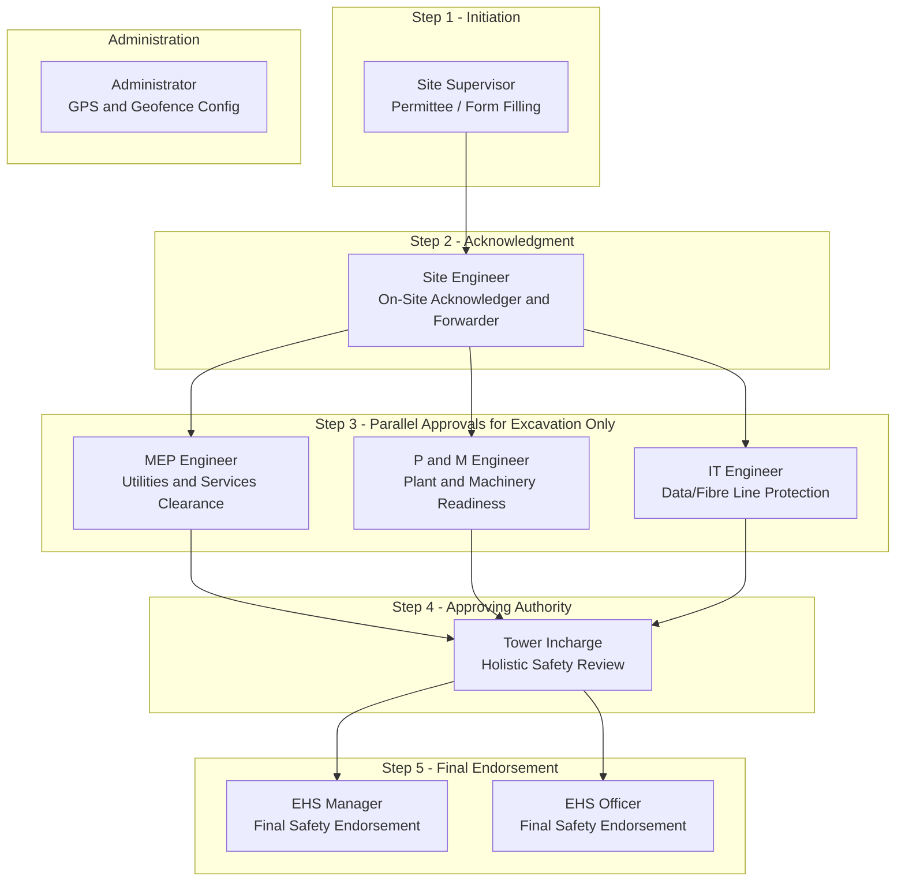

### 4.2 Role Permission Matrix

| Capability | Site Supervisor | Site Engineer | MEP | P&M | IT | Tower Incharge | EHS Manager | EHS Officer | Admin |
|:---|:---:|:---:|:---:|:---:|:---:|:---:|:---:|:---:|:---:|
| Create Permit | ✅ | — | — | — | — | — | — | — | — |
| Acknowledge & Forward | — | ✅ | — | — | — | — | — | — | — |
| Parallel Approval | — | — | ✅ | ✅ | ✅ | — | — | — | — |
| Section Head Approval | — | — | — | — | — | ✅ | — | — | — |
| EHS Final Endorsement | — | — | — | — | — | — | ✅ | ✅ | — |
| Raise Observation | — | — | — | — | — | — | ✅ | ✅ | — |
| Respond to Observation | ✅ | — | — | — | — | — | — | — | — |
| Request Extension | ✅ | — | — | — | — | — | — | — | — |
| Close & Surrender | — | ✅ | — | — | — | — | — | — | — |
| Download PDF | — | — | — | — | — | — | ✅ | ✅ | — |
| Configure Geofence | — | — | — | — | — | — | — | — | ✅ |
| View Dashboard KPIs | ✅ | ✅ | ✅ | ✅ | ✅ | ✅ | ✅ | ✅ | ✅ |
| View Notifications | ✅ | ✅ | ✅ | ✅ | ✅ | ✅ | ✅ | ✅ | ✅ |

### 4.3 EHS Endorsement: First-Wins Gate

The EHS final endorsement stage implements a **first-wins** pattern:

- **Either** EHS Manager **or** EHS Officer can provide the final endorsement
- Whichever approves first activates the permit
- The other role receives a courtesy notification that their approval is no longer required
- This ensures operational continuity when one EHS authority is unavailable

---

## 5. Permit Types & Master Data

### 5.1 Active Permit Types

| Code | Permit Type | Form ID | Checklist Items | Special Requirements |
|:---|:---|:---|:---:|:---|
| **PT-01** | Excavation Work | `EHS_PTW_001` | 12 | 3-role parallel gate (MEP + P&M + IT); depth, slope ratio, soil condition |
| **PT-02** | Hot Work | `EHS_PTW_002` | 20 | 1-hour continuous fire watch; welder ID; spark containment; flash-back arresters |
| **PT-03** | Guard Rail / Floor Protection Removal | `EHS_PTW_003` | 9 | Minimum one watcher until re-fixed; fall protection gear mandatory |
| **PT-04** | Confined Space Entry | `EHS_PTW_004` | 15 | **4-parameter multi-gas detector** (Combustible, H2S, CO, O2); rescue equipment |
| **PT-05** | Shaft Work | `EHS_PTW_005` | 10 | Scaffold green tag verification; MEP clearance step; platform density limits |

### 5.2 Approval Chain Topology per Permit Type

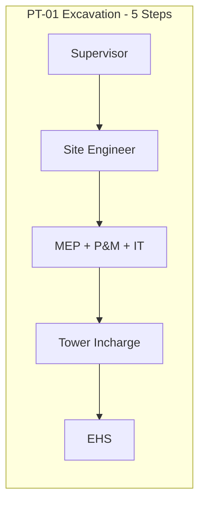

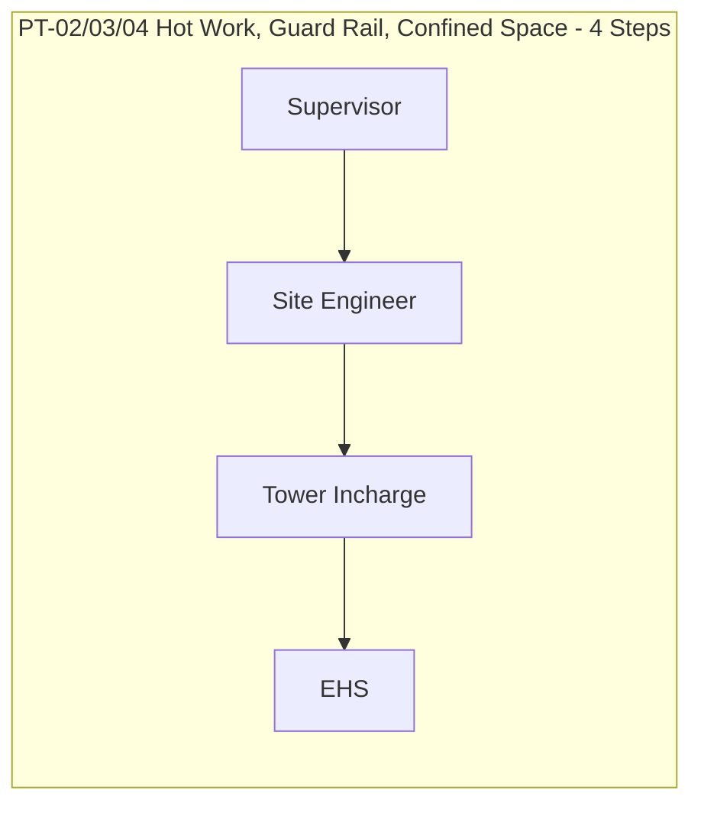

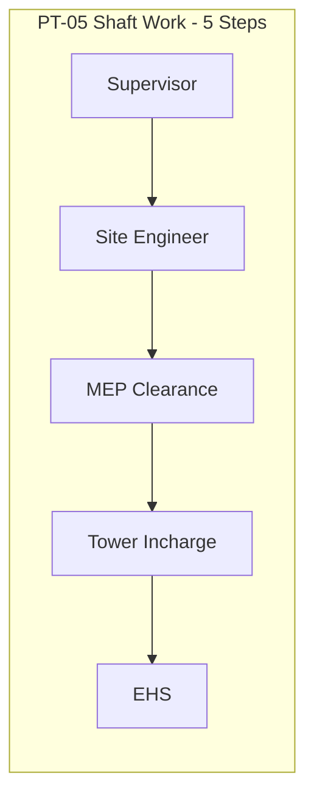

### 5.3 Confined Space Gas Detection Thresholds (PT-04)

All four parameters must be within safe limits before the permit can proceed:

| Parameter | Safe Range | Unit | Description |
|:---|:---|:---|:---|
| **Combustible Gas** | 0 to less than 10% | % LEL | Lower Explosive Limit |
| **Hydrogen Sulphide (H2S)** | 0 to 5 | PPM | Parts Per Million |
| **Carbon Monoxide (CO)** | 0 to less than 25 | PPM | Parts Per Million |
| **Oxygen (O2)** | 19.5 to 21.0 | % by volume | Oxygen deficiency/enrichment |

### 5.4 Project Master Data

| Field | Description | Example |
|---|---|---|
| `id` | Unique project identifier | `PRJ-AGR` |
| `name` | Human-readable project name | `Auro Grand Residency` |
| `towers[]` | Array of tower/block names | `['Tower A', 'Tower B', 'Tower C', 'Tower D']` |
| `site.lat` / `site.lng` | GPS coordinates of site centre | `17.4239, 78.4738` |
| `site.address` | Human-readable address | `Gachibowli, Hyderabad, Telangana` |
| `radius` | Geofence radius in metres | `150` |
| `configured` | Whether GPS has been tagged by Admin | `true` / `false` |
| `configuredAt` | ISO timestamp of last configuration | `2026-09-01T10:00:00Z` |
| `tagMethod` | GPS tagging method used | `On-Site Tagged (Device GPS)` |

---

## 6. Core Workflow: Permit Lifecycle State Machine

### 6.1 Complete State Transition Diagram

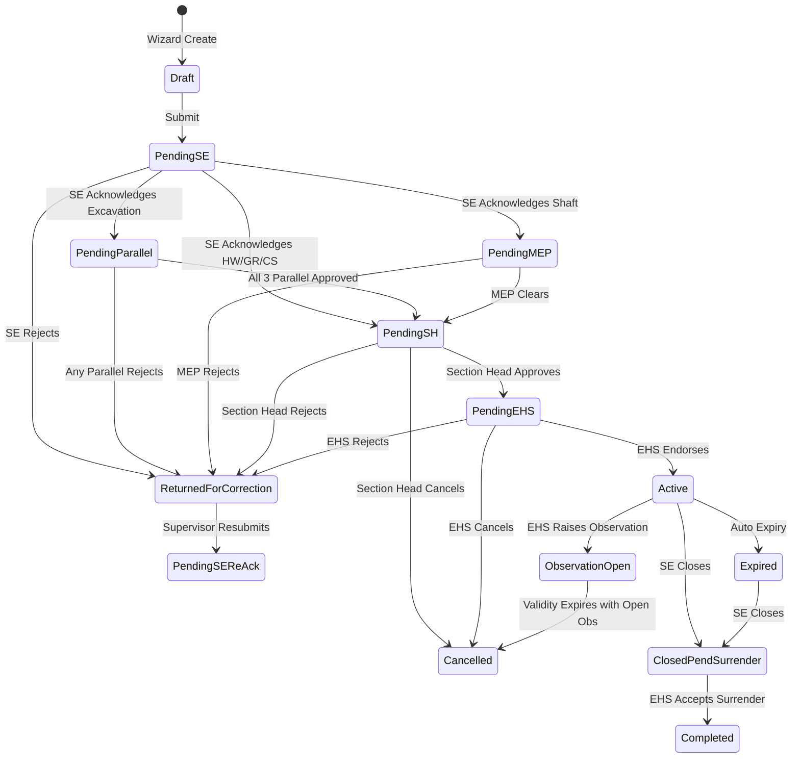

### 6.2 Status Enumeration

| Status | Description | Next Actions |
|:---|:---|:---|
| `Draft` | Permit form created, not yet submitted | Submit, Delete |
| `Pending Site Engineer Acknowledgment` | Awaiting SE on-site verification | Acknowledge, Reject |
| `Pending Parallel Approval` | MEP + P&M + IT reviewing (Excavation) | Each approves independently |
| `Pending MEP Clearance` | MEP reviewing (Shaft Work) | Approve, Reject |
| `Pending Section Head` | Tower Incharge reviewing | Approve, Reject, Cancel |
| `Pending EHS Approval` | EHS Manager/Officer final endorsement | Approve, Reject, Cancel |
| `Active` | Work authorised to proceed | Raise Observation, Close, Extend |
| `Active – Observation Open` | Work paused; observation pending | Respond with rectification |
| `Expired` | Validity period exceeded without closure | Close & Surrender |
| `Closed – Pending Surrender` | Work complete, awaiting EHS surrender acceptance | EHS Accept/Reject |
| `Returned for Correction` | Rejected by an approver | Supervisor corrects & resubmits |
| `Cancelled` | Terminated — no recovery | PDF available for audit |
| `Completed` | Fully surrendered and accepted by EHS | PDF available for audit |

---

## 7. Approval Chain Architecture

### 7.1 Chain Data Model

Each permit carries an `approvals` object that tracks every approver's decision:

```javascript
// Excavation (PT-01) — Full parallel + sequential chain
{
  kind: 'exc',
  mep:          { status: 'pending|approved|rejected', by, at, gps, comment, sig },
  pm:           { status: 'pending|approved|rejected', by, at, gps, comment, sig },
  it:           { status: 'pending|approved|rejected', by, at, gps, comment, sig },
  sectionHead:  { status: 'pending|approved|rejected|cancelled', by, at, gps, comment, sig },
  ehsManager:   { status: 'pending|approved|rejected|cancelled', by, at, gps, comment, sig },
  ehsOfficer:   { status: 'pending|approved|rejected|cancelled', by, at, gps, comment, sig }
}

// Hot Work / Guard Rail / Confined Space (PT-02/03/04) — Sequential only
{
  kind: 'hotwork|guardrail|confined',
  sectionHead:  { ... },
  ehsManager:   { ... },
  ehsOfficer:   { ... }
}

// Shaft Work (PT-05) — MEP clearance + sequential
{
  kind: 'shaft',
  mep:          { ... },
  sectionHead:  { ... },
  ehsManager:   { ... },
  ehsOfficer:   { ... }
}
```

### 7.2 Stage Resolution Algorithm

The `chainStage()` function implements a **priority-ordered finite automaton** that determines the current approval stage:

```
1. Check for rejections/cancellations → return 'rejected-*'
2. Check parallel gate completion    → return 'parallel' if incomplete
3. Check section head approval       → return 'section-head' if pending
4. Check EHS endorsement             → return 'ehs' if pending
5. All cleared                       → return 'complete'
```

### 7.3 Stale Approval Retention

When a permit is rejected and resubmitted, **prior approvals from uninvolved stages are retained**. For example, if Tower Incharge rejects an Excavation permit but MEP/P&M/IT had already approved, those parallel approvals are preserved on resubmission. Only the rejecting stage and beyond require fresh approval.

---

## 8. Swimlane Diagrams

### 8.1 Excavation Permit (PT-01): End-to-End Lifecycle

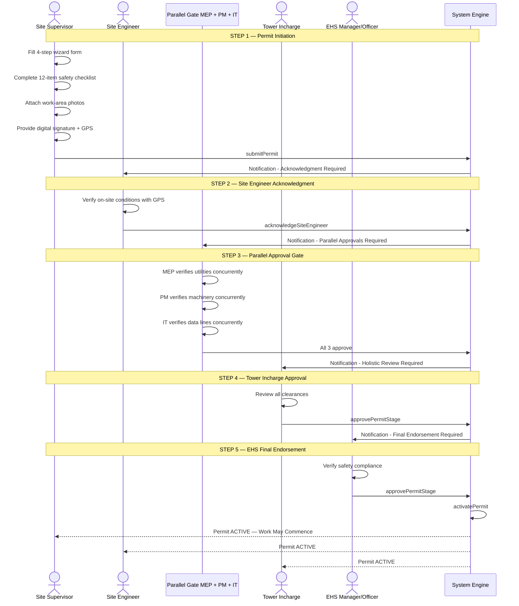

### 8.2 Rejection & Correction Flow

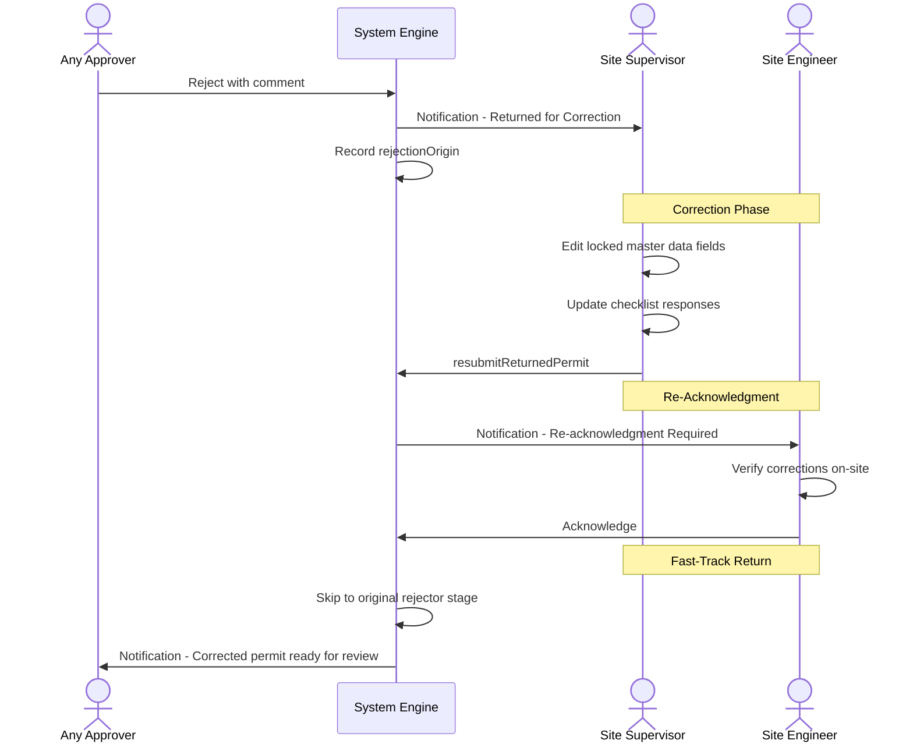

### 8.3 Safety Observation Lifecycle

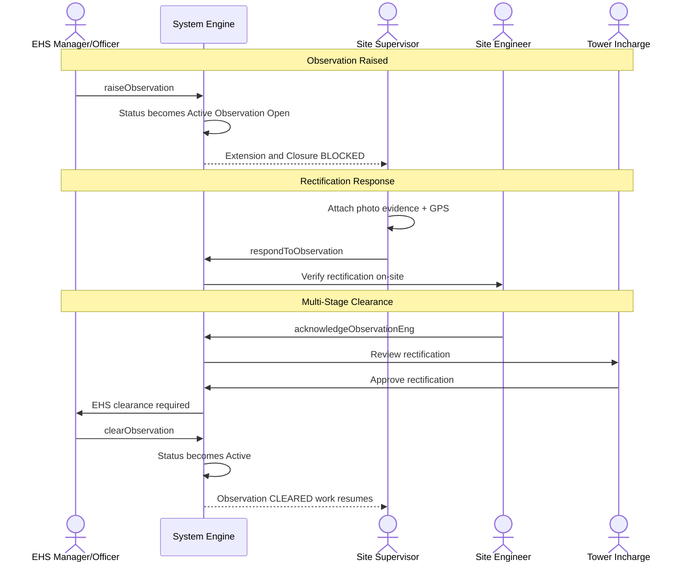

### 8.4 Extension Request Flow

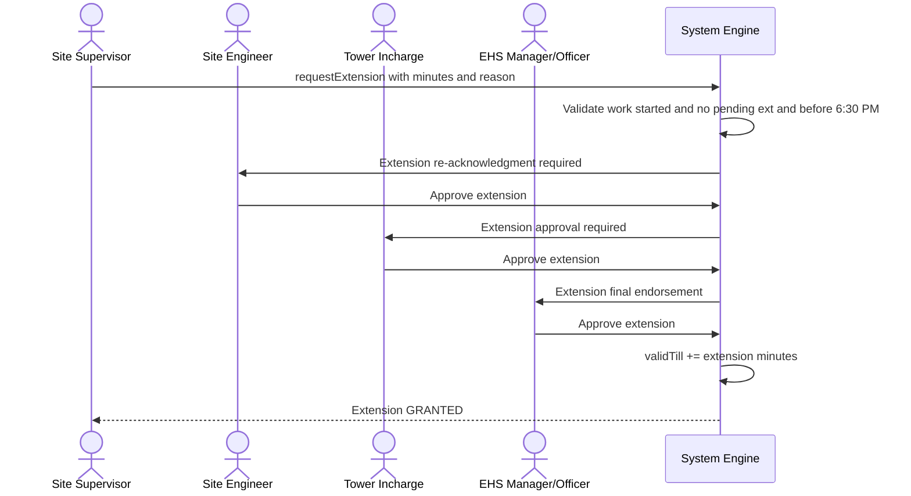

---

## 9. Escalation & Auto-Expiry Engine

The escalation engine runs on a **5-second interval timer** (`setInterval(runEscalationTick, 5000)`), checking every active permit for time-based triggers.

### 9.1 Escalation Matrix

```mermaid
graph TD
    subgraph "Pending Stage Escalation"
        A["Permit enters pending stage"] --> B{"Elapsed greater than Stage 1 threshold"}
        B -->|Yes| C["Stage 1 Escalation<br/>Notify Tower Incharge + EHS Manager"]
        B -->|No| D["Continue monitoring"]
        C --> E{"Elapsed greater than Stage 2 threshold"}
        E -->|Yes| F["Stage 2 Escalation<br/>Notify EHS Manager + EHS Officer"]
    end

    subgraph "Active Permit Timers"
        G["Active Permit"] --> H{"T minus 30 minutes before expiry"}
        H -->|Yes| I["Close Reminder<br/>Notify Supervisor + Engineer"]
        I --> J{"Past validTill?"}
        J -->|Yes| K["Auto-EXPIRED<br/>Notify All stakeholders"]
    end

    subgraph "Observation Auto-Cancel"
        L["Active Observation Open"] --> M{"Past validTill?"}
        M -->|Yes| N["Auto-CANCELLED<br/>Stop work immediately"]
    end

    subgraph "Surrender Escalation"
        O["Expired / Closed Pending"] --> P{"Every 6th tick cycle"}
        P -->|Yes| Q["Surrender Reminder<br/>Recurring until resolved"]
    end
```

### 9.2 Escalation Configuration

| Timer | Demo Value | Production Equivalent | Target Roles |
|:---|:---|:---|:---|
| Stage 1 Escalation | 45 seconds | 2 hours | Tower Incharge + EHS Manager |
| Stage 2 Escalation | 120 seconds | 4 hours | EHS Manager + EHS Officer |
| 30-Minute Close Warning | 30 minutes | 30 minutes | Supervisor + Site Engineer |
| Auto-Expiry | At `validTill` | At `validTill` | All stakeholders |
| Observation Auto-Cancel | At `validTill` | At `validTill` | All stakeholders |
| Surrender Reminder | Every 6th cycle | Every 30 seconds (demo) | All stakeholders |

---

## 10. Safety Observation Workflow

The observation system implements a **mini approval chain within an active permit**, blocking extensions and closures until the safety concern is fully resolved.

### 10.1 Observation State Machine

| State | Owner | Next Action |
|:---|:---|:---|
| `Open` | EHS raised | Supervisor must respond |
| `Rectified – Awaiting Engineer Ack` | Supervisor responded | Site Engineer verifies on-site |
| `Pending Tower Incharge Review` | Engineer acknowledged | Tower Incharge reviews |
| `Pending EHS Clearance` | Tower Incharge approved | EHS clears observation |
| `Cleared` | EHS cleared | Permit returns to `Active` |
| **Rejection loops**: Any reviewer can reject, sending it back to Supervisor for re-rectification |

### 10.2 Business Rules

- **Extension Blocked**: No extension requests are accepted while an observation is open
- **Closure Blocked**: Site Engineer cannot close the permit while an observation exists
- **Auto-Cancel on Expiry**: If the permit validity expires while an observation remains unrectified, the system automatically cancels the permit and dispatches emergency stop-work notifications

---

## 11. Extension Workflow

### 11.1 Extension Business Rules

| Rule | Description |
|:---|:---|
| **Work Must Have Started** | Extensions cannot be requested before the scheduled work start time |
| **Single Extension Queue** | Only one extension request can be in the approval pipeline at a time |
| **6:30 PM IST Cutoff** | Extension requests are blocked after 6:30 PM IST |
| **8:30 PM IST Maximum Ceiling** | Validity cannot be extended beyond 8:30 PM IST |
| **Minimum Step** | Configurable minimum extension increment |
| **Observation Block** | Cannot request extension while a safety observation is open |

### 11.2 Extension Approval Chain

Extensions follow a **4-step sequential flow**:
1. **Site Engineer** → Re-acknowledgment (verify on-site conditions still safe)
2. **Tower Incharge** → Approval
3. **EHS Manager / Officer** → Final endorsement (first-wins gate)

Upon approval, `validTill` is extended by the requested duration.

---

## 12. Day 2 Re-Trigger Workflow

When a permit has been surrendered and completed, but the same work scope continues the next day, the system supports a **Day 2 Re-Trigger**:

1. **Site Supervisor** requests re-trigger with updated validity dates
2. **Site Engineer** verifies on-site conditions remain valid
3. **EHS Manager/Officer** reviews and approves, rejects, or cancels
4. Upon approval, the permit transitions to a fresh `Active` state with new validity

The re-trigger retains the original permit's master data (project, location, contractor, checklist) but creates fresh validity windows and signatory records.

---

## 13. Notification Engine

### 13.1 Architecture

The notification engine implements a **role-targeted, multi-cast message queue**:

```javascript
function notify(roleTargets, message, severity, permitId, kind) {
    // roleTargets: string | string[] — supports 'all' for broadcast
    // severity: 'info' | 'warn' | 'error' | 'success'
    // Stored in NOTIFICATIONS[] with unique ID and IST timestamp
}
```

### 13.2 Routing Logic

| Target Pattern | Behaviour |
|:---|:---|
| `['site-engineer']` | Single role |
| `['mep', 'pm', 'it']` | Multi-role simultaneous |
| `['ehs-manager', 'ehs-officer']` | EHS team (either/both) |
| `['all']` | Global broadcast to all roles |
| `['hw-section-head']` / `['section-head']` | Alias resolution — both keys reach Tower Incharge |

### 13.3 UI Components

| Component | Description |
|:---|:---|
| **Bell Badge** | Red counter showing unread count (capped at `99+`) |
| **Notification Drawer** | Slide-out panel with chronological feed |
| **Severity Icons** | Info, Warning, Error, Success with corresponding colours |
| **Deep Links** | Each notification with a `permitId` includes a "View Permit" button |
| **Mark All Read** | Single action to clear all unread indicators |

### 13.4 Notification Volume by Workflow

| Event | Notifications Generated |
|:---|:---|
| Permit Submission | 2 (targeted + stakeholder broadcast) |
| Each Approval Stage | 2–3 (next approver + stakeholder update) |
| Rejection | 2 (supervisor + stakeholder broadcast) |
| Observation Raised | 1 (all stakeholders) |
| Each Escalation Tier | 1 (targeted escalation recipients) |
| Permit Activation | 1 (all stakeholders) |
| Auto-Expiry | 1 (all stakeholders — emergency) |

---

## 14. GPS Geofencing & Proximity Verification

### 14.1 Purpose

Every approval action requires the approver to confirm they are **physically present at the construction site**. The system uses the **Haversine formula** to calculate the great-circle distance between the approver's device GPS and the configured site centre:

```javascript
function haversine(lat1, lng1, lat2, lng2) {
    const R = 6371000; // Earth's radius in metres
    const toRad = x => x * Math.PI / 180;
    const dLat = toRad(lat2 - lat1), dLng = toRad(lng2 - lng1);
    const a = Math.sin(dLat / 2) ** 2 +
              Math.cos(toRad(lat1)) * Math.cos(toRad(lat2)) *
              Math.sin(dLng / 2) ** 2;
    return R * 2 * Math.atan2(Math.sqrt(a), Math.sqrt(1 - a));
}
```

### 14.2 Geofence Configuration

| Parameter | Description | Configurable By |
|:---|:---|:---|
| Site Centre (Lat/Lng) | GPS coordinates of the project site | Administrator |
| Proximity Radius | Acceptance radius in metres (default: 100–200m) | Administrator |
| Tag Method | `On-Site Tagged (Device GPS)` or `Manual Entry` | Administrator |

### 14.3 GPS Enforcement Points

GPS verification is required at:
- Permit submission (Site Supervisor)
- Site Engineer acknowledgment
- Each approval stage (parallel and sequential)
- Observation rectification response
- Extension request and approvals
- Closure and surrender

---

## 15. Digital Signature Engine

### 15.1 Capabilities

| Feature | Description |
|:---|:---|
| **Canvas Drawing** | Pointer Events API for mouse and touch input |
| **Upload Support** | PNG/JPG signature image upload (max 2 MB) |
| **Data Storage** | Signatures stored as Base64 data URLs on the permit record |
| **PDF Rendering** | Signatures reproduced in the statutory PDF report |
| **Identity Binding** | Signer enters their name before signing; recorded with IST timestamp |
| **Consent Tracking** | `consent: true` flag recorded with each signature |

### 15.2 Signature Storage Model

```javascript
permit.signatories = {
    'site-supervisor': {
        name: 'R. K. Patel',
        sig: 'data:image/png;base64,...',
        consent: true,
        at: '2026-09-06T10:15:00+05:30'
    },
    'site-engineer': {
        name: 'V. S. Rao',
        sig: 'data:image/png;base64,...',
        consent: true,
        at: '2026-09-06T10:30:00+05:30'
    }
    // one entry per role that has acted
}
```

---

## 16. Statutory PDF Generation

### 16.1 Access Control

PDF download is **strictly restricted to EHS roles only** (EHS Manager and EHS Officer). All other roles see an "Access Denied" badge on the download button.

| Condition | Behaviour |
|:---|:---|
| Pre-approval stages | Download button is **completely hidden** |
| Post-activation (Active, Cancelled, Completed) | Button visible, but locked for non-EHS |
| EHS Manager / Officer + post-activation | Button enabled — PDF generation proceeds |

### 16.2 PDF Content (per Permit Type)

| Section | Contents |
|:---|:---|
| **Header** | Company logo area, permit number, form ID, status badge |
| **General Information** | Project, tower, location, contractor, date, validity window |
| **Type-Specific Fields** | Excavation: depth, slope, soil; Hot Work: welder ID, fire watch; Confined Space: gas readings |
| **Safety Checklist** | All checklist items with YES/NO/NA responses, comments, and photo evidence indicators |
| **Approval Chain** | Full signatory chain with name, role, decision, timestamp, GPS coordinates, and digital signature |
| **Observations** | Observation details, rectification evidence, and clearance chain (if applicable) |
| **Extensions** | Extension requests, approvals, and updated validity |
| **Activity Log** | Complete chronological audit trail |

---

## 17. Role-Specific Dashboards & KPIs

Each role sees a customised dashboard with relevant KPI cards:

### 17.1 Dashboard Matrix

| KPI Card | SS | SE | MEP | P&M | IT | TI | EHS-M | EHS-O | Admin |
|:---|:---:|:---:|:---:|:---:|:---:|:---:|:---:|:---:|:---:|
| My Drafts | ✅ | — | — | — | — | — | — | — | — |
| In Approval Chain | ✅ | — | — | — | — | — | — | — | — |
| Active Permits | ✅ | ✅ | — | — | — | ✅ | ✅ | ✅ | — |
| Open Observations | ✅ | — | — | — | — | — | ✅ | ✅ | — |
| Extension Requests | ✅ | — | — | — | — | — | — | — | — |
| Closed Permits | ✅ | — | — | — | — | — | — | — | — |
| Pending Acknowledgment | — | ✅ | — | — | — | — | — | — | — |
| Day 2 Re-trigger Acks | — | ✅ | — | — | — | — | — | — | — |
| Surrendered Permits | — | ✅ | — | — | — | — | — | — | — |
| Pending My Approval | — | — | ✅ | ✅ | ✅ | ✅ | ✅ | ✅ | — |
| Approved by Me | — | — | — | — | — | ✅ | — | — | — |
| Pending Extension Approval | — | — | — | — | — | ✅ | — | — | — |
| Total Permits | — | — | — | — | — | — | ✅ | ✅ | ✅ |
| Status Distribution | — | — | — | — | — | — | — | — | ✅ |
| Geofence Config Ratio | — | — | — | — | — | — | — | — | ✅ |

### 17.2 Empty State Resilience

All dashboard calculations handle `PERMITS = []` gracefully — zero `NaN`, zero `undefined`, zero runtime crashes. Validated by automated tests.

---

## 18. Permit Register & Advanced Filtering

### 18.1 Filter Capabilities

| Filter | Type | Options |
|:---|:---|:---|
| **Search `q`** | Text input | Matches against: Permit ID, Project Name, Location, Contractor Name, Tower, Permit Code |
| **Status** | Dropdown | All statuses from the state machine |
| **Project** | Dropdown | All configured projects |
| **Type** | Dropdown | excavation, hotwork, guardrail, confined, shaft |

### 18.2 Sorting

Permits are always sorted **newest-first** by creation timestamp (`createdAt`), ensuring the most recent activity is immediately visible.

### 18.3 Null Safety

Search handles `null` / `undefined` fields gracefully using safe access patterns:
```javascript
(p.tower || '').toLowerCase()
```
This prevents `TypeError` crashes in records where optional fields (like `tower` for greenfield/basement projects) are not populated.

---

## 19. Responsive Design Architecture

### 19.1 Device Tier Breakpoints

| Tier | Breakpoint | Layout Strategy |
|:---|:---|:---|
| Mobile Phones | 580px and below, with 360px small variant | Single-column fluid; 44px min tap targets; bottom-sheet modals; iOS 16px font fix |
| Tablets | 960px and below, with 768px variant | Sliding drawer nav; 2-column KPIs; touch momentum scrolling |
| Laptops | 961px to 1200px | 2-column detail grid; flexible filter wrapping |
| Desktops | 1201px to 1919px | Persistent sidebar; multi-column workflows; full analytics |
| Large / Ultra-wide | 1920px and above | max-width 1560px with auto margins to prevent content stretching |

### 19.2 Touch Optimisation

| Feature | Implementation |
|:---|:---|
| **WCAG Tap Targets** | All interactive elements at least 44px via `@media (pointer: coarse)` |
| **Safe Area Insets** | `env(safe-area-inset-*)` for notched/rounded devices |
| **Touch Scrolling** | `-webkit-overflow-scrolling: touch` on data tables |
| **iOS Zoom Prevention** | `font-size: 16px` minimum on inputs to prevent auto-zoom |
| **Grid Overflow Prevention** | `min-width: 0` on all grid children; `minmax(0, 1fr)` column definitions |

### 19.3 CSS Architecture

```
:root  (25 design tokens)
  ├── Base Reset (*, html, body)
  ├── Typography System
  ├── Component Styles
  │   ├── .btn, .btn-primary, .btn-ghost, .btn-danger
  │   ├── .card, .kpi-card, .status-pill
  │   ├── .modal, .drawer
  │   ├── .form-group, .form-hint
  │   ├── .table, .register-table
  │   └── .toast, .notif-*
  ├── View-Specific Styles
  │   ├── .landing-*
  │   ├── .dashboard-*
  │   ├── .wizard-*
  │   └── .detail-*
  └── Media Queries (mobile-first)
      ├── @media (max-width: 960px)
      ├── @media (max-width: 768px)
      ├── @media (max-width: 580px)
      ├── @media (max-width: 360px)
      └── @media (pointer: coarse)
```

---

## 20. Data Persistence & State Management

### 20.1 Storage Architecture

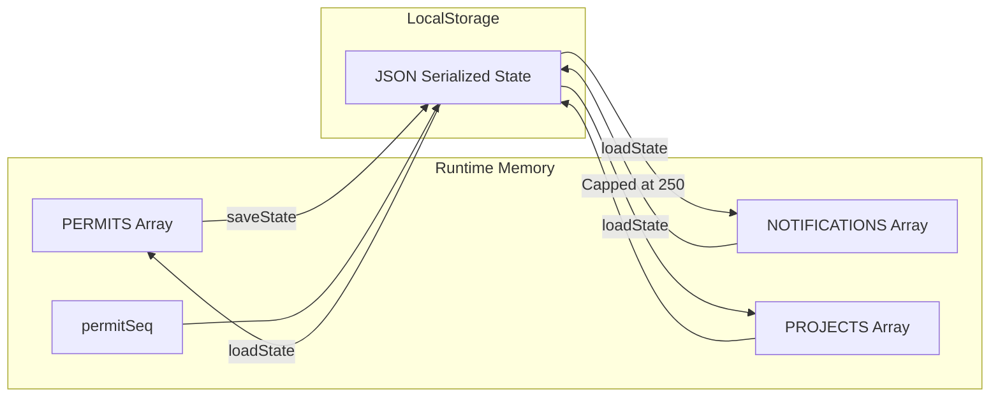

### 20.2 Persistence Strategy

| Aspect | Implementation |
|:---|:---|
| **Save Trigger** | After every state mutation (submit, approve, reject, etc.) |
| **Notification Cap** | Maximum 250 notifications persisted (FIFO) |
| **Quota Overflow** | Graceful fallback: truncates to 120 notifications if `QuotaExceededError` |
| **Seed Data** | Pre-loaded with representative permits across all 5 types and multiple statuses |
| **Reset** | `resetDemoData()` clears LocalStorage and reloads with seed data |

### 20.3 Permit Data Model

```javascript
{
    id: 'EXC-2026-000001',          // Auto-generated permit number
    ptype: 'excavation',             // Permit type key
    project: 'Auro Grand Residency', // Project name
    tower: 'Tower A',                // Tower/block
    location: 'Grid Line A3-A7',     // Work location
    floor: 'Basement 2 (B2)',        // Floor/level
    contractor: 'ABC Construction',  // Contractor name
    supervisor: 'R. K. Patel',       // Supervisor name
    workerCount: 8,                  // Number of workers
    validFrom: '2026-09-06',         // Validity start date
    validTill: '2026-09-06T18:30',   // Validity end (IST)
    startTime: '08:30',              // Scheduled work start
    
    // Discipline-specific fields
    depth: '3.5m',                   // Excavation depth
    slope: '1:1',                    // Slope ratio
    soilCondition: 'Clay',           // Soil type
    equipment: ['Excavator', 'Compactor'],

    // Safety checklist
    checklist: [
        { ans: 'yes', comment: '', photo: null, gps: null }
        // one entry per checklist item
    ],
    
    // Workflow state
    status: 'Active',
    submittedAt: '2026-09-06T08:00:00+05:30',
    activatedAt: '2026-09-06T09:15:00+05:30',
    stageEnteredAt: '...',
    escalation: { stage1: false, stage2: false },
    
    // Approval chain
    siteEngineerAck: { acknowledged: true, at, by, gps, sig },
    approvals: { kind: 'exc', mep: {}, pm: {}, it: {}, sectionHead: {}, ehsManager: {}, ehsOfficer: {} },
    signatories: { 'site-supervisor': {}, 'site-engineer': {} },
    
    // Observation (if any)
    observation: { id, raisedAt, raisedBy, comment, status, response },
    
    // Extension (if any)
    extension: { id, minutes, reason, approvals: {}, status },
    
    // Activity log
    activityLog: [
        { at: '...', text: 'Permit submitted by...', by: '...' }
    ],
    
    // GPS and signatures
    gps: { lat, lng, address, distance, within, radius },
    signature: { dataUrl, at, by, consent }
}
```

---

## 21. Unified Component Library

### 21.1 Component Catalogue

| Component | Usage | Variants |
|:---|:---|:---|
| **Button** (`.btn`) | All interactive actions | `btn-primary`, `btn-ghost`, `btn-danger`, `btn-sm` |
| **Card** (`.card`) | Content containers | Standard, KPI, Detail Section |
| **Status Pill** (`.status-pill`) | Permit status indicators | 7 colour variants mapped to status |
| **Modal** (`.modal`) | Overlay dialogs | Action Modal, GPS Modal, Photo Modal, Signature Modal |
| **Toast** (`.toast`) | Ephemeral notifications | `ok` (green), `err` (red), `warn` (amber), `info` (blue) |
| **Form Group** (`.form-group`) | Input containers | Text, Select, Textarea, Radio Pills, Check Pills |
| **Stepper** (`.stepper`) | Wizard progress | 4-step linear with completion indicators |
| **Table** (`.register-table`) | Data grids | Responsive with sticky columns on mobile |
| **Drawer** (`.notif-drawer`) | Slide-out panels | Notification feed, Mobile navigation |
| **Feed** (`.feed-*`) | Notification items | With severity icons and deep links |

### 21.2 Design Token System

```css
:root {
    /* Brand */
    --navy: #0A1628;
    --orange: #E8600A;
    
    /* Surfaces */
    --bg: #F7F8FA;
    --surface: #FFFFFF;
    --border: #E2E5EA;
    
    /* Semantic Colours */
    --green: #1E7A3D;      /* Success, Approved */
    --amber: #9A6400;      /* Warning, Pending */
    --red: #B3261E;        /* Error, Rejected */
    --blue: #1B5FAE;       /* Info, In Progress */
    --purple: #6941C6;     /* Extension, Special */
    --teal: #0E7C86;       /* Observation */
    
    /* Typography */
    --font-ui: "Segoe UI", -apple-system, BlinkMacSystemFont, ...;
    --font-mono: "SFMono-Regular", Consolas, ...;
    
    /* Spacing & Depth */
    --radius: 8px;
    --shadow-sm: 0 1px 2px rgba(10, 22, 40, .06);
    --shadow-md: 0 6px 20px rgba(10, 22, 40, .12);
    --shadow-lg: 0 20px 50px rgba(10, 22, 40, .28);
}
```

---

## 22. Security & Compliance

### 22.1 DPDP Act 2023 Compliance

| Requirement | Implementation |
|:---|:---|
| **No Pre-Assigned Names** | Roles are functional; names entered dynamically at signature time |
| **Consent Tracking** | Every signature records `consent: true` with timestamp |
| **Data Minimisation** | Only operational data collected; no PII stored beyond signatures |
| **Audit Trail** | Immutable activity log per permit with IST timestamps |

### 22.2 Access Control Enforcement

| Enforcement Point | Mechanism |
|:---|:---|
| **PDF Download** | Role check: only `ehs-manager` and `ehs-officer` |
| **Permit Creation** | Only `site-supervisor` can access the wizard |
| **Approval Actions** | `roleCanActOnChain()` validates role against current chain stage |
| **Observation** | Only EHS roles can raise; only Supervisor can respond |
| **Admin Config** | Only `admin` role can access geofence configuration |

### 22.3 Input Sanitisation

All user-facing text is sanitised through `escapeHtml()`:
```javascript
function escapeHtml(s) {
    return String(s)
        .replace(/&/g, '&amp;')
        .replace(/</g, '&lt;')
        .replace(/>/g, '&gt;')
        .replace(/"/g, '&quot;')
        .replace(/'/g, '&#039;');
}
```

---

## 23. Testing & Quality Assurance

### 23.1 Test Suite Architecture

```bash
# Execute full test suite (Zero external dependencies, Node.js built-in runner)
npm test
# OR
node tests/run_all_tests.js
```

| Suite | File | Tests | Coverage Area |
|:---|:---|:---:|:---|
| **Base Lifecycle** | `tests/run_full_test_suite.js` | 165 | State machine, approval chains, role permissions, RBAC, checklist validation, gas readings |
| **Extended Audit** | `tests/run_extended_audit_tests.js` | 74 | Notifications, escalation engine, PDF security, KPI calculations, register filters |
| **Master Runner** | `tests/run_all_tests.js` | 239 | Runs both suites sequentially (100% automated pass rate) |

### 23.2 Test Coverage Matrix

| Domain | Positive Tests | Negative Tests | Edge Cases |
|:---|:---:|:---:|:---:|
| Permit Lifecycle (all 5 types) | ✅ | ✅ | ✅ |
| Approval Chain State Transitions | ✅ | ✅ | ✅ |
| Notification Routing & Privacy | ✅ | ✅ | ✅ |
| Escalation Engine (Stage 1 & 2) | ✅ | ✅ | ✅ |
| Auto-Expiry & Auto-Cancel | ✅ | ✅ | ✅ |
| PDF Role-Based Security | ✅ | ✅ | ✅ |
| KPI Dashboard Calculations | ✅ | ✅ | ✅ |
| Register Filters & Search | ✅ | ✅ | ✅ |
| Gas Reading Validation (PT-04) | ✅ | ✅ | ✅ |
| Extension Business Rules | ✅ | ✅ | ✅ |
| Observation Lifecycle | ✅ | ✅ | ✅ |
| Empty State Resilience | — | — | ✅ |

### 23.3 Test Results

```
================================================================
MASTER TEST SUITE SUMMARY
================================================================

Suite 1: Base Lifecycle & Engine Tests
  Total: 165 | Passed: 165 | Failed: 0 | Pass Rate: 100%

Suite 2: Extended Audit Tests (Notifs, Escalation, PDF, KPIs, Filters)
  Total: 74  | Passed: 74  | Failed: 0  | Pass Rate: 100%

GRAND TOTAL: 239/239 PASSED (100% PASS RATE)
================================================================
```

---

## 24. Roadmap: Future Permit Types

| Code | Permit Type | Status | Key Requirements |
|:---|:---|:---|:---|
| PT-06 | Electrical Work (HT/LT) | Planned | LOTO, earthing, written shutdown cancellation |
| PT-07 | Drilling and Blasting | Planned | Licensed Blasting In-charge presence |
| PT-08 | General Work | Planned | Erection, hoist, formwork sub-checklists |
| PT-09A | General and Heavy Lifting | Planned | Crane operations; loads above 5MT trigger PT-09B |
| PT-09B | Lift Plan (Non-Routine / Critical) | Planned | 14 critical lift criteria; Project Head approval |
| PT-10 | Night Shift / Holiday Work | Planned | Alcohol test, emergency vehicle, linked sub-permits |

---

## 25. Glossary

| Term | Definition |
|:---|:---|
| **PTW** | Permit-to-Work — formal document authorising specific high-risk activities |
| **EHS** | Environment, Health and Safety |
| **LEL** | Lower Explosive Limit — concentration of gas below which explosion cannot occur |
| **PPM** | Parts Per Million — unit for gas concentration measurement |
| **LOTO** | Lockout-Tagout — safety procedure for hazardous energy isolation |
| **RBAC** | Role-Based Access Control |
| **IST** | Indian Standard Time (UTC+5:30) |
| **DPDP** | Digital Personal Data Protection (Act 2023, India) |
| **Haversine** | Formula for calculating great-circle distance on a sphere |
| **HIRA** | Hazard Identification and Risk Assessment |
| **SWM** | Safe Work Method |
| **MSDS** | Material Safety Data Sheet |
| **RSP** | Rope Suspended Platform |
| **Geofencing** | Virtual perimeter enforcement using GPS coordinates |
| **First-Wins Gate** | Approval pattern where the first of multiple eligible approvers to act completes the stage |

---

## 26. Authors & Engineering Team

Developed and engineered by:
* **Mohith**
* **Prasanna**
* **Abigna**

---

<div align="center">

**ARPL EHS Permit-to-Work Management System** · Demo Build · September 2026

PT-01 Excavation · PT-02 Hot Work · PT-03 Guard Rail · PT-04 Confined Space · PT-05 Shaft Work

*Built for safety. Engineered for accountability.*

</div>
