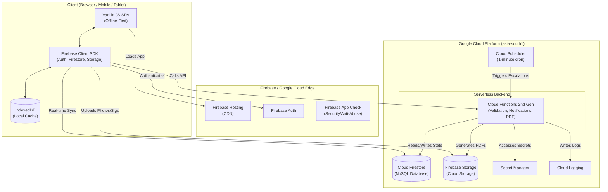

# Final Architecture Blueprint — ARPL EHS PTW System

> **Status**: APPROVED & VALIDATED
> **Architecture Variant**: Firebase-First Serverless Architecture
> **Date**: 2026-09-25

---

## 1. Executive Architecture Summary

The ARPL EHS Permit-to-Work (PTW) System utilises a **Firebase-First Serverless Architecture**. 

This architecture was selected over a traditional GCP containerised approach (Cloud Run/Cloud SQL) because it natively solves the primary challenge of construction site deployments: **intermittent network connectivity**. By leveraging Firebase's client SDKs, the application achieves seamless offline CRUD operations with automatic background synchronisation. Furthermore, Firestore's `onSnapshot` listeners provide the real-time websocket-like updates required for multi-stage safety approvals without requiring complex polling infrastructure.

---

## 2. Core Technical Stack

### Frontend (Client Layer)
- **Framework**: Vanilla JavaScript (ES6+), HTML5, CSS3.
- **Build System**: Zero-build architecture (no Webpack, Vite, or Node.js runtime required).
- **Hosting**: **Firebase Hosting** (Global CDN, free SSL, HTTP/2).
- **State Management**: Event-driven unidirectional data flow governed by a central `window.APP_CONFIG` master object.

### Backend (Data & Auth Layer)
- **Database**: **Cloud Firestore** (`asia-south1` region). Document-oriented NoSQL database.
- **Offline Persistence**: `enableIndexedDbPersistence()` active on the client.
- **Authentication**: **Firebase Authentication** (Email/Password).
- **File Storage**: **Firebase Storage** (backed by Google Cloud Storage in `asia-south1`).

### Backend (Compute & Automation Layer)
- **Serverless Compute**: **Cloud Functions for Firebase 2nd Gen** (Runs on Google Cloud Run architecture).
- **Runtime**: Node.js 18+.
- **Cron / Scheduling**: **Cloud Scheduler** triggering HTTP Cloud Functions (for the Escalation Engine).
- **PDF Generation**: Server-side generation using headless utilities within Cloud Functions.

### DevOps & Observability
- **CI/CD**: **Cloud Build** pipeline deploying to Firebase Hosting and Functions.
- **Secrets Management**: **Google Secret Manager** for API keys.
- **Logging & Auditing**: **Cloud Logging** for backend function execution and database audit trails.

---

## 3. High-Level Component Diagram



---

## 4. Security & Access Control Model

### 4.1 Authentication & Provisioning
- The application is **closed-registration**. Construction workers cannot create their own accounts.
- System Administrators provision accounts using Firebase Admin SDK.
- Users authenticate via Email and Password.

### 4.2 Role-Based Access Control (RBAC)
Roles and project assignments are cryptographically attached to the user's authentication token via **Firebase Custom Claims**. 

Example Token Claim:
```json
{
  "role": "tower-incharge",
  "projectIds": ["PRJ-ART", "PRJ-ABP"]
}
```

### 4.3 Firestore Security Rules
All database access is heavily restricted at the database level (ignoring the UI). The rules guarantee:
1. **Tenant Isolation**: A user can only read permits where `permit.projectId` matches a project in their Custom Claims.
2. **Role Enforcement**: A user cannot mutate a permit document unless their role matches the expected role for the current approval stage (e.g., only the `EHS Manager` can transition a permit to `Active`).
3. **Data Integrity**: Enforces schema validation on incoming writes to prevent payload tampering.

---

## 5. Offline-First Data Synchronization

1. **Disconnected State**: When a user goes offline (e.g., in a deep basement), the Firebase SDK seamlessly routes all read/write requests to the local `IndexedDB` cache.
2. **Local Queuing**: Any approvals or new permits created are queued locally. The UI reflects the success instantly.
3. **Reconnection**: Upon detecting a network connection, the Firebase SDK flushes the queue to the server in chronological order.
4. **Conflict Resolution**: Firestore handles conflicts via a "last-writer-wins" strategy at the document field level. Server-side Cloud Functions validate the state transition to ensure no illegal moves occurred during the offline period.

---

## 6. Core Application Workflows

### 6.1 Real-Time State Machine
Permits progress through strict finite states defined in `window.APP_CONFIG.workflows`. 
- Clients listen to changes via `onSnapshot`.
- When an approver clicks "Approve", the client updates the document in Firestore.
- A Cloud Function (`onDocumentWritten` trigger) acts as an authoritative referee, intercepting the change, verifying the signature, and dispatching notifications to the next role in the chain.

### 6.2 Escalation Engine
- **Cloud Scheduler** triggers the `escalationEngine` Cloud Function every 60 seconds.
- The function queries Firestore for permits in `Pending` states where `timeInState > SLA_THRESHOLD`.
- It executes automated business rules (e.g., sending reminder notifications, escalating to the Project Manager, or auto-expiring unapproved night shift permits at the 21:00 cutoff).

### 6.3 Digital Signatures
- Signatures are captured on the client using HTML5 Canvas (`PointerEvents`).
- The canvas data is serialized to a Base64 PNG, uploaded to Firebase Storage, and the resulting secure URL is attached to the permit document along with GPS coordinates and a trusted timestamp.

---

## 7. Scalability & Cost Profile

Based on the rigorous **Cost Validation Audit** (`docs/costing/cost-validation.md`):

- **Scale-to-Zero MVP**: For early deployments (100-500 users), the architecture operates almost entirely within the Google Cloud / Firebase Free Tier, resulting in operating costs close to ₹0/month.
- **Production (5,000 users)**: Highly cost-efficient (~₹8,000/month), dominated primarily by Firestore document reads and storage.
- **Infrastructure Overhead**: Zero server maintenance, zero OS patching, zero container orchestration, and zero downtime deployments. 

---

## 8. Development & Deployment

- **Local Development**: Developers use the **Firebase Emulator Suite** to run Firestore, Auth, Storage, and Functions entirely locally without incurring cloud costs.
- **Environments**: Strict separation of concerns using independent Firebase Projects:
  - `arpl-ehs-dev`
  - `arpl-ehs-production`
- **Deployment**: Executed via standard CI/CD pipelines invoking the Firebase CLI (`firebase deploy`).
